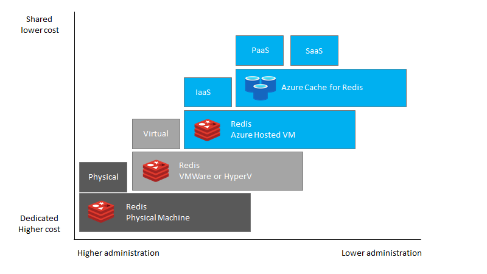

# Introduction

This migration guide is designed to provide snackable and actionable information for Redis customers seeking to migrate on-premises or non-Azure hosted Redis workloads to [Azure Cache for Redis](https://docs.microsoft.com/en-us/azure/azure-cache-for-redis/cache-overview). This guide will provide realistic guidance planning for executing the migration of a majority of Redis configurations to Azure.

Workload functionality and existing application connectivity can present challenges when migrating existing Redis instances to the cloud. This guide offers helpful links and recommendations focusing on migrating the cache, ensuring performance, and functional application operational parity.

The information provided will center on a customer journey using the Microsoft [Cloud Adoption Framework](https://docs.microsoft.com/en-us/azure/cloud-adoption-framework/get-started/) to perform assessment, migration, and post-optimization activities for an Azure Cache for Redis environment.

## Redis

Redis has a rich history in the open source community and is heavily used in corporate websites and critical applications. This guide will assist administrators who have been asked to scope, plan, and execute the migration. Administrators new to Redis can also review the [Redis Documentation](https://redis.io/documentation) for deeper information of the internal workings on Redis. Additionally, each document section contains links to helpful reference articles and tutorials.

### Common Usage of Redis

Any application that has infrequently changing data (aka deterministic within a set timeframe) such as from a database or method call with high costs (network latency, processing time, etc) are appropriate uses of caching technology like Redis.  There are many features of .NET and other technologies that can address this locally (in application memory), but in many cases you have applications that are distributed to increase performance.  In these cases, you also need a distributed cache (such as Redis, NCache or Memchached) that allow all the workers to access it. Because of the frequently changing features and support of these products, it is best to design your applications with layers of abstraction such that if you ever decide to change your caching layer, it is seamless  to your applications.

## Azure Cache for Redis

Microsoft offers a fully managed Redis cache environment to support your data cache, content cache, session store and many other applications as a Platform as a Service (PaaS) offering. In this fully managed environment, the operating system and software updates are automatically applied, as well as the implementation of high availability and protection of the data. For more overview about the Redis cache offering in Azure, reference the [About Azure Cache for Redis](https://docs.microsoft.com/en-us/azure/azure-cache-for-redis/cache-overview) documentation page.

Although we will solely focus on the managed service, Redis can also run in Azure Virtual machines..

This guide will focus entirely on migrating the on-premises Redis workloads to the Platform as a Service (PaaS) Azure Cache for Redis offering due to its various advantages over Infrastructure as a Service (IaaS) such as scale-up and scale-out, pay-as-you-go, high availability, security and manageability features.
