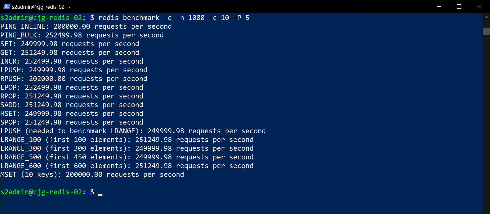

# Performance Baselines

Understanding the existing Redis workload is one of the best investments that can be made to ensure a successful migration. Excellent system performance depends on adequate hardware and great application design.  Items such as CPU, memory, disk, and networking need to be sized and configured appropriately for the anticipated load. Hardware and configuration are part of the system performance equation.  The developer must understand the instance query load and the most expensive queries to execute. Focusing on the most expensive queries can have a big difference in the overall performance metrics.

Creating baselines of query performance is vital to a migration project. The performance baselines can be used to verify the Azure landing zone configuration for the migrated data workloads. Most systems will be run 24/7 and have different peak load times. It is important to capture the peak workloads for the baseline. Later in the document, we will explore the source server parameters and how they are essential to the overall performance baseline picture. The server parameters should not be overlooked during a migration project.

## Tools

Below are tools used to gather server metrics and instance workload information. Use the captured metrics to determine the appropriate Azure Cache for Redis tier and the associated scaling options.

- [redis-benchmark.exe](https://www.percona.com/software/instance-tools/percona-monitoring-and-management): Redis includes the redis-benchmark utility that simulates running commands done by N clients at the same time sending M total queries.

You can find some of the pitfalls and misconceptions of using tools to benchmark Redis [here](https://redis.io/topics/benchmarks).

## redis-benchmark

- Open a terminal to the **PREFIX-redis01** server
- Run the following:

    ```bash
    redis-benchmark -t set -r 100000 -n 1000000
    ```

- You should get back something similar to the following:

    

- You can also run the tool against the target Azure instance:

    ```bash
    redis-benchmark -h <REDIS_IP> -p <REDIS_PORT> -a <REDIS_PWD> -t set -r 100000 -n 1000000
    ```

> **Note** You will get errors as various commands are not exposed in Azure Cache for Redis.

## WWI Use Case

WWI reviewed its conference website instance workload and determined it had a very small load.  Although a basic tier server would work for them, they did not want to perform work later to migrate to another tier.  The server being deployed will eventually host the other Redis data workloads, so they picked the `Premium` tier which will provide more than enough memory and throughput.  They also like the ideal of having geo-replication with the `Premium` tier.

In reviewing the Redis instance, the Redis 4.0 server is running with the default server configuration set during the initial install so no configuration settings will need to be migrated.
