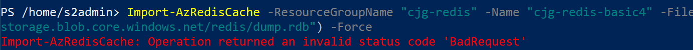
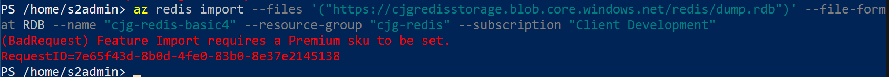

# Path 1 - Migration with RDB

## Setup

Follow all the steps in the [Setup](#appendix-a-environment-setup) guide to create an environment to support the following steps.

## Disable AOF

Follow the `Disable AOF in the target` steps in the [common tasks article](#disable_aof).

## Data

> **NOTE** RDB file format changes between versions may not be backwards compatible.

### Manual Backup (Source)

- Run the following command to find where your RDB file is located:

```bash
redis-cli config get dir
```

- Create a backup

```bash
redis-cli bgsave
```

- To check for errors or the status of the background save, run the following:

```bash
sudo tail /var/log/redis/redis-server.log -n 100
```

- Install Azure CLI (this has already been done for you, but provided for reference)

```bash
cd

curl -sL https://aka.ms/InstallAzureCLIDeb | sudo bash
```

- Run the following commands to save your RDB file to azure storage, be sure to replace the subscription id, resource group and storage account tokens:

> **NOTE** It can take a couple of minutes for the Azure RBAC assignment to go into effect.

```bash
az login

az account set --subscription "<subscription name>"

az ad signed-in-user show --query objectId -o tsv | az role assignment create --role "Storage Blob Data Contributor" --assignee @- --scope "/subscriptions/<subscription-id>/resourceGroups/<resource-group>/providers/Microsoft.Storage/storageAccounts/<storage-account>"

az storage container create --account-name <storage-account> --name <container> --auth-mode login

sudo az storage blob upload  --account-name <storage-account> --container-name redis --name database.rdb --file /var/lib/redis/dump.rdb --auth-mode login
```

### Manual Restore

You can import the data using the Azure Portal or Azure CLI / PowerShell.

> **NOTE** If you attempt to import on a Basic or Standard tier, you will get an error that a Premium tier is required.

> **NOTE** Each tier supports a maximum number of databases.  If you have more than the default of `16`, be sure that you pick a tier to migrate too that has support for all source databases.

> **NOTE** Azure Cache for Redis supports RDB import up through RDB version 7.

> **NOTE** You can import/export between a clustered cache and a non-clustered cache. Since Redis cluster only supports database 0, any data in databases other than 0 isn't imported. When clustered cache data is imported, the keys are redistributed among the shards of the cluster.

#### Azure PowerShell

- Install Azure PowerShell (this has already been done for you, but provided for reference)

    ```bash
    # Update the list of packages
    sudo apt-get update
    # Install pre-requisite packages.
    sudo apt-get install -y wget apt-transport-https software-properties-common
    # Download the Microsoft repository GPG keys
    wget -q https://packages.microsoft.com/config/ubuntu/20.04/packages-microsoft-prod.deb
    # Register the Microsoft repository GPG keys
    sudo dpkg -i packages-microsoft-prod.deb
    # Update the list of products
    sudo apt-get update
    # Enable the "universe" repositories
    sudo add-apt-repository universe
    # Install PowerShell
    sudo apt-get install -y powershell
    ```

- Perform the import:

    ```PowerShell
    # Start PowerShell
    pwsh

    Install-Module -Name Az -AllowClobber -force

    Connect-AzAccount -UseDeviceAuthentication

    Set-AzContext -Subscription "<SUBSCRIPTION_NAME>"

    Import-AzRedisCache -ResourceGroupName "resourceGroupName" -Name "cacheName" -Files @("https://<STORAGE_ACCOUNT_NAME>.blob.core.windows.net/redis/dump.rdb") -Force

    exit
    ```

- Imports are only supported on `Premium` or higher tiers:

    

#### Azure Cli

- Perform the import:

    ```bash
    az redis import --files "https://<STORAGE_ACCOUNT_NAME>.blob.core.windows.net/redis/dump.rdb"  --file-format RDB --name "cacheName" --resource-group "resourceGroupName"  --subscription "subscriptionName"
    ```

- Imports are only supported on `Premium` or higher tiers:

    

#### Azure Portal

- Browse to the Azure Portal
- Select the Redis resource group
- Select the target Redis instance (must be Premium or higher)
- Under **Import**, select **Import**
- Select the storage account
- Select the **redis** container
- Select the **dump.rdb** file
- Select **OK**

## Check success

Depending on the size of the file, it could take a while for the import to finish.  Once it is completed, verify that all keys have been migrated.

Follow the `Check success` steps in the [common tasks article](#common-tasks).

## Enable AOF in Target

Follow the `Enable AOF in the target` steps in the [common tasks article](#common-tasks).

## Summary - Backup and Restore

Even a simple backup and restore operation can potentially require significant effort to restore to an Azure Cache for Redis instance (such as with clusters).

Practice the above steps and record the time it takes to complete the entire migration. In most cases, you should be able to script the migration process.

## Resources

- [Import and Export data in Azure Cache for Redis](https://docs.microsoft.com/en-us/azure/azure-cache-for-redis/cache-how-to-import-export-data)
- [Redis Persistence](https://redis.io/topics/persistence)
- [Azure PowerShell](https://docs.microsoft.com/en-us/azure/azure-cache-for-redis/cache-how-to-manage-redis-cache-powershell)
- [Azure CLI](https://docs.microsoft.com/en-us/azure/azure-cache-for-redis/cli-samples)
