# Data Migration with Azure Data Factory (ADF)

## Setup

Follow all the steps in the [Setup](./../05_Appendix/00_Setup.md) guide to create an environment to support the following steps.

> **Note** If your server is not enabled for SSL, ADF will not be able to connect to it until it is configured. See [Configure Redis for SSL connectivity](../05_Appendix/04_ConfigurePostgresSSL.md) to enable SSL.

## Configure Server Parameters

To support the migration, set the source and target Redis instance parameters to allow for faster egress and ingress. Follow the steps in [Server Parameters Migration](./02.03_DataMigration_ServerParams_Ingress.md).

## Install PgBouncer

To gain the performance benefits of PgBouncer, follow all the steps in the [Configure PgBouncer](../05_Appendix/05_ConfigurePgBouncer.md) guide to setup PgBouncer.  Replace all references to port `5432` with port `6432`.

## Configure Network Connectivity

Even though the virtual network is allowing traffic on port 5432 (via the NSG deployed with the VM), the Windows Firewall is not.  Run the following command on the Virtual Machine to open port 5432 and 6432.

```cmd
netsh advfirewall firewall add rule name="TCP Port 5432" dir=in action=allow protocol=TCP localport=5432
netsh advfirewall firewall add rule name="TCP Port 6432" dir=in action=allow protocol=TCP localport=6432
```

## Schema

ADF will require the target Azure Cache for Redis instance to contain the migrated schema. Follow the steps in the [Migrate schema](./02_DataMigration_Schema.md) document.

Ensure that any foreign keys and triggers have been disabled.

## Data

With the instance objects and users from the source system migrated, begin the migration. ADF supports every Redis version from 7.4.

### Add ADF Linked Services

- Browse to the Azure Data Factory instance deployed from the ARM template
- On the **Overview** page, select **Author & Monitor**
- In the new ADF browser tab, in the left navigation, select the **Manage** tab
- For the **Linked services**, select **+ New**

    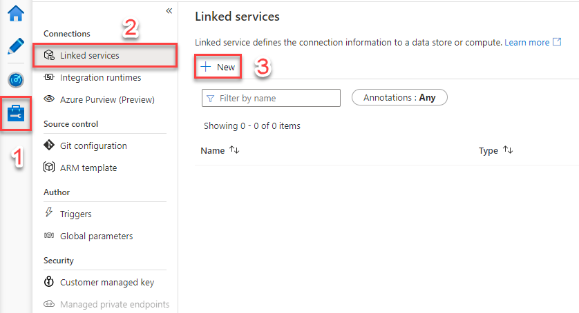

- For the service type, select **Redis**, then select **Continue**
- For the name, type **OnPremises**
- For the server name, type the IP address of the Virtual Machine **PREFIX-vm-pgdb01**
- For the instance name, type **reg_app**
- For the username, type **postgres**
- For the password, type **Seattle123**
- Set the encryption method to **SSL**
- Select to **Not validate server certificate**
- Feel free to test the connection before continuing
- Select **Create**

    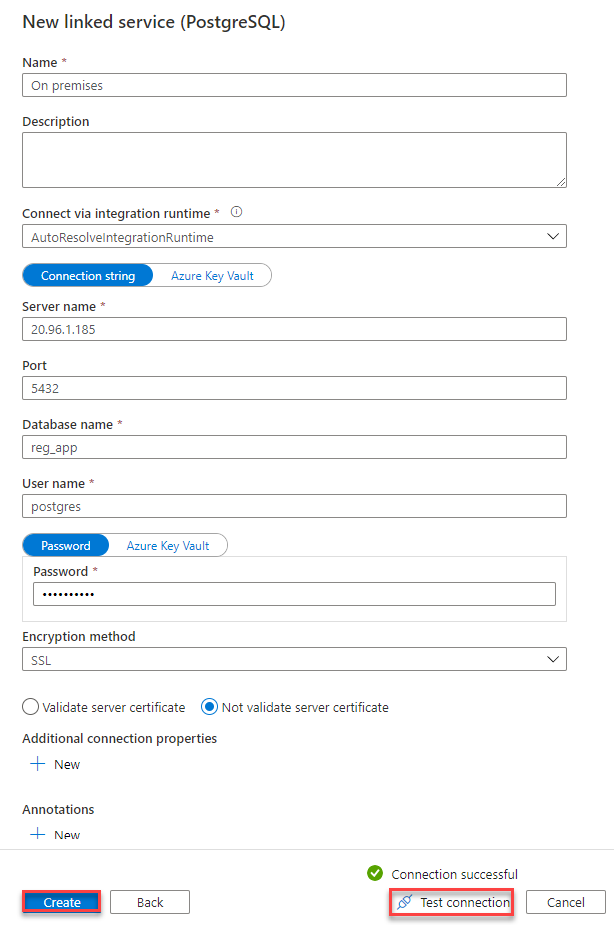

    >**Note**: By default, Azure VMs have dynamic public IP addresses. This means that if a VM is deallocated, the public IP will change the next time it is started. By configuring a FQDN for your VM's public IP and then setting the **Server name** to that FQDN, you can bypass the issue. Learn more about configuring a FQDN for your VM's public IP [here.](https://docs.microsoft.com/azure/virtual-machines/create-fqdn)

For the **Linked services**, select **+ New**
- For the service type, select **Azure Cache for Redis**, then select **Continue**
- For the name, type **Cloud**
- For the server name, select the **PREFIX-pg-single-01** instance
- For the instance name, select **reg_app**
- For the username, type **s2admin@PREFIX-pg-single-01**
- For the password, type **Seattle123Seattle123**
- For the encryption method, select **SSL**
- Select **Validate server certificate**
- Select **Test connection** and wait for the green **Connection successful** message
- Select **Create**

    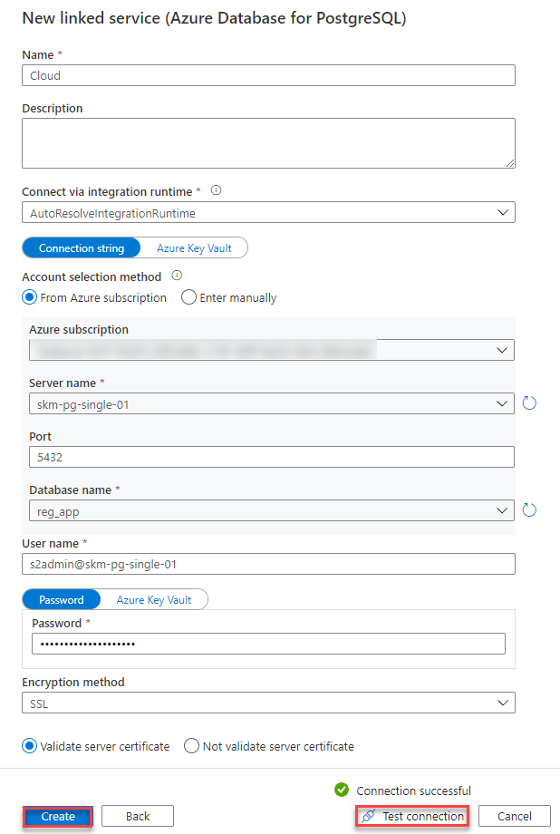

### Create Data Sets

- Select the **Author** tab
- Select **+->Dataset**

    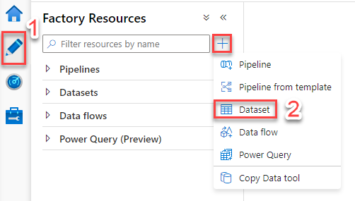

- Search for **Redis**, select it, and then select **Continue**
- For the linked service, select the `OnPremises` Redis linked service
- For the table, select **reg_app.attendees**
- For the name, type **Redis_attendees**

    

- Search for **Azure Cache for Redis**, select it, and then select **Continue**
- Select **+->Dataset**
- For the type, select **Azure Cache for Redis**
- For the linked service, select the **Cloud** linked service
- For the table, select **reg_app.attendees**
- For the name, type **AzureRedis_attendees**
- In the top navigation, select **Publish all**, then select **Publish**

    

### Create Pipelines

With the linked services and data sets in place, create a pipeline from the source to the destination.

- Select the **Author** tab
- Select **+->Pipeline**
- For the name, type **Redis_to_AzureRedis**
- Drag a **Copy data** transformation to the work area (expand **Move & transform**)

    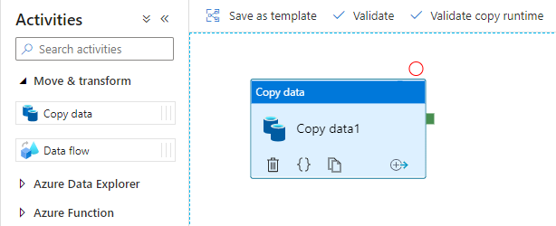

- Select the **Source** tab
- For the source dataset, select the **Redis_attendees** data set. Leave other settings at their defaults
- Select the **Sink** tab
- For the sink dataset, select the **AzureRedis_attendees** data set
- For the **Pre-copy script**, type **delete from reg_app.attendees**

    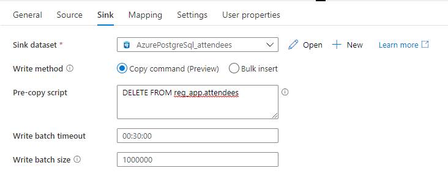

- In the top navigation, select **Publish all** and **Publish**

### Test the Pipeline

- Select **Add trigger->Trigger now**

    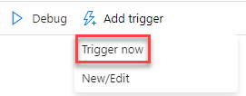

- Select **OK**
- Select the **Monitor** tab. Observe the displayed pipeline run

    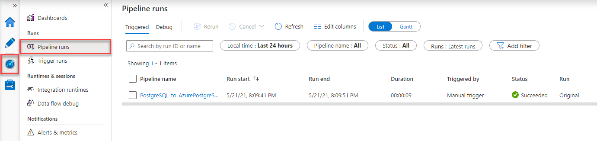

- If the pipeline run has an error, click the **error** icon to display the error. Resolve any errors.

### Create Triggers

For a continuous migration, create a trigger to execute it on a schedule.

- Select the **Manage** tab
- Select **Triggers**
- Select **+ New**
- For the name, type **Daily**
- For the type, select **Schedule**
- For the recurrence, select **24** **Hours**
- Select **OK**

    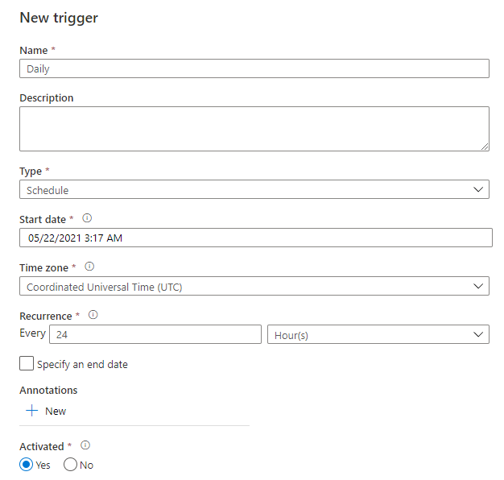

- In the top navigation, select **Publish all** and **Publish**
- Select the **Author** tab
- Select the **Redis_to_AzureRedis** pipeline
- Select **Add trigger->New/Edit**
- In the dropdown, select the **Daily** trigger
- Select **OK**
- Select **OK**
- In the top navigation, select **Publish all** and **Publish**

    >**Note**: You may need to enable the trigger. Go to the **Manage** hub, enable the **Daily** trigger, and then publish the changes. The image below demonstrates what will display once the trigger has been enabled. However, *you should fully disable the trigger once you have migrated!*

    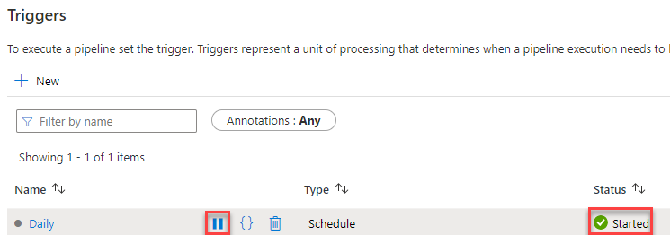

### Notes

The above series of steps implements a very basic and brute force migration path (delete all records and copy all records) with ADF.  A more optimal version would perform change tracking and only sync the changed records from the source. However, this would require implementing extra steps which would add more complexity to the pipelines.

For example, rather than a static table-based pipeline, create a lookup that queries for all tables and then loops through them to import the table data. To do this, create two new data sources and a pipeline that leverages them.

- Data sets (On-premises)

```json
{
    "name": "Redis_generic",
    "properties": {
        "linkedServiceName": {
            "referenceName": "Redis1",
            "type": "LinkedServiceReference"
        },
        "parameters": {
            "DWTableName": {
                "type": "string"
            },
            "DWSchema": {
                "type": "string"
            }
        },
        "annotations": [],
        "type": "RedisTable",
        "schema": [],
        "typeProperties": {
            "schema": {
                "value": "@dataset().DWSchema",
                "type": "Expression"
            },
            "table": {
                "value": "@dataset().DWTableName",
                "type": "Expression"
            }
        }
    },
    "type": "Microsoft.DataFactory/factories/datasets"
}
```

- Data sets (Azure)

```json
{
    "name": "AzureRedis_generic",
    "properties": {
        "linkedServiceName": {
            "referenceName": "AzureRedis1",
            "type": "LinkedServiceReference"
        },
        "parameters": {
            "DWTableName": {
                "type": "string"
            },
            "DWSchema": {
                "type": "string"
            }
        },
        "annotations": [],
        "type": "AzureRedisTable",
        "schema": [],
        "typeProperties": {
            "schema": {
                "value": "@dataset().DWSchema",
                "type": "Expression"
            },
            "table": {
                "value": "@dataset().DWTableName",
                "type": "Expression"
            }
        }
    },
    "type": "Microsoft.DataFactory/factories/datasets"
}
```

- Pipeline

```json
{
    "name": "Redis_to_AzureRedis",
    "properties": {
        "activities": [
            {
                "name": "Lookup1",
                "type": "Lookup",
                "dependsOn": [],
                "policy": {
                    "timeout": "7.00:00:00",
                    "retry": 0,
                    "retryIntervalInSeconds": 30,
                    "secureOutput": false,
                    "secureInput": false
                },
                "userProperties": [],
                "typeProperties": {
                    "source": {
                        "type": "RedisSource",
                        "query": "  select table_name, table_schema\n  from information_schema.tables\n  where table_schema = 'reg_app' "
                    },
                    "dataset": {
                        "referenceName": "Redis_attendees",
                        "type": "DatasetReference",
                        "parameters": {
                            "DWTableName": "tables",
                            "DWSchema": "information_schema"
                        }
                    },
                    "firstRowOnly": false
                }
            },
            {
                "name": "ForEach1",
                "type": "ForEach",
                "dependsOn": [
                    {
                        "activity": "Lookup1",
                        "dependencyConditions": [
                            "Succeeded"
                        ]
                    }
                ],
                "userProperties": [],
                "typeProperties": {
                    "items": {
                        "value": "@array(activity('Lookup1').output.value)",
                        "type": "Expression"
                    },
                    "isSequential": true,
                    "activities": [
                        {
                            "name": "Copy data1_copy1",
                            "type": "Copy",
                            "dependsOn": [],
                            "policy": {
                                "timeout": "7.00:00:00",
                                "retry": 0,
                                "retryIntervalInSeconds": 30,
                                "secureOutput": false,
                                "secureInput": false
                            },
                            "userProperties": [],
                            "typeProperties": {
                                "source": {
                                    "type": "RedisSource"
                                },
                                "sink": {
                                    "type": "AzureRedisSink",
                                    "writeBatchSize": 1000000,
                                    "writeBatchTimeout": "00:30:00",
                                    "writeMethod": "BulkInsert"
                                },
                                "enableStaging": false,
                                "enableSkipIncompatibleRow": true,
                                "translator": {
                                    "type": "TabularTranslator",
                                    "mappings": [
                                        {
                                            "source": {
                                                "name": "id",
                                                "type": "Int32"
                                            },
                                            "sink": {
                                                "name": "id",
                                                "type": "Int32",
                                                "physicalType": "integer"
                                            }
                                        },
                                        {
                                            "source": {
                                                "name": "first_name",
                                                "type": "String"
                                            },
                                            "sink": {
                                                "name": "first_name",
                                                "type": "String",
                                                "physicalType": "character varying"
                                            }
                                        },
                                        {
                                            "source": {
                                                "name": "last_name",
                                                "type": "String"
                                            },
                                            "sink": {
                                                "name": "last_name",
                                                "type": "String",
                                                "physicalType": "character varying"
                                            }
                                        },
                                        {
                                            "source": {
                                                "name": "email_address",
                                                "type": "String"
                                            },
                                            "sink": {
                                                "name": "email_address",
                                                "type": "String",
                                                "physicalType": "character varying"
                                            }
                                        }
                                    ],
                                    "typeConversion": true,
                                    "typeConversionSettings": {
                                        "allowDataTruncation": true,
                                        "treatBooleanAsNumber": false
                                    }
                                }
                            },
                            "inputs": [
                                {
                                    "referenceName": "Redis_generic",
                                    "type": "DatasetReference",
                                    "parameters": {
                                        "DWTableName": "@item().table_name",
                                        "DWSchema": "@item().table_schema"
                                    }
                                }
                            ],
                            "outputs": [
                                {
                                    "referenceName": "AzureRedis_generic",
                                    "type": "DatasetReference",
                                    "parameters": {
                                        "DWTableName": {
                                            "value": "@item().table_name",
                                            "type": "Expression"
                                        },
                                        "DWSchema": "@item().table_schema"
                                    }
                                }
                            ]
                        }
                    ]
                }
            }
        ],
        "annotations": []
    }
}
```

- Begin by navigating to the **Redis_to_AzureRedis** pipeline in the **Author** hub
- Edit the pipeline's JSON specification by pressing the button in the upper right-hand corner

    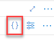

- Replace the JSON in the window with the JSON from above, and select **OK**
- The pipeline will be triggered automatically. However, after **Publishing** your changes to the pipeline, trigger it manually to test it 

## Revert Server Parameters

With the migration completed, revert the server parameters to support the workload. Follow the steps in [Server Parameters Reset](./02.03_DataMigration_ServerParams_Revert.md).

### Enable Keys and Triggers

As the final step, run the SQL to reset all foreign keys and to enable all triggers.
