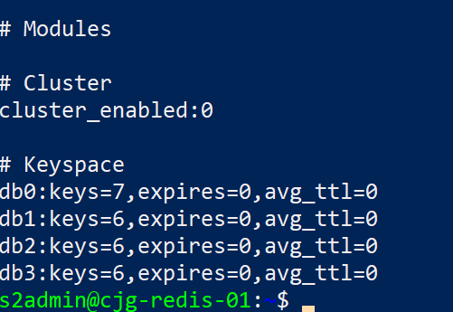
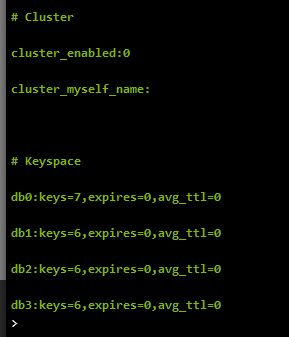

# Common Tasks

## Disable AOF in Target

To speed up the import, be sure to disable AOF in the target instance.

- Run the following on the target:

```bash
Set-AzRedisCache -ResourceGroupName "<RESOURCE_GROUP_NAME>" -Name "<REDIS_NAME>" -RedisConfiguration @{"aof-backup-enabled" = "false", "aof-storage-connection-string-0" = "DefaultEndpointsProtocol=https;BlobEndpoint=https://<STORAGE_ACCOUNT_NAME>.blob.core.windows.net/;AccountName=cjgredisstorage;AccountKey=<STORAGE_ACCOUNT_KEY1>", "aof-storage-connection-string-1" = "DefaultEndpointsProtocol=https;BlobEndpoint=https://<STORAGE_ACCOUNT_NAME>.blob.core.windows.net/;AccountName=cjgredisstorage;AccountKey=<STORAGE_ACCOUNT_KEY2>"}
```

> **Note** Azure does not recognize the `CONFIG` command so all actions must be done through the Azure APIs : `redis-cli -h <REDIS_NAME>.redis.cache.windows.net -a <REDIS_KEY> config set appendonly no`.  Only `Premium` tier or higher supports data persistence.

## Enable AOF in Target

If you disabled AOF in the target, re-enable it:

- Run the following on the target:

```bash
Set-AzRedisCache -ResourceGroupName "<RESOURCE_GROUP_NAME>" -Name "<REDIS_NAME>" -RedisConfiguration @{"aof-backup-enabled" = "true", "aof-storage-connection-string-0" = "DefaultEndpointsProtocol=https;BlobEndpoint=https://<STORAGE_ACCOUNT_NAME>.blob.core.windows.net/;AccountName=cjgredisstorage;AccountKey=<STORAGE_ACCOUNT_KEY1>", "aof-storage-connection-string-1" = "DefaultEndpointsProtocol=https;BlobEndpoint=https://<STORAGE_ACCOUNT_NAME>.blob.core.windows.net/;AccountName=cjgredisstorage;AccountKey=<STORAGE_ACCOUNT_KEY2>"}
```

## Check Success

You should now have the redis instance keys and values moved to the new Redis instance, but you should verify the source and destination.

- On the source, run the following:

    ```bash
    redis-cli INFO
    ```

    

- On the target, run the following:

    ```bash
    redis-cli -h <REDIS_NAME>.redis.cache.windows.net -p 6379 -a <REDIS_PWD> INFO
    ```

- Ensure that both have the same values in the keyspaces

    
