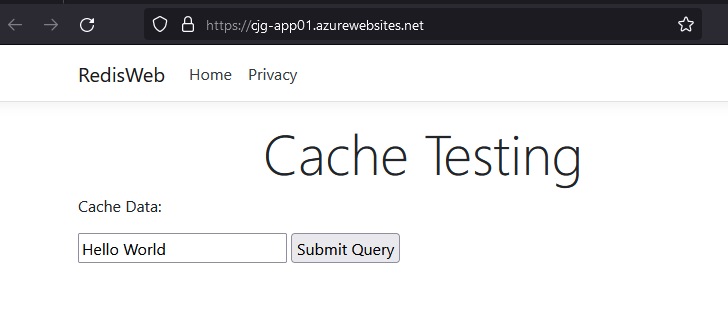

# Data Migration - Application Settings

Most applications use Redis client libraries to handle communication with their caches. In some cases, you may need to upgrade the client library to get the SSL supported version.  Once you have that version, you may also need to make code changes to support SSL.  Reference [Configure your application to use TLS 1.2](https://docs.microsoft.com/en-us/azure/azure-cache-for-redis/cache-remove-tls-10-11#configure-your-application-to-use-tls-12) for more information.

## Setup

Follow all the steps in the [Setup](#appendix-a-environment-setup) guide to create an environment to support the following steps.

## Migration

Ensure that you have migrated the data in the source to the target using one of the migration paths:

- [Backup and Restore](#path-1---migration-with-rdb))
- [Copy command](#path-2---migration-with-insertion)
- [Replication](#path-3---migration-via-replication)
- [3rd Party Tools](#path-4---migration-via-3rd-party-tools)
- [Layer of abstraction](#path-5---migration-via-dual-write)
- [Append Only File](#path-6---migration-via-append-only-file)

## Update Applications to support SSL

- Switch to the Azure Portal
- Select the **PREFIX-app01** app service
- Under **Settings**, select **Configuration**
- For the **REDIS_CONNECTION** application setting, replace it to point to the migrated Azure Cache for Redis instance:

    ```text
    "REDIS_CONNECTION": "PREFIX-redis-prem.redis.cache.windows.net:6380,password=<REDIS_PWD>,ssl=True,abortConnect=False"
    ```

> **NOTE** Notice the usage of the `ssl=True` addition to the connection string

> **NOTE** If you used the secure template, you would be connecting to the private IP endpoint in the connection string.

- Press **F5** to run the application, you should see the migrated data from the source displayed

    

You have successfully completed an on-premises to Azure Cache for Redis migration!
