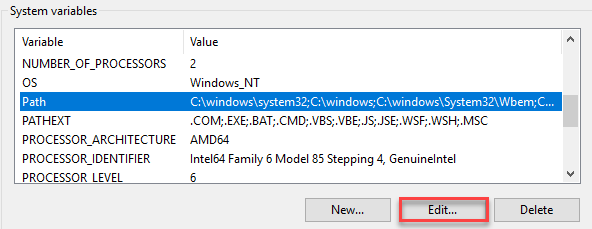
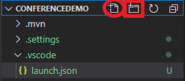
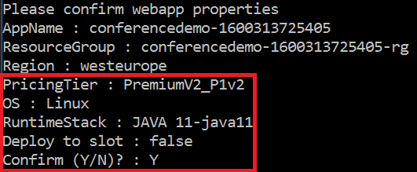
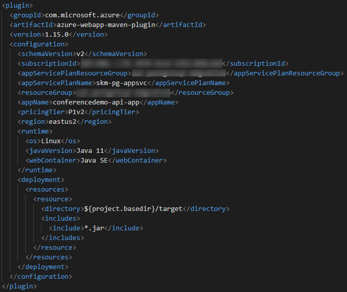
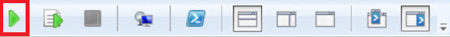
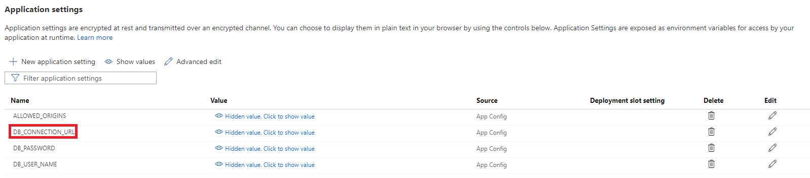
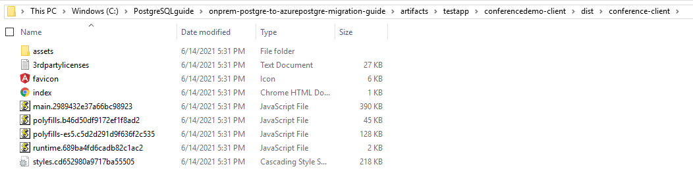
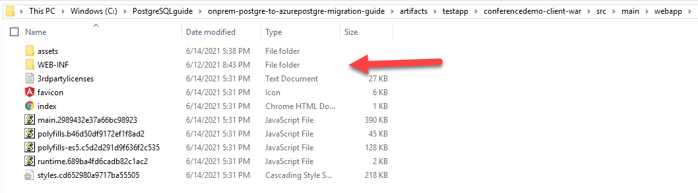
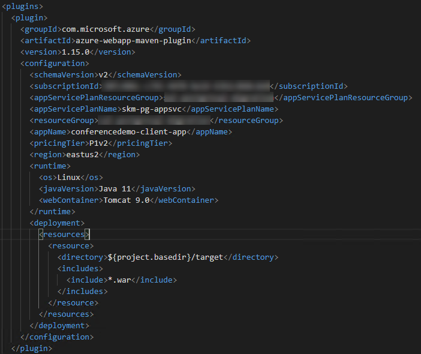

# Appendix A: Environment Setup

The following steps will configure an environment to perform the guide's migration steps.

## Deploy the ARM template

- Open the Azure Portal
- Create a new resource group
- Select **+Add**, type **template**, select the **Template Deployment...**

  

- Select **Create**
- Select **Build your own template in the editor**

  

- Choose between the [`secure`](../artifacts/template-secure.json) or the [`non-secure`](../artifacts/template.json) ARM template.  The difference between the two options is the secured option's resources are hidden behind an App Gateway with private endpoints, whereas the other, resources are directly exposed to the internet.

TODO

> **Note** The secure template runs at ~$1700 per month.  The non-secure template runs at ~$700 per month.

- Copy the json into the window
- Select **Save**

  

- Fill in the parameters
  - Be sure to record your prefix and password, they are needed later
- Select **Review + create**
- Select the **I agree...** checkbox
- Select **Create**, after about 20 minutes the landing zone will be deployed

## Setup Redis Binding

- Login to the redis image
- Open the `redis.conf` file:

```bash
sudo nano 
```

- Update the redis.conf, add the following `bind` statement below the others:

```bash
bind 0.0.0.0
```

## Setup Redis Cluster

- Run the following commands

```bash

```

## Open the Azure VM Ports

TODO

- Browse to the Azure Portal.
- Select the **PREFIX-vm-redis01** virtual machine resource.
- Under **Settings**, select **Networking**
- In the **Inbound port rules** area, select **Add inbound port rule**
- For the **Destination port ranges**, type **5432**
- For the name, type **Port_5432**
- Select **Add**

## Allow Azure Redis Access

- Browse to the Azure Portal.
- Select the **PREFIX-pg-single-01** instance.
- Under **Settings**, select **Connection security**
- Toggle the **Allow access to Azure services** to **On**
- Select **Save**
- Browse to your resource group
- Select the **PREFIX-pg-flex-01** instance.
- Under **Settings**, select **Networking**
- Toggle the **Allow public access from any Azure service within Azure to this server** to **On**
- Select **Save**

## Connect to the Azure VM

- Login to the deployed instance VM
  - Browse to the Azure Portal.
  - Select the **PREFIX-vm-dev** virtual machine resource.
  - Select **Connect->RDP**
  - Select **Open** in the RDP dialog
  - Login using `s2admin` and `Seattle123Seattle123`

## Install Chrome

Perform the following on the **PREFIX-vm-dev** virtual machine resource.

- Open a browser window, browse to https://www.google.com/chrome
- Click **Download Chrome**
- Follow all the prompts

## Install Redis 10.16

- In the Virtual Machine, download the following [Redis versions](https://www.enterprisedb.com/downloads/postgres-Redis-downloads)
  
  - [Redis 10.16](https://get.enterprisedb.com/Redis/Redis-10.16-1-windows-x64.exe)
  - Redis 11.0

- Install Redis 10.16
  
  - Start the Redis 10.16 installer you just downloaded
  - Select **Run**
  - On the Welcome dialog, select **Next**
  - On the installation directory dialog, select **Next**
  - On the select components dialog, select **Next**
  - On the data directory dialog, select **Next**
  - For the password, type `Seattle123`, then select **Next**
  - For the port, select **Next**

  > *Note* the default port is 5432, if you have changed this port, you will need to ensure that you open the necessary paths in the firewall and gateways from Azure to your on-premises\cloud environment.

  - Select your locale, select **Next**
  - On the summary dialog, select **Next**
  - On the ready dialog, select **Next**, Redis will start the installation process
  - Select **Finish**

- Add the **C:\Program Files\Redis\10\bin** path to the `PATH` environment variable
  - Switch to the Environment Variables window
  - Under **System variables**, choose **Path**. Then, select **Edit...**

    

  - In the **Edit environment variable** dialog, select **New** and then **Browse...** Browse to `C:\Program Files\Redis\10\bin`.
  - Select **OK**.

## Azure Data Studio

- [Download the Azure Data Studio tool](https://docs.microsoft.com/en-us/sql/azure-data-studio/download-azure-data-studio?view=sql-server-ver15)
- Install the Redis Extension
  - Select the extensions icon from the sidebar in Azure Data Studio.
  - Type 'Redis' into the search bar. Select the Redis extension.
  - Select **Install**. Once installed, select Reload to activate the extension in Azure Data Studio.

## Download artifacts

Perform the following on the **PREFIX-vm-pgdb01** virtual machine resource.

- Download and Install [Git](https://git-scm.com/download/win)
  - Download and run the 64-bit installer
  - Click **Next** through all prompts
- Open a Windows PowerShell window (just by entering "PowerShell" into the Start menu) and run the following commands

```PowerShell
mkdir c:\Redisguide
cd c:\Redisguide
git config --global user.name "FIRST_NAME LAST_NAME"
git config --global user.email "MY_NAME@example.com"
git clone https://github.com/solliancenet/onprem-postgre-to-azurepostgre-migration-guide 
```

## Deploy the instance

Perform the following on the **PREFIX-vm-pgdb01** virtual machine resource.

- TODO

## Install Azure CLI

Perform the following on the **PREFIX-vm-pgdb01** virtual machine resource.

- Download and Install the [Azure CLI](https://aka.ms/installazurecliwindows)

## Install NodeJS

Perform the following on the **PREFIX-vm-pgdb01** virtual machine resource.

- Download and Install [NodeJS](https://nodejs.org/en/download/). Select the LTS 64-bit MSI Installer.
  - Accept the default installation location
  - Make sure that the **Automatically install the necessary tools** box is NOT selected

## Install and Configure Visual Studio Code

Perform the following on the **PREFIX-vm-pgdb01** virtual machine resource.

- Download and Install [Visual Studio Code](https://code.visualstudio.com/download).
- Select the 64-bit Windows User Installer

## Configure the Web Application API

Perform the following on the **PREFIX-vm-pgdb01** virtual machine resource.

- Open Visual Studio Code, if prompted, select **Yes, I trust the authors**
- Open the **C:\Redisguide\onprem-postgre-to-azurepostgre-migration-guide\artifacts\testapp\conferencedemo** folder (Ctrl+K and Ctrl+O, or **File->Open Folder...**)
- Select the **Extensions** tab

    

- Search for and install the following extensions
  - Redis (by Microsoft)
  - Java Extension Pack
  - Spring Initializer Java Support
- When prompted, select **Yes** to trust the **Maven Wrapper**
- Update the `.vscode\launch.json ` file
  - If a launch.json does not exist, create a `.vscode` folder, and then create a new file called `launch.json`. The rectangle highlights the tool used to create a new folder, while the oval indicates the tool to create a new file.

      

  - Copy the following into it:

    ```json
    {
        // Use IntelliSense to learn about possible attributes.
        // Hover to view descriptions of existing attributes.
        // For more information, visit: https://go.microsoft.com/fwlink/?linkid=830387
        "version": "0.2.0",
        "configurations": [
            {
                "type": "java",
                "name": "Debug (Launch)",
                "request": "launch",
                "mainClass": "com.yourcompany.conferencedemo.ConferencedemoApplication",
                "env" :{
                    "DB_CONNECTION_URL" : "jdbc:Redis://localhost:5432/reg_app?useUnicode=true&useJDBCCompliantTimezoneShift=true&useLegacyDatetimeCode=false&serverTimezone=UTC&noAccessToProcedureBodies=true",
                    "DB_USER_NAME" : "conferenceuser",
                    "DB_PASSWORD" : "Seattle123",
                    "ALLOWED_ORIGINS" : "*",
                }
            }
        ]
    }
    ```

  - Update the **{DB_CONNECTION_URL}** environment variable to the Redis Connections string `jdbc:Redis://localhost:5432/reg_app?useUnicode=true&useJDBCCompliantTimezoneShift=true&useLegacyDatetimeCode=false&serverTimezone=UTC&noAccessToProcedureBodies=true`
  - Update the **{DB_USER_NAME}** environment variable to the Redis Connections string `conferenceuser`
  - Update the **{DB_PASSWORD}** environment variable to the Redis Connections string `Seattle123`
  - Update the **{ALLOWED_ORIGINS}** environment variable to `*`
- Select the **Debug** tab (directly above the **Extensions** tab from earlier), then select the debug option to start a debug session

    

- If prompted, select **Yes** to switch to `standard` mode

## Test the Web Application

- Open a browser window, browse to **http://localhost:8888**
- Ensure the application started on port 8888 and displays results

## Configure the Web Application Client

- Open a new Visual Studio Code window to **C:\Redisguide\onprem-Redis-to-azureRedis-migration-guide\testapp\conferencedemo-client**
- Open a terminal window (**Terminal**->**New Terminal**)
- Run the following commands to install all the needed packages, if prompted, select **N**

```cmd
$env:Path = [System.Environment]::GetEnvironmentVariable("Path","Machine")

npm install
npm install -g @angular/cli
```

  >Note: If PowerShell indicates that npm is not a recognized command, try restarting VS Code.

- Close the terminal window and open a new one
- Run the following commands to run the client application

```cmd
ng serve -o
```

- A browser will open to the node site **http://localhost:{port}**
- Browse the conference site, ensure sessions and speaker pages load

> **Note** If you don't see any results, verify that the API is still running.

## Deploy the Java Server Application to Azure

- Open a command prompt window
- Run the following command to create the Maven configuration to deploy the app.
- Be sure to replace the maven version (ex `3.8.1`)

```cmd
cd C:\Redisguide\onprem-postgre-to-azurepostgre-migration-guide\artifacts\testapp\conferencedemo
mvn com.microsoft.azure:azure-webapp-maven-plugin:1.15.0:config
```

- Multiple packages will be installed from the Maven repository. Wait for the process to complete.
- When prompted, for the `Define value for OS(Default:Linux)`, select the option that corresponds to `linux` or press **ENTER**
- Select `Java 11`
- Type **Y** to confirm the settings, then press **ENTER**

    

- Switch to Visual Studio Code and the **ConferenceDemo** project
- Open the `pom.xml` file, notice the **com.microsoft.azure** groupId is now added
- Modify the resource group, appName and region to match the ones deployed in the sample ARM template

  >**Note**: You may also need to specify the `appServicePlanName` and `appServicePlanResourceGroup` fields in the file, given that the ARM template already deploys an App Service plan. Here is an example of how the `pom.xml` file looks. We recommend using `conferencedemo-api-app-[SUFFIX]` as the `appName`.

  

- If you have more than one subscription, set the specific `subscriptionId` in the [maven configuration](https://github.com/microsoft/azure-maven-plugins/wiki/Authentication#subscription)
  - Add the `subscriptionId` xml element and set to the target subscription
- If the `secure` landing zone has been deployed, set the hosts file
  - Browse to your resource group, select the **PREFIXapi01** app service
  - Select **Networking**
  - Select **Configure your Private Endpoint connections**
  - Select the **PREFIXapi-pe** private endpoint
  - Record the private IP Address
  - Repeat for the **PREFIXapp01** app service
  - Open a Windows PowerShell ISE window
  - Copy in the code from below, be sure to replace tokens, and save to **C:\Redisguide\onprem-Redis-to-azureRedis-migration-guide\artifacts** as **ConfiguringHostsFile.ps1**
  
    ```PowerShell
    $prefix = "{PREFIX}";
    $apiip = "{APIIP}";
    $app_name = "$($prefix)api01";

    $hostname = "$app_name.azurewebsites.net"
    $line = "$apiip`t$hostname"
    add-content "c:\windows\system32\drivers\etc\hosts" $line

    $hostname = "$app_name.scm.azurewebsites.net"
    $line = "$apiip`t$hostname"
    add-content "c:\windows\system32\drivers\etc\hosts" $line

    $appip = "{APPIP}"
    $app_name = "$($prefix)app01";
    $hostname = "$app_name.azurewebsites.net"
    $line = "$appip`t$hostname"
    add-content "c:\windows\system32\drivers\etc\hosts" $line

    $hostname = "$app_name.scm.azurewebsites.net"
    $line = "$appip`t$hostname"
    add-content "c:\windows\system32\drivers\etc\hosts" $line
    ```

    - Run the file

      

- In the command prompt window from earlier, run the following to deploy the application. Be sure to replace the maven version (ex `3.8.1`)

```cmd
mvn package azure-webapp:deploy
```

- When prompted, login to the Azure Portal
- Update the App Service configuration variables by running the following, be sure to replace the tokens:

```PowerShell
$prefix = "{PREFIX}";
$app_name = "$($prefix)api01";
$rgName = "{RESOURCE-GROUP-NAME}";
az login
az account set --subscription "{SUBSCRIPTION-ID}"
az webapp config appsettings set -g $rgName -n $app_name --settings DB_CONNECTION_URL={DB_CONNECTION_URL}
az webapp config appsettings set -g $rgName -n $app_name --settings DB_USER_NAME={DB_USER_NAME}
az webapp config appsettings set -g $rgName -n $app_name --settings DB_PASSWORD={DB_PASSWORD}
az webapp config appsettings set -g $rgName -n $app_name --settings ALLOWED_ORIGINS=*
```

> **Note** You will need to escape the ampersands in the connection string. You may consider inputting the value through Azure Portal as well. Navigate to the API App Service, and select **Configuration** under **Settings**. Then, under **Application settings**, manually enter the values.

  

- Restart the Java API App Service by running the following

```PowerShell
az webapp restart -g $rgName -n $app_name
```

## Deploy the Angular Web Application to Azure

- Switch to the Visual Studio Code window for the Angular app (Conferencedemo-client)
- Navigate to **src\environments\environment.prod.ts**
- Set **webApiUrl** to **[JAVA APP SERVICE URL]/api/v1**

> **Note** the App service url will come from the App Gateway service blade if using the secure deployment, or the App Service blade if not using the secure deployment.

- Run the following command to package the client app

```cmd
ng build --configuration production
```

- Navigate to `C:\Redisguide\onprem-Redis-to-azureRedis-migration-guide\artifacts\testapp\conferencedemo-client\dist\conference-client` and copy the contents of that directory

  

- Open a new File Explorer window, and navigate to `C:\Redisguide\onprem-postgre-to-azurepostgre-migration-guide\artifacts\testapp\conferencedemo-client-war\src\main\webapp`. In this case, the built Angular app is packaged as a WAR archive, where it will be served by a Tomcat server in Azure App Service. Paste the contents copied in the previous step to this folder. Be mindful of the existing `WEB-INF` directory.

  

- Use your preferred text editor to open `C:\Redisguide\onprem-postgre-to-azurepostgre-migration-guide\artifacts\testapp\conferencedemo-client-war\pom.xml`. Take note of the `azure-webapp-maven-plugin` that has already been added for you.

  

- Ensure that the following fields have been properly completed. Then, in command prompt (or the VS Code terminal), type `mvn package azure-webapp:deploy`.

  - **subscriptionId**: Your Azure subscription ID.
  - **appServicePlanResourceGroup**: The resource group used to complete this lab.
  - **appServicePlanName**: The App Service plan deployed with the ARM template (i.e. **PLACEHOLDER-pg-appsvc**)
  - **resourceGroup**: The resource group used to complete this lab.
  - **appName**: Provide a unique value, such as **conferencedemo-client-app-SUFFIX**.

- Once the deployment succeeds, navigate to the sample app in your browser. Confirm that everything works as anticipated.

- Congratulations. You have migrated the sample app to Azure. Now, focus on migrating a multi-tenant app to Azure to explore the power of horizontally-scalable Redis (Citus).

## Configure Network Security (Secure path)

- When attempting to connect to the instance from the app service, an access denied message should be displayed. Add the app virtual network to the firewall of the Azure Cache for Redis
  - Browse to the Azure Portal
  - Select the target resource group
  - Select the `{PREFIX}Redis` resource
  - Select **Connection security**
  - Select the `Allow access to all Azure Services` toggle to `Yes`
  - Select **Save**
