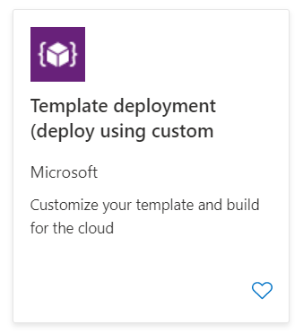
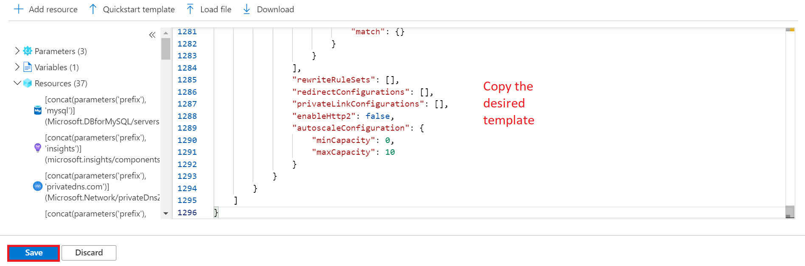
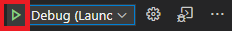

# Appendix A: Environment Setup

The following steps will configure an environment to perform the guide's migration steps.

## Deploy the ARM template

- Open the Azure Portal
- Create a new resource group
- Select **+Add**, type **template**, select the **Template Deployment...**

  

- Select **Create**
- Select **Build your own template in the editor**

  

- Choose between the [`secure`](../artifacts/template-secure.json) or the [`non-secure`](../artifacts/template.json) ARM template.  The difference between the two options is the secured option's resources are hidden behind an App Gateway with private endpoints, whereas the other, resources are directly exposed to the internet.

TODO

> **Note** The secure template runs at ~$2550 per month.  The non-secure template runs at ~$1550 per month.

- Copy the json into the window
- Select **Save**

  

- Fill in the parameters
  - Be sure to record your prefix and password, they are needed later
- Select **Review + create**
- Select the **I agree...** checkbox
- Select **Create**, after about 20 minutes the landing zone will be deployed

## Setup Redis Binding

- Login to the redis image (**PREFIX-redis01** and **PREFIX-redis02**)
- Open the `redis.conf` file:

```bash
sudo nano /etc/redis/redis.conf
```

- Update the redis.conf, add the following `bind` statement below the others:

```bash
bind 0.0.0.0
```

## Setup Redis Cluster

- Run the following commands

```bash
sudo service redis-server restart
```

## Open the Azure VM Ports

TODO

- Browse to the Azure Portal.
- Select the **PREFIX-redis01** virtual machine resource.
- Under **Settings**, select **Networking**
- In the **Inbound port rules** area, select **Add inbound port rule**
- For the **Destination port ranges**, type **6379**
- For the name, type **Port_6379**
- Select **Add**

## Allow Azure Redis Access

- Browse to the Azure Portal.
- Select the **PREFIX-redis-basic** instance.
- Under **Settings**, select **Connection security**
- Toggle the **Allow access to Azure services** to **On**
- Select **Save**
- Browse to your resource group
- Select the **PREFIX-redis-std** instance.
- Under **Settings**, select **Networking**
- Toggle the **Allow public access from any Azure service within Azure to this server** to **On**
- Select **Save**

## Connect to the Azure VM

- Login to the deployed instance VM
  - Browse to the Azure Portal.
  - Select the **PREFIX-win10** virtual machine resource.
  - Select **Connect->RDP**
  - Select **Open** in the RDP dialog
  - Login using `s2admin` and `Seattle123Seattle123`
  
## Download artifacts

Perform the following on the **PREFIX-win10** virtual machine resource.

- Open a Windows PowerShell window (just by entering "PowerShell" into the Start menu) and run the following commands

```PowerShell
mkdir c:\redismigration
cd c:\redismigration
git config --global user.name "FIRST_NAME LAST_NAME"
git config --global user.email "MY_NAME@example.com"
git clone https://github.com/solliancenet/microsoft-redis-cache-migration 
```

## Configure the Web Application API

Perform the following on the **PREFIX-win10** virtual machine resource.

- Open Visual Studio Code, if prompted, select **Yes, I trust the authors**
- Open the **C:\redismigration\microsoft-redis-cache-migration\artifacts\testapp\conferencedemo** folder (Ctrl+K and Ctrl+O, or **File->Open Folder...**)
- Select the **Extensions** tab

    

- Search for and install the following extensions
  - TODO

- Update the **{DB_CONNECTION_URL}** environment variable to the Redis Connections string `jdbc:Redis://localhost:5432/reg_app?useUnicode=true&useJDBCCompliantTimezoneShift=true&useLegacyDatetimeCode=false&serverTimezone=UTC&noAccessToProcedureBodies=true`
- Select the **Debug** tab (directly above the **Extensions** tab from earlier), then select the debug option to start a debug session

    

- If prompted, select **Yes** to switch to `standard` mode

## Test the Web Application

- Open a browser window, browse to **http://localhost:8888**
- Ensure the application started on port 8888 and displays results

## Configure the Web Application Client

- Open a new Visual Studio Code window to **C:\redismigration\microsoft-redis-cache-migration\testapp\conferencedemo-client**
- Open a terminal window (**Terminal**->**New Terminal**)
- Run the following commands to install all the needed packages, if prompted, select **N**
- Press **F5** to run the application, a browser will open to the node site **http://localhost:{port}**

## Deploy the Application to Azure

- TODO
- Restart the App Service by running the following

```PowerShell
az webapp restart -g $rgName -n $app_name
```

- Congratulations. You have migrated the sample app to Azure. Now, focus on migrating a multi-tenant app to Azure to explore the power of horizontally-scalable Redis (Citus).

## Configure Network Security (Secure path)

- When attempting to connect to the instance from the app service, an access denied message should be displayed. Add the app virtual network to the firewall of the Azure Cache for Redis
  - Browse to the Azure Portal
  - Select the target resource group
  - Select the `{PREFIX}Redis` resource
  - Select **Connection security**
  - Select the `Allow access to all Azure Services` toggle to `Yes`
  - Select **Save**
