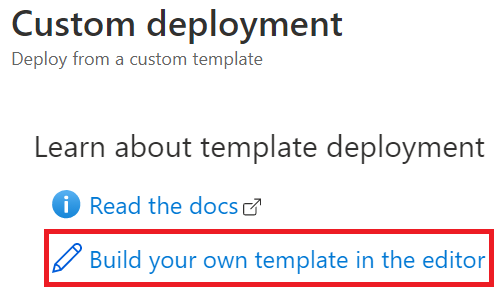

# Appendix A: Environment Setup

The following steps will configure an environment to perform the guide's migration steps.

## Deploy the ARM template

- Open the Azure Portal
- Create a new resource group
- Select **+Add**, type **template**, select the **Template Deployment...**

  

- Select **Create**
- Select **Build your own template in the editor**

  

- Choose between the [`secure`](../artifacts/template-secure.json) or the [`non-secure`](../artifacts/template.json) ARM template.  The difference between the two options is the secured option's resources are hidden behind an App Gateway with private endpoints, whereas the other, resources are directly exposed to the internet.

> **Note** The secure template runs at ~$2700 per month.  The non-secure template runs at ~$1700 per month.

- Copy the json into the window
- Select **Save**

  

- Fill in the parameters
  - Be sure to record your prefix and password, they are needed later
- Select **Review + create**
- Select the **I agree...** checkbox
- Select **Create**, after about 20 minutes the landing zone will be deployed

  > **NOTE** If anything deploys incorrectly in the redis images via the Azure script extensions, you can check the Azure agent log files using:

  ```bash
  sudo chmod +rwx /var/lib/waagent

  sudo chmod +rwx /var/lib/waagent/custom-script/download/0

  cd /var/lib/waagent/custom-script/download/0

  sudo nano stderr
  ```

> **NOTE** If you choose the `secure` template, you will need to perform all the tasks via the Azure Portal or inside the **PREFIX-win10** jump machine in the **PREFIX-vnet-hub** virtual network.  You will also need to make sure that DNS records are correct such that you can connect to the resources in the **PREFIX-vnet-redis** virtual network.  For simplicity, you should use the `non-secure` template.

## Ensure Redis is Configured

- Browse to the Azure Portal
- Select your lab resource group
- Select the **PREFIX-redis01** virtual machine
- Record the public IP address
- Login to the redis image (**PREFIX-redis01** and **PREFIX-redis02**) by opening a PowerShell window and run the following:

  ```PowerShell
  ssh s2admin@<IP>
  ```

- Enter the password `S2@dmins2@dmin`
- Open the `redis.conf` file:

  ```bash
  sudo nano /etc/redis/redis.conf
  ```

- Check the following `bind` statement exists:

  ```bash
  bind 0.0.0.0
  ```

- If the setting does not exist or it is an empty file, run all the commands in the `.\artifacts\post-install-script01.sh` file

## Connect to the Azure VM

- Login to the deployed instance VM.
  - Browse to the Azure Portal.
  - Select the **PREFIX-win10** virtual machine resource
  - Select **Connect->RDP**.
  - Select **Open** in the RDP dialog.
  - Login using `s2admin` and `S2@dmins2@dmin`.
  - Select **Accept** in the dialog.
  
## Configure and Test the Web Application

Perform the following on the **PREFIX-win10** virtual machine resource.

- Open Visual Studio
- Open the **C:\redismigration\microsoft-redis-cache-migration\artifacts\applications\Redis.sln** file
- When prompted, login using an account that has a Visual Studio license enabled
- Open the ``appsettings.json` file, update the **{TODO}** variable to the Redis Connections string `TODO`
- Press **F5** to run the application, a browser window should open

## Deploy the Application to Azure

- Right-click the **RedisWeb** project, select **Publish**

- Congratulations. You have migrated the sample app to Azure, now we need to migrate the Redis instance.
