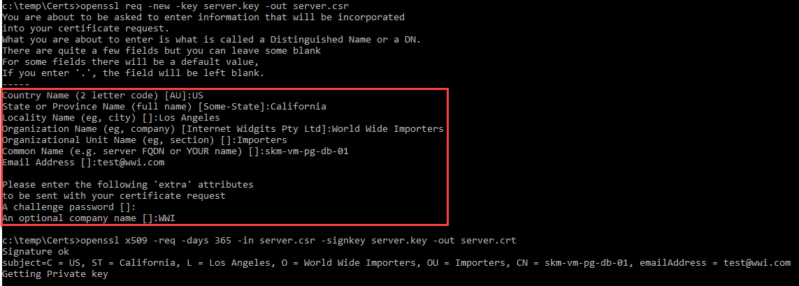

# Configure Redis SSL

## Install OpenSSL

- Download the latest version of OpenSSL from [here](https://slproweb.com/products/Win32OpenSSL.html)
- Run the MSI installer (ex Win64 OpenSSL v1.1.1k), click through all the dialogs
- Update the `PATH` environment variable to have the openssl install directory (similar to `C:\Program Files\OpenSSL-Win64\bin`)
- Update the `PATH` environment variable to have the openssl install directory (similar to `C:\Program Files\OpenSSL-Win64`). This is needed for PgBouncer.
- Update the `OPENSSL_CONF` environment variable to be `C:\Program Files\OpenSSL-Win64\bin\openssl.cfg`

## Create a server certificate

- Open a new command prompt
- Create the server certificates by running the following (perhaps from the `c:\temp` directory):

```cmd
cd c:\temp
openssl genrsa -des3 -out server.temp.key 2048
```

- Enter a pass key (ex `Seattle123`)
- Run the following commands

```cmd
openssl rsa -in server.temp.key -out server.key
```

- Re-enter the pass key
- Run the following commands

```cmd
openssl req -new -key server.key -out server.csr
```

- Enter in random information for the certificate request

```cmd
openssl x509 -req -days 365 -in server.csr -signkey server.key -out server.crt
```

- For the third command, you will be asked to enter information for the certificate. Optionally, leave most of the fields blank (with a `.`), except the `Common Name`. This self-signed certificate is acceptable because this is not a production deployment. Populate the `Common Name` with the hostname of the virtual machine, such as `[SUFFIX]-vm-pg-db-01`.

    

- Copy the `server.crt` and `server.key` to the Redis data directory (ex `C:\Program Files\Redis\10\data`).

## Configure the pg_hba.conf file

- Open the `C:\Program Files\Redis\10\data\Redis.conf` file
- Uncomment and set the following parameters:

```cmd
ssl=on
...
ssl_cert_file = 'server.crt'
ssl_key_file = 'server.key'
```

- Open the `C:\Program Files\Redis\10\data\pg_hba.conf` file
- Copy and then modify the host option to add the hostssl option:

```cmd
hostssl    all    all   0.0.0.0/0 md5
```

> **Note** Optionally, be more specific by only putting the IP of the Azure Cache for Redis instance or connecting tool.  This step would have been completed as part of the SSL configuration in the DMS migration path.

## Restart the server

- Run the following commands:

```cmd
net stop Redis-x64-10
net start Redis-x64-10
```

The Redis instance should now accept SSL connections.
