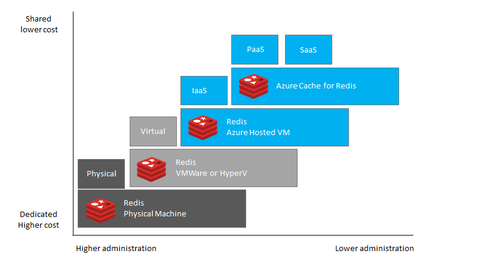
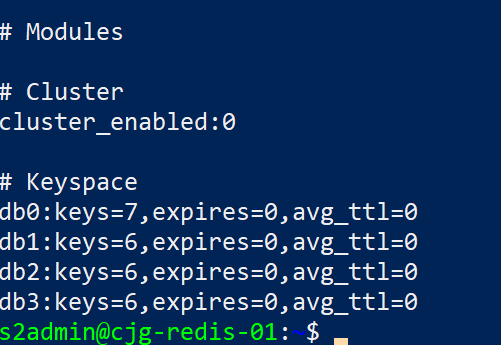
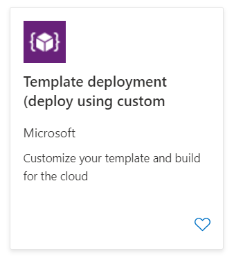
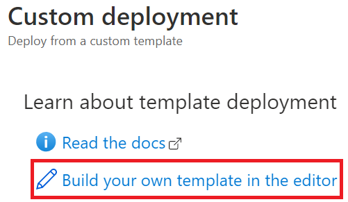

# Introduction

This migration guide is designed to provide snackable and actionable
information for Redis customers seeking to migrate on-premises or
non-Azure hosted Redis workloads to [Azure Cache for
Redis](https://docs.microsoft.com/en-us/azure/azure-cache-for-redis/cache-overview).
This guide will provide realistic guidance planning for executing the
migration of a majority of Redis configurations to Azure.

Workload functionality and existing application connectivity can present
challenges when migrating existing Redis instances to the cloud. This
guide offers helpful links and recommendations focusing on migrating the
cache, ensuring performance, and functional application operational
parity.

The information provided will center on a customer journey using the
Microsoft [Cloud Adoption
Framework](https://docs.microsoft.com/en-us/azure/cloud-adoption-framework/get-started/)
to perform assessment, migration, and post-optimization activities for
an Azure Cache for Redis environment.

## Redis

Redis has a rich history in the open source community and is heavily
used in corporate websites and critical applications. This guide will
assist administrators who have been asked to scope, plan, and execute
the migration. Administrators new to Redis can also review the [Redis
Documentation](https://redis.io/documentation) for deeper information of
the internal workings on Redis. Additionally, each document section
contains links to helpful reference articles and tutorials.

### Common Usage of Redis

Any application that has infrequently changing data (aka deterministic
within a set timeframe) such as from a database or method call with high
costs (network latency, processing time, etc) are appropriate uses of
caching technology like Redis. There are many features of .NET and other
technologies that can address this locally (in application memory), but
in many cases you have applications that are distributed to increase
performance. In these cases, you also need a distributed cache (such as
Redis, NCache or Memchached) that allow all the workers to access it.
Because of the frequently changing features and support of these
products, it is best to design your applications with layers of
abstraction such that if you ever decide to change your caching layer,
it is seamless to your applications.

## Azure Cache for Redis

Microsoft offers a fully managed Redis cache environment to support your
data cache, content cache, session store and many other applications as
a Platform as a Service (PaaS) offering. In this fully managed
environment, the operating system and software updates are automatically
applied, as well as the implementation of high availability and
protection of the data. For more overview about the Redis cache offering
in Azure, reference the [About Azure Cache for
Redis](https://docs.microsoft.com/en-us/azure/azure-cache-for-redis/cache-overview)
documentation page.

Although we will solely focus on the managed service, Redis can also run
in Azure Virtual machines..



This guide will focus entirely on migrating the on-premises Redis
workloads to the Platform as a Service (PaaS) Azure Cache for Redis
offering due to its various advantages over Infrastructure as a Service
(IaaS) such as scale-up and scale-out, pay-as-you-go, high availability,
security and manageability features.

# Use Case

## Overview

World Wide Importers (WWI) is a San Francisco, California-based
manufacturer and wholesale distributor of novelty goods. They began
operations in 2002 and developed an effective business-to-business (B2B)
model, selling the items they produce directly to retail customers
throughout the United States. Its customers include specialty stores,
supermarkets, computing stores, tourist attraction shops, and some
individuals. This B2B model enables a streamlined distribution system of
their products, allowing them to reduce costs and offer more competitive
pricing on the items they manufacture. They also sell to other
wholesalers via a network of agents who promote their products on WWI's
behalf.

Before launching into new areas, WWI wants to ensure its IT
infrastructure can handle the expected growth. WWI currently hosts all
its IT infrastructure on-premises at its corporate headquarters and
believes moving these resources to the cloud enables future growth. They
have tasked their CIO with overseeing the migration of their customer
portal and the associated data workloads to the cloud.

WWI would like to continue to take advantage of the many advanced
capabilities available in the cloud, and they are interested in
migrating their instances and associated workloads into Azure. They want
to do this quickly and without having to make any changes to their
applications or instances. Initially, they plan on migrating their
java-based customer portal web application and the associated Redis
instances and workloads to the cloud.

### Migration Goals

The primary goals for migrating their Redis instances and associated
workloads to the cloud include:

-   Improve their overall security posture by encrypting data at rest
    and in-transit.
-   Enhance the high availability and disaster recovery (HA/DR)
    capabilities.
-   Position the organization to leverage cloud-native capabilities and
    technologies such as point in time restore.
-   Take advantage of administrative and performance optimizations
    features of Azure Cache for Redis.
-   Create a scalable platform that they can use to expand their
    business into more geographic regions.
-   Allow for enhanced compliance with various legal requirements where
    PII information is stored.

WWI used the [Cloud Adoption Framework
(CAF)](https://docs.microsoft.com/azure/cloud-adoption-framework/) to
educate their team on following best practices guidelines for cloud
migration. Using CAF as a higher-level migration guide, WWI customized
their migration into three main stages. Within each stage, they defined
activities that needed to be addressed to ensure a successful lift and
shift cloud migration.

These stages include:

  -----------------------------------------------------------------------
  Stage                   Name                    Activities
  ----------------------- ----------------------- -----------------------
  1                       Pre-migration           Assessment, Planning,
                                                  Migration Method
                                                  Evaluation, Application
                                                  Implications, Test
                                                  Plans, Performance
                                                  Baselines

  2                       Migration               Execute Migration,
                                                  Execute Test Plans

  3                       Post-migration          Business Continuity,
                                                  Disaster Recovery,
                                                  Management, Security,
                                                  Performance
                                                  Optimization, Platform
                                                  modernization
  -----------------------------------------------------------------------

WWI has several instances of Redis running with varying versions ranging
from 3.0 to 6.0. They would like to move their older instances to the
latest Redis version as soon as possible, but there are some concerns
regarding applications functioning without issues. A decision has been
made to migrate to the cloud first and upgrade the Redis version later
knowing that Redis 3.0 and 4.0 are coming to end of support.

They would also like to ensure that their data workloads are safe and
available across multiple geographic regions in case of failure and are
looking at the available configuration options.

WWI wants to start off with a simple application for the first
migration, and then move to more business-critical applications in a
later phase. This will provide the team with the knowledge and
experience they need to prepare and plan for those future migrations.

# Assessment

Before jumping right into migrating a Redis workload, there is a fair
amount of due diligence that must be performed. This includes analyzing
the data, hosting environment, and application workloads to validate the
Azure landing zone is properly configured and prepared to host the
soon-to-be migrated workloads.

## Redis Versions

Remote Dictionary Server (Redis) has a rich history starting in late
2000s. Since then, it has evolved into a widely used memory based key
value data management system. Azure Cache for Redis started with the
support of Redis version 4.0 and has continued to 6.0 (as of 8/2021).
For a listing of all Redis versions, reference [this detailed
page](https://bucardo.org/postgres_all_versions.html).

For the latest on Azure Cache for Redis version support, reference
[Supported Azure Cache for Redis server
versions](https://docs.microsoft.com/en-us/azure/Redis/concepts-supported-versions).
In the Post Migration Management section, we will review how upgrades
(such as 4.0 to 6.0) are applied to the Redis instances in Azure.

> **Note** Redis Support is based on the release of the latest stable
> release. Only the latest stable version, and the last two versions
> will receive maintenance. As of 4/2021, anything prior to 4.0 is end
> of life.

Knowing the source Redis version is important as many features have been
introduced through the major versions. The applications using the system
may be expecting behavior and features that are specific to that
version. Although Redis has been great at keeping breaking changes at a
minimum and keeping compatibility between versions, there are a small
handful of cases that may influence the migration path and version:

-   Support for Redis Modules (RedisSearch, RedisBloom, RedisTimeSeries)
-   RDB format change (5.0 not backwards compatible, 4.0 is not
    backwards compatible)
-   Change in INFO fields (4.0)
-   Usage of REDIS ACL (6.0+)
-   RESP3 mode (6.0+)
-   LRU Cache changes (4.0+)
-   Any Lua Language changes (EVAL, EVALSHA)
-   Extensive use of TTL
-   Number of databases

To check the Redis server version run the following command against the
Redis instance:

``` {.bash}
redis-server --version
```

For a list of changes between versions, reference the latest release
documentation:

-   [Redis
    6.x](https://raw.githubusercontent.com/redis/redis/6.0/00-RELEASENOTES)
-   [Redis
    5.x](https://raw.githubusercontent.com/redis/redis/5.0/00-RELEASENOTES)
-   [Redis
    4.x](https://raw.githubusercontent.com/redis/redis/4.0/00-RELEASENOTES)
-   [Redis
    3.x](https://raw.githubusercontent.com/redis/redis/3.0/00-RELEASENOTES)

## Architecture and Objects

Data (keys and the values) is only one component of instance migration.
The instance supporting configuration may also need to be migrated and
validated to ensure the applications will continue to run reliably. As
part of the assessment, it is important to understand what features of
the system are being used other than data storage.

Here is a list of inventory items that should be inventoried before and
after the migration:

-   Users
-   Configuration settings

After reviewing the above items, notice there is much more than just
data that may be required to migrate a Redis workload. The following
sections below address more specific details about several of the above.

## Limitations

Azure Cache for Redis is a fully supported version of Redis running as a
platform as a service. However, there are some common limitations to
become familiar with when doing an initial assessment for selected your
landing zone. Many of these limitations are driven by the tier selected
as shown in the online [supported features
document](https://docs.microsoft.com/en-us/azure/azure-cache-for-redis/cache-overview#feature-comparison)

Many of the other items are simply operational aspects that
administrators should become familiar with as part of the operational
data workload lifecycle management. This guide will explore many of
these operational aspects in the [Post Migration
Management](../04_PostMigration/01_Management.md) section.

-   Each tier supports a maximum number of databases (when not in
    cluster mode). If you have more than the default of `16`, be sure
    that you pick a tier to migrate too that has support for all source
    databases.

-   Although you can cluster enable the premium tier, in doing so, you
    will only be able to support the `db0` database. If you are using a
    tool that supports migrating databases, you will need to ensure that
    you move all source databases to the `db0` database in the target.

-   You cannot cluster enable `Basic` or `Standard` tiers so migrating
    via cluster failover is not an option. You can cluster enable a
    premium instance but it will become part of its own cluster and you
    cannot use it to cluster failover.

-   Once you cluster enabled the premium instance, it will communication
    over the Redis cluster protocol.

### Redis Modules

You can extend the features of Redis by implemented custom Redis
modules. Look for any `loadmodule` directives in the `redis.conf` file
that are not part of the default installation. You can also get a list
of all modules by running:

``` {.bash}
redis-cli MODULE LIST
```

## Databases

When performing a migration, consider the Redis instance may have more
than one database. Databases in Redis were not designed for scaling but
rather for namespaces. For example a SaaS Application may run one code
base but hundreds of clients each with their own namespace / redis
database. Databases allow you to flush a client without affecting others
and minimize administrative overhead.

The tool you select will need to be able to support migrating keys in
all databases and ensuring they are moved to the target appropriately
versus just moving the default `0` database. You can find the number of
databases by running the following:

``` {.bash}
redis-cli INFO keyspace
```

OR

``` {.bash}
redis-cli config get databases
```

## Source Systems

The amount of migration preparation can vary depending on the source
system and its location. In addition to the instance objects, consider
how to get the data from the source system to the target system.
Migrating data can become challenging when there are firewalls and other
networking components in between the source and target.

Internet migration speed is an important factor. Moving data over the
Internet can be slower than using dedicated circuits to Azure. Consider
setting up an
[ExpressRoute](https://docs.microsoft.com/en-us/azure/expressroute/expressroute-introduction)
connection between the source network and the Azure network when moving
many gigabytes, terabytes, and petabytes of data.

Do not overwhelm existing network infrastructure. If ExpressRoute is
already present, the connection is likely being used by other
applications. Performing a migration over an existing route can cause
strain on the network throughput and potentially cause considerable
performance degradation for both the migration and other applications
using the network.

Lastly, disk space must be evaluated. When exporting a very large
instance, consider the size of the data. Ensure the system where the
tool is running and the export location have enough disk space to
perform the export operation.

### Clusters

If the source system is running in a cluster, you will need to ensure
that the target instance is also running in a similarly configured
cluster with the same performance metrics as the source.

### Hashing layers

When not using clusters, you can place a `hashing` layer in front of a
set of Redis servers. In this case, you will need to ensure that you
have the same technology sitting in front of the Azure Cache for Redis
instances. The path or tool you use to migrate will need to be tested
with whatever hashing layer you are using to ensure that all keys are
discovered and migrated to the target.

For instance, the default source code for the tool `twemproxy` will
require all the target servers to have the same password or no password.
You cannot change the Azure Cache for Redis password/keys to a custom
value. This means you would need to setup Redis cache servers in Virtual
Machines in a private network and place the `twemproxy` in front of
them.

During the migration from the hashing layer, you will need to export
keys from each of the source servers and then add the values through the
new hashing layer setup with the same configuration on the target side.

### Cloud Providers

Migrating instances from cloud services providers, such as Google Cloud
(GCP) and Amazon Web Services (AWS), may require extra networking
configuration steps to access the cloud-hosted Redis instances or they
may prevent Redis migration commands. Any first party or third party
migration tools will require access from outside IP ranges and may be
blocked by default.

### On-premises

Like cloud provider-hosted environments, if the Redis data environment
is behind corporate firewalls or other network security layers, a path
will need to be created between the on-premises instance and Azure Cache
for Redis.

## Performance Analysis Tools

Many tools and methods can be used to assess the Redis data workloads
and environments. Each tool will provide a different set of assessment
and migration features and functionality. As part of this guide, we will
review the most commonly used tools for assessing Redis data workloads.

## Azure Cache for Redis - Service Tiers

Equipped with the assessment information (CPU, memory, storage, etc.),
the migration user's next choice is to decide which Azure Cache for
Redis service and pricing tier to start with.

There are currently five potential options:

-   **Azure Cache for Redis (Basic)** : An OSS Redis cache running on a
    single VM. This tier has no service-level agreement (SLA) and is
    ideal for development/test and non-critical workloads.
-   **Azure Cache for Redis (Standard)** : An OSS Redis cache running on
    two VMs in a replicated configuration.
-   **Azure Cache for Redis (Premium)** : High-performance OSS Redis
    caches. This tier offers higher throughput, lower latency, better
    availability, and more features. Premium caches are deployed on more
    powerful VMs compared to the VMs for Basic or Standard caches.
-   **Azure Cache for Redis (Enterprise)** : High-performance caches
    powered by Redis Labs' Redis Enterprise software. This tier supports
    Redis modules including RediSearch, RedisBloom, and RedisTimeSeries.
    Also, it offers even higher availability than the Premium tier.
-   **Azure Cache for Redis (Enterprise Flash)** : Cost-effective large
    caches powered by Redis Labs' Redis Enterprise software. This tier
    extends Redis data storage to non-volatile memory, which is cheaper
    than DRAM, on a VM. It reduces the overall per-GB memory cost.

Briefly, these options were discussed in the
[Limitations](##Limitations) document.

### Comparison of Services

Which Azure Cache for Redis service should be selected and used? This
table outlines some of the advantages and disadvantages of each along
with their Redis version support as of 4/2021.

  -----------------------------------------------------------------------
  Service           Pros              Cons              Versions
                                                        Supported
  ----------------- ----------------- ----------------- -----------------
  Azure VM          Any version, most Customer          Any Version
                    flexible, full    responsible for   
                    Redis feature     updates,          
                    support           security, and     
                                      administration    

  Basic             Sizes up to 53GB, Lower             4.x, 6.x
                    low cost          performance, no   
                                      data persistence, 
                                      no replication or 
                                      failover          

  Standard          All basic, plus   Lower             4.x, 6.x
                    replication and   performance, no   
                    failover support  data persistence  

  Premium           All Standard,     No support for    4.x, 6.x
                    plus zone         Redis Modules     
                    redundancy, data                    
                    persistence and                     
                    clustering                          

  Enterprise        All Premium, plus Higher costs      6.x
                    Redis Module                        
                    support                             

  Enterprise Flash  Flash based       No Redis Module   6.x
                    memory            support           
  -----------------------------------------------------------------------

As displayed above, if the instance is running Redis 3.x or lower and do
not plan to upgrade, the workload will need to run in an Azure VM.

### Costs

After evaluating the entire WWI Redis data workloads, WWI determined
they would need at least 6GB of cache capacity with data persistence and
clustering support so a Premium Sku was selected. WWI intentionally
chose to begin its Azure migration journey with a relatively small
workload. However, the best practices of instance migration still apply
and will be used as a template for future migrations.

To determine the memory usage, they interrogated the redis processes on
their source system during a heavy load period:

``` {.bash}
ps -o pid,user,%mem,command ax | sort -b -k3 -r
```

They then monitored the network bandwidth to see how much traffic was
being used between the clients and the Redis server. They measured about
15% cache usage per hour which equated to 900MB of traffic per hour
which equates to 328GB of traffic per year. The current application will
not be moved to the same Azure region but will utilize the Azure Redis
Cache which means network bandwidth will have to be paid. They had a
couple of tools to choose from to monitor the network traffic (`iptraf`
and `nethogs`):

``` {.bash}
sudo apt-get install iptraf -y

sudo netstat =tump | grep <port_number>
```

``` {.bash}
sudo apt-get install nethogs

sudo nethogs
```

Additionally, because they want [data
persistence](https://redis.io/topics/persistence) and backups, they will
persist this to Azure Storage.

Using the [Azure Cache for Redis pricing
calculator](https://azure.microsoft.com/en-us/pricing/details/cache/)
WWI was able to determine the costs for the Azure Cache for Redis
instance. As of 8/2021, the total costs of ownership (TCO) is displayed
in the following table for the WWI Conference instance:

  -----------------------------------------------------------------------
  Resource          Description       Quantity          Cost
  ----------------- ----------------- ----------------- -----------------
  Compute (Premium) 6GB Memory (1     24 x 365 @        \$4853.04 / yr
                    primary, 1        \$0.554/hr        
                    replica)                            

  Storage (backup)  6GB               6 \* 12 @ \$0.15  \$10.80 / yr

  Network           \~27.37GB/month   12 \* 22.37 \*    \$21.4752 / yr
                    egress            \$.08             

  Total                                                 \$4885.31 / yr
  -----------------------------------------------------------------------

After reviewing the initial costs, WWI's CIO confirmed they will be on
Azure for a period much longer than 3 years. They decided to use 3-year
[reserve
instances](https://docs.microsoft.com/en-us/azure/Redis/concept-reserved-pricing)
to save an extra \~\$2.6K/yr:

  -----------------------------------------------------------------------
  Resource          Description       Quantity          Cost
  ----------------- ----------------- ----------------- -----------------
  Compute (Premium) 6GB Memory (1     24 x 365 @        \$2190 / yr
                    primary, 1        \$0.249/hr        
                    replica)                            

  Storage (backup)  6GB               6 \* 12 @ \$0.15  \$10.80 / yr

  Network           \~27.37GB/month   12 \* 22.37 \*    \$21.4752 / yr
                    egress            \$.08             

  Total                                                 \$2222.27 / yr
                                                        (\~45% savings)
  -----------------------------------------------------------------------

As the table above shows, backups, network egress, and any extra nodes
must be considered in the total cost of ownership (TCO). As more
instances are added, the storage and network traffic generated would be
the only extra cost-based factor to consider.

> **Note:** The estimates above do not include any
> [ExpressRoute](https://docs.microsoft.com/en-us/azure/expressroute/expressroute-introduction),
> [Azure App
> Gateway](https://docs.microsoft.com/en-us/azure/application-gateway/overview),
> [Azure Load
> Balancer](https://docs.microsoft.com/en-us/azure/load-balancer/load-balancer-overview),
> or [App
> Service](https://docs.microsoft.com/en-us/azure/app-service/overview)
> costs for the application layers.

> The above pricing can change at any time and will vary based on
> region. The region used above was `West US 2`.

### Application Implications

When moving to Azure Cache for Redis, the conversion to [secure sockets
layer
(SSL)](https://docs.microsoft.com/en-us/azure/azure-cache-for-redis/cache-remove-tls-10-11#configure-your-application-to-use-tls-12)
based communication is likely to be one of the biggest changes for the
applications. SSL is enabled by default in Azure Cache for Redis and it
is likely the on-premises application and data workload is not set up to
connect to Redis using SSL. When enabled, SSL usage will add some
additional processing overhead and should be monitored.

> **Note** Although SSL is enabled by default, it is possible to
> disable. This is strongly not recommended.

Lastly, modify the server name in the application connection strings or
switch the DNS to point to the new Azure Cache for Redis server.

## WWI Use Case

WWI started the assessment by gathering information about their Redis
instances. They were able to compile the following:

  Name               Source        Size   Data Persistence   Version   Owner                    Downtime
  ------------------ ------------- ------ ------------------ --------- ------------------------ ----------
  Redis (Www)        AWS (PaaS)    6GB    yes                3.0       Information Technology   4 hr
  Redis (Database)   On-premises   12GB   yes                5.0       Information Technology   1 hrs

Each instance owner was contacted to determine the acceptable downtime
period. The planning and migration method selected was based on the
acceptable instance downtime.

For the first phase, WWI focused solely on the web site supporting
instance. The team needed the migration experience to assist in the
proceeding data workload migrations. The www instance was selected
because of the simple instance structure and the lenient downtime
requirements. Once the instance was migrated, the team focused on
migrating the application into the secure Azure landing zone.

## Assessment Checklist

-   Test the workload runs successfully on the target system.
-   Ensure the right networking components are in place for the
    migration.
-   Understand the data workload resource requirements.
-   Estimate the total costs.
-   Understand the downtime requirements.
-   Be prepared to make application changes.

# Planning

## Landing Zone

An [Azure Landing
zone](https://docs.microsoft.com/en-us/azure/cloud-adoption-framework/ready/landing-zone/)
is the target environment defined as the final resting place of a cloud
migration project. In most projects, the landing zone should be scripted
via ARM templates for its initial setup. Finally, it should be
customized with PowerShell or the Azure Portal to fit the needs of the
workload.

Since WWI is based in San Francisco, all resources for the Azure landing
zone were created in the `US West 2` region. The following resources
were created to support the migration:

-   [Azure Cache for
    Redis](https://docs.microsoft.com/en-us/azure/Redis/quickstart-create-Redis-server-instance-using-azure-portal)
-   [Express
    Route](https://docs.microsoft.com/en-us/azure/expressroute/expressroute-introduction)
-   [Azure Virtual
    Network](https://docs.microsoft.com/en-us/azure/virtual-network/quick-create-portal)
    with [hub and spoke
    design](https://docs.microsoft.com/en-us/azure/architecture/reference-architectures/hybrid-networking/hub-spoke)
    with corresponding [virtual network
    peerings](https://docs.microsoft.com/en-us/azure/virtual-network/virtual-network-peering-overview)
    establish.
-   [App
    Service](https://docs.microsoft.com/en-us/azure/app-service/overview)
-   [Application
    Gateway](https://docs.microsoft.com/en-us/azure/load-balancer/quickstart-load-balancer-standard-internal-portal?tabs=option-1-create-internal-load-balancer-standard)
-   [Private
    endpoints](https://docs.microsoft.com/en-us/azure/private-link/private-endpoint-overview)
    for the App Services and Redis instance

> **Note:** As part of this guide, two ARM templates (one with private
> endpoints, one without) were provided to deploy a potential Azure
> landing zone for a Redis migration project. The private endpoints ARM
> template provides a more secure, production-ready scenario. Additional
> manual Azure landing zone configuration may be necessary, depending on
> the requirements.

> **Note** Creating a Redis instance in an Azure Virtual Machine with a
> default port and no password or on an non-SSL port with a password
> with no network security group protecting them is highly discouraged.
> Bots continually monitor the Azure IP address space and will find your
> Redis instance within a few days. Be very careful creating resources
> that are exposed to the internet.

## Networking

Getting data from the source system to Azure Cache for Redis in a fast
and optimal way is a vital component to consider in a migration project.
Small unreliable connections may require administrators to restart the
migration several times until a successful result is achieved.
Restarting migrations due to network issues can lead to wasted effort,
time and money.

Take the time to understand and evaluate the network connectivity
between the source, tool, and destination environments. In some cases,
it may be appropriate to upgrade the internet connectivity or configure
an ExpressRoute connection from the on-premises environment to Azure.
Once on-premises to Azure connectivity has been created, the next step
is to validate that the selected migration tool can connect from the
source to the destination.

The migration tool location will determine the network connectivity
requirements. As shown in the table below, the selected migration tool
must be able to connect to both the on-premises machine and Azure. Azure
should be configured to only accept network traffic from the migration
tool location.

  ---------------------------------------------------------------------------
  Migration Tool  Type           Tool Location  Inbound        Outbound
                                                Network        Network
                                                Requirements   Requirements
  --------------- -------------- -------------- -------------- --------------
  Import/Export   Offline        On-premises    None           A path to copy
  (RDB)                                                        the file to
                                                               the new
                                                               instance

  DUMP/RESTORE    Online         On-premises    None           Open port to
                                                               the target
                                                               instance

  SLAVEOF /       Online         On-premises    None           Open port to
  REPLICAOF                                                    the target
                                                               instance

  MIGRATE         Online         On-premises    None           Open port to
                                                               the target
                                                               instance

  3rd party tools Offline        On-premises    Based on tool  Based on tool
                   Online                                      
  ---------------------------------------------------------------------------

> **Note** We will discuss these migration methods in more detail in the
> next section.

Other networking considerations include:

-   When using an Azure Virtual Machine to run the migration tools,
    assign it a public IP address and then only allow it to connect to
    the on-premises Redis instance.

-   Outbound firewalls must ensure outbound connectivity to Azure Cache
    for Redis.

## Private Link and/or VNet integration

All Azure Cache for Redis services support private links and VNet
integration. There are however be sure to review the [FAQs for private
endpoints](https://docs.microsoft.com/en-us/azure/azure-cache-for-redis/cache-private-link#faq)
to understand the behavior of the cache when behind a private endpoint.

## SSL/TLS Connectivity

In addition to the application implications of migrating to SSL-based
communication, the SSL/TLS connection types are also something that
needs to be considered. After creating the Azure Cache for Redis
instance, review the SSL settings, and read the [Configure your
application to use TLS
1.2](https://docs.microsoft.com/en-us/azure/azure-cache-for-redis/cache-remove-tls-10-11#configure-your-application-to-use-tls-12)
article to understand how the TLS settings can affect the security
posture of an application.

## WWI Use Case

WWI's cloud team has created the necessary Azure landing zone resources
in a specific resource group for the Azure Cache for Redis. Additional
resources will be included to support the applications. To create the
landing zone, WWI decided to script the setup and deployment using ARM
templates. By using ARM templates, they would be able to quickly tear
down and re-setup the environment, if needed.

As part of the ARM template, all connections between virtual networks
will be configured with peering in a hub and spoke architecture. The
instance and application will be placed into separate virtual networks.
An Azure App Gateway will be placed in front of the app service to allow
the app service to be isolated from the Internet. The Azure App Service
will connect to the Azure Cache for Redis using a private endpoint.

WWI originally wanted to test an online migration, but the required
network setup for DMS to connect to their on-premises environment made
this infeasible. WWI chose to do an offline migration instead. The Redis
pgAdmin tool was used to export the on-premises data and then was used
to import the data into the Azure Cache for Redis instance. The WWI
migration team has also learned that the versatile Azure Data Studio
tool has preview Redis support, and would like to explore its utility
for developing applications using Redis.

## Planning Checklist

-   Prepare the Azure landing zone. Consider using ARM template
    deployment in case the environment must be torn down and rebuilt
    quickly.
-   Verify the networking setup. Verification should include testing
    connectivity, bandwidth, latency, and firewall configurations.
-   Determine if you are going to use the online or offline data
    migration strategy.
-   Decide on the SSL certificate strategy.

# Migration Methods

Getting the data from the source to target will require using tools or
features of Redis to accomplish the migration.

It is important to complete the entire assessment and planning stages
before starting the next stages. The decisions and data collected are
migration path and tool selection dependencies.

We explore the following commonly used tools in this section:

-   Database export/import via RDB file
-   Append Only File (AOF)
-   Layer of abstraction
-   SLAVEOF / REPLICAOF commands
-   MIGRATE command
-   3rd Party tools

## Import / Export

### Redis Persistence

Redis is a memory server, designed for high-performance storage and
retrieval. If the server or service where to be shutdown, all the items
in the cache would be lost. To ensure durability, you can [select a
persistence mode](https://redis.io/topics/persistence) to keep the
values in the case of failure. These two persistence methods include RDB
and AOF.

You can also select the [persistence in Azure Redis
instances](https://docs.microsoft.com/en-us/azure/azure-cache-for-redis/cache-how-to-premium-persistence).

### RDB File

By default, Redis will keep cache data persisted to disk on a fairly
regular basis, this can however be disabled by the administrator to
improve performance. However, doing so would cause any data in memory to
be lost in the case of a server fault or reboot. In most cases this is
enabled, but has [advantages and
disadvantages](https://redis.io/topics/persistence).

### Append Only File (AOF)

The append-only file is an alternative to RDB and is a fully-durable
strategy for Redis. It first became available in version 1.1. AOF can be
enabled in the Redis configuration file:

``` {.text}
appendonly yes
```

Once enabled, every time Redis receives a command that changes the
dataset (e.g. SET) it will append it to the AOF. When you restart Redis
it will re-play the AOF to rebuild the state. This same file can be used
to rebuild / migrate a Redis instance in Azure.

This option is more durable than the RDB file, but comes at some costs
in larger files, repeated commands and slower performance when under
huge write loads.

### Manual (SET)

The most basic way to migrate an instance is to enumerate all the keys
from the source and then `SET` the values in the destination. This works
well with basic key values such as strings and integers, but care has to
be taken with more complex objects such that the tool encodes the values
correctly in the migrate process.

### Manual (DUMP/RESTORE)

This path is the preferred path as it will export the key in the Redis
encoded format. Although it is the preferred method, it presents various
challenges when the source and target are not within a compatible
version range for the encoding algorithm.

### SLAVEOF / REPLICAOF

Redis includes the ability to create replicas of master nodes. This path
is one of the easiest to setup, but unfortunately none of the Azure
services support the `SLAVEOF` or `REPLICAOF` commands. This means this
path is best used for when you are moving from one version to another to
support a move to the cloud using the `DUMP` and `RESTORE` path.

### MIGRATE

The [`MIGRATE`](https://redis.io/commands/migrate) Redis command will
atomically transfer a key from a source Redis instance to a destination
Redis instance. On success the key is deleted from the original instance
and is guaranteed to exist in the target instance.

### Layer of Abstraction

Layer of abstraction means that you can use your applications to migrate
your Redis data in real-time and as the data is used. Once you hit 100%
key coverage, you can then remove the layer of abstraction and retire
the old Redis instances.

### Other open-source tools

There are several 3rd party migration tools that help migrate Redis
workloads easily and quickly. In most cases, the time savings and ease
of use come with a price and may add extra costs to the migration.

Some of these include:

-   [redis-copy](https://github.com/deepakverma/redis-copy)
-   [redis-migrate](https://github.com/vipshop/redis-migrate-tool)

## Fastest/Minimum Downtime Migration

As outlined above, there are plenty of paths for migrating cache data.
Deciding which path to take is a function of the migration team's skill
set, and the amount of downtime the instance and application owners are
willing to accept. Some tools support multi-threaded parallel data
migration approaches while other tools were designed for simple
migrations of key/value data only.

## Decision Table

There are many paths WWI can take to migrate their Redis workloads. We
have provided a table of the potential paths and the advantages and
disadvantages of each:

  -----------------------------------------------------------------------------------------
  Objective    Description   Tool            Prerequisites   Advantages     Disadvantages
  ------------ ------------- --------------- --------------- -------------- ---------------
  Fastest      Parallel      3rd party tool  Scripted Setup  Highly         Target
  migration    approach                                      parallelized   throttling
  possible                                                                  

  Online       Keep the      Replication     None            Seamless       Extra
  migration    source up for                                                processing and
               as long as                                                   storage
               possible                                                     

  Highly       Selectively   IMPORT/EXPORT   None            Highly         Manual
  Customized   export                                        customizable   
  Offline      objects                                                      
  Migration                                                                 
  -----------------------------------------------------------------------------------------

In terms of the more specific tools and methods, here is a table of
supported features with advantages and disadvantages of each:

  ----------------------------------------------------------------------------------------------------
  Path`\Tool`{=tex}     Supported   Multiple    Clusters   Underlying     Advantages   Disadvantages
                        in Azure    Databases              Cmds                        
  --------------------- ----------- ----------- ---------- -------------- ------------ ---------------
  RDP Backup/Restore    Premium+    Yes         Yes        N/A            Simple file  Requires
                                                                          copy         storage
                                                                                       account,
                                                                                       Complicated for
                                                                                       clusters

  AOF Backup/Restore    Premium+    Yes         Yes        N/A            Simple file  Requires
                                                                          copy         storage
                                                                                       account,
                                                                                       Complicated for
                                                                                       clusters

  Cluster Failover      No          \-          \-         \-             \-           \-
  (Migration)                                                                          

  Replication           No          \-          \-         \-             \-           \-
  (SLAVEOF/REPLICAOF)                                                                  

  Mass Insertion        Yes         Yes         Yes        SET/GET        Simple to    Binary encoding
  (SET/GET)                                                               implement    complexities
                                                                                       (output and
                                                                                       input
                                                                                       formatting)

  Mass Insertion        Yes         Yes         Yes        DUMP/RESTORE   Simple to    Binary encoding
  (DUMP/RESTORE)                                                          implement    complexities
                                                                                       (versions must
                                                                                       match)

  Mass Insertion        Yes         Yes         Yes        MIGRATE        Simple to    Binary encoding
  (MIGRATE)                                                               implement    complexities
                                                                                       (versions must
                                                                                       match), Data is
                                                                                       deleted from
                                                                                       source during
                                                                                       migration.

  Layer of Abstraction  Yes         Yes         Yes        SET/GET        Simple to    Requires
                                                                          implement    application
                                                                                       changes, does
                                                                                       not support
                                                                                       local SET/GET
                                                                                       (outside of
                                                                                       application)
  ----------------------------------------------------------------------------------------------------

## WWI Use Case

WWI has selected its conference instance as its first migration
workload. The workload was selected because it had the least risk and
the most available downtime due to the gap in the annual conference
schedule. They also assessed the instance to not be using any
unsupported features in the target Azure Cache for Redis service. Based
on the migration team's other assessment details, they determined that
they will attempt to perform an offline migration using the backup and
restore Redis tools.

During their assessment period, they did find that the customer instance
does use some languages, extensions, and a custom function that are not
available in the target service for the conference instance. They have
asked the development team to review replacing those features while they
migrate the more simple workloads. If they can be replaced successfully,
they will choose an Azure Cache for Redis service, otherwise, they will
provision an Azure VM to host the workload.

## Migration Methods Checklist

-   Ensure the right method is selected given the target and source
    environments.
-   Ensure the method can meet the business requirements.
-   Always verify if the data workload will support the method.

# Test Plans

## Overview

WWI created a test plan that included a set of IT and Business tasks.
Successful migrations require all the tests to be executed.

Tests:

-   Ensure the migrated instance has consistency (same record counts)
    with on-premises instance.
-   Ensure the performance is acceptable (it should match the same
    performance as if it were running on-premises).
-   Ensure acceptable network connectivity between on-premises and the
    Azure network.
-   Ensure all identified applications and users can connect to the
    migrated data instance.

WWI has identified a migration weekend and time window that started at
10 pm and ended at 2 am Pacific Time. If the migration did not complete
before the 2 am target (the 4hr downtime target) with all tests passing,
the rollback procedures were started. Issues were documented for future
migration attempts. All migrations windows were pushed forward and
rescheduled based on acceptable business timelines.

## Sample Queries

A series of queries were executed on the source and target to verify
migration success. The following queries and scripts will help determine
if the migration moved all required instance objects from the source to
the target.

### Exporting Objects

Use this query to get all the keys:

``` {.bash}
KEYS *
```

> **NOTE** Running this command on a production environment can cause
> performance issues with any applications using the target instance. It
> is advisable to execute during low traffic/usage periods.

As of Redis 6.x, you can implement [ACL
lists](https://redis.io/topics/acl). If your source is 6.x or higher,
use this query to get all the users:

``` {.bash}
ACL LIST
```

### Rename Commands

`RENAME` is not supported in Azure Cache for Redis, but if you are
moving to Azure Virtual Machines, you will want to export and re-apply
any rename commands to the target.

Command renames (for app level)

### Scripts

If you have any scripts or your application makes calls to the [`EVAL`
command](https://redis.io/commands/eval), be sure to test them
thoroughly in case your scripts use commands or features that are not
available in Azure Cache for Redis.

## Rollback Strategies

The queries above will provide a list of object names and counts that
can be used in a rollback decision. Migration users can take the first
object verification step by checking the source and target object
counts. A failure in counts may not necessarily mean that a rollback is
needed. Performing an in-depth evaluation could point out that the
discrepancy is small and easily recoverable. Manual migration of a few
failed objects may be possible.

For example, if all keys and values were migrated, but only a few users
were missed, remediate those failed items and finalize the migration. If
the instance is relatively small, it could be possible to clear the
Azure Cache for Redis and restart the migration again. However, if the
instance is relatively large, there may not be enough time to determine
what occurred. The migration will need to stop and rollback.

Identifying missing instance objects needs to occur quickly during a
migration window. Every minute counts. One option could be exporting the
environment object names to a file and using a data comparison tool to
reduce the missing object verification time. Another option could be
exporting the source instance object names and importing the data into a
target instance environment temp table. Compare the data using a
**scripted** and **tested** query statement. Data verification speed and
accuracy are critical to the migration process. Do not rely on reading
and verifying a long list of instance objects during a migration window.
Manage by exception.

### Decision Table

  Discrepancy          Time To Sync                     Rollback?   Resolution Path
  -------------------- -------------------------------- ----------- -----------------------
  Key Count Mismatch   Less than the remaining window   No          Sync the missing keys
  Key Value Mismatch   More than the remaining window   Yes         Start the Rollback

In the [migration](./../03_Migration/01_DataMigration.md) section, we
will provide a instance migration inventory script that will provide
object counts that can be used to compare source and destination after a
migration path has been completed.

## WWI Use Case

The WWI CIO received a confirmation report that all instance objects
were migrated from the on-premises instance to the Azure Cache for Redis
instance. The infrastructure and dev teams ran the above queries against
the instance before the beginning of the migration and saved all the
results to a spreadsheet for tracking.

The source instance information was used to verify the target migration
object fidelity.

## Checklist

-   Have test queries scripted, tested, and ready to execute.
-   Know how long test queries take to run and make them a part of the
    migration timeline.
-   Have a mitigation and rollback strategy ready for different
    potential outcomes.
-   Have a well-defined timeline of events for the migration.

# Performance Baselines

Understanding the existing Redis workload is one of the best investments
that can be made to ensure a successful migration. Excellent system
performance depends on adequate hardware and great application design.
Items such as CPU, memory, disk, and networking need to be sized and
configured appropriately for the anticipated load. Hardware and
configuration are part of the system performance equation. The developer
must understand the instance query load and the most expensive queries
to execute. Focusing on the most expensive queries can have a big
difference in the overall performance metrics.

Creating baselines of query performance is vital to a migration project.
The performance baselines can be used to verify the Azure landing zone
configuration for the migrated data workloads. Most systems will be run
24/7 and have different peak load times. It is important to capture the
peak workloads for the baseline. Later in the document, we will explore
the source server parameters and how they are essential to the overall
performance baseline picture. The server parameters should not be
overlooked during a migration project.

## Tools

Below are tools used to gather server metrics and instance workload
information. Use the captured metrics to determine the appropriate Azure
Cache for Redis tier and the associated scaling options.

-   [redis-benchmark.exe](https://www.percona.com/software/instance-tools/percona-monitoring-and-management):
    Redis includes the redis-benchmark utility that simulates running
    commands done by N clients at the same time sending M total queries.

You can find some of the pitfalls and misconceptions of using tools to
benchmark Redis [here](https://redis.io/topics/benchmarks).

## redis-benchmark

-   Open a terminal to the **PREFIX-redis01** server

-   Run the following:

    ``` {.bash}
    redis-benchmark -t set -r 100000 -n 1000000
    ```

-   You should get back something similar to the following:

    

-   You can also run the tool against the target Azure instance:

    ``` {.bash}
    redis-benchmark -h <REDIS_IP> -p <REDIS_PORT> -a <REDIS_PWD> -t set -r 100000 -n 1000000
    ```

> **Note** You will get errors as various commands are not exposed in
> Azure Cache for Redis.

## WWI Use Case

WWI reviewed its conference website instance workload and determined it
had a very small load. Although a basic tier server would work for them,
they did not want to perform work later to migrate to another tier. The
server being deployed will eventually host the other Redis data
workloads, so they picked the `Premium` tier which will provide more
than enough memory and throughput. They also like the ideal of having
geo-replication with the `Premium` tier.

In reviewing the Redis instance, the Redis 4.0 server is running with
the default server configuration set during the initial install so no
configuration settings will need to be migrated.

# Data Migration with Backup and Restore (RDB)

## Setup

Follow all the steps in the [Setup](./../05_Appendix/00_Setup.md) guide
to create an environment to support the following steps.

## Disable AOF

Follow the `Disable AOF in the target` steps in the [common tasks
article](03_DataMigration_Common.md).

## Data

> **NOTE** RDB file format changes between versions may not be backwards
> compatible.

### Manual Backup

-   Run the following command to find where your RDB file is located:

``` {.bash}
redis-cli config get dir
```

-   Create a backup

``` {.bash}
redis-cli bgsave
```

-   To check for errors or the status of the background save, run the
    following:

``` {.bash}
sudo tail /var/log/redis/redis-server.log -n 100
```

-   Install Azure CLI (this has already been done for you, but provided
    for reference)

``` {.bash}
cd

curl -sL https://aka.ms/InstallAzureCLIDeb | sudo bash
```

-   Run the following commands to save your RDB file to azure storage,
    be sure to replace the subscription id, resource group and storage
    account tokens:

> **NOTE** It can take a couple of minutes for the Azure RBAC assignment
> to go into effect.

``` {.bash}
az login

az account set --subscription "<subscription name>"

az ad signed-in-user show --query objectId -o tsv | az role assignment create --role "Storage Blob Data Contributor" --assignee @- --scope "/subscriptions/<subscription-id>/resourceGroups/<resource-group>/providers/Microsoft.Storage/storageAccounts/<storage-account>"

az storage container create --account-name <storage-account> --name <container> --auth-mode login

sudo az storage blob upload  --account-name <storage-account> --container-name redis --name database.rdb --file /var/lib/redis/dump.rdb --auth-mode login
```

### Manual Restore

You can import the data using the Azure Portal or Azure CLI /
PowerShell.

> **NOTE** If you attempt to import on a Basic or Standard tier, you
> will get an error that a Premium tier is required.

> **NOTE** Each tier supports a maximum number of databases. If you have
> more than the default of `16`, be sure that you pick a tier to migrate
> too that has support for all source databases.

> **NOTE** Azure Cache for Redis supports RDB import up through RDB
> version 7.

> **NOTE** You can import/export between a clustered cache and a
> non-clustered cache. Since Redis cluster only supports database 0, any
> data in databases other than 0 isn't imported. When clustered cache
> data is imported, the keys are redistributed among the shards of the
> cluster.

#### Azure Powershell

-   Install Azure Powershell (this has already been done for you, but
    provided for reference)

    ``` {.bash}
    # Update the list of packages
    sudo apt-get update
    # Install pre-requisite packages.
    sudo apt-get install -y wget apt-transport-https software-properties-common
    # Download the Microsoft repository GPG keys
    wget -q https://packages.microsoft.com/config/ubuntu/20.04/packages-microsoft-prod.deb
    # Register the Microsoft repository GPG keys
    sudo dpkg -i packages-microsoft-prod.deb
    # Update the list of products
    sudo apt-get update
    # Enable the "universe" repositories
    sudo add-apt-repository universe
    # Install PowerShell
    sudo apt-get install -y powershell
    ```

-   Perform the import:

    ``` {.powershell}
    # Start PowerShell
    pwsh

    Install-Module -Name Az -AllowClobber -force

    Connect-AzAccount -UseDeviceAuthentication

    Set-AzContext -Subscription "<SUBSCRIPTION_NAME>"

    Import-AzRedisCache -ResourceGroupName "resourceGroupName" -Name "cacheName" -Files @("https://<STORAGE_ACCOUNT_NAME>.blob.core.windows.net/redis/dump.rdb") -Force

    exit
    ```

-   Imports are only supported on `Premium` or higher tiers:

    

#### Azure Cli

-   Perform the import:

    ``` {.bash}
    az redis import --files "https://<STORAGE_ACCOUNT_NAME>.blob.core.windows.net/redis/dump.rdb"  --file-format RDB --name "cacheName" --resource-group "resourceGroupName"  --subscription "subscriptionName"
    ```

-   Imports are only supported on `Premium` or higher tiers:

    

#### Azure Portal

-   Browse to the Azure Portal
-   Select the redis resource group
-   Select the target Redis instance (must be Premium or higher)
-   Under **Import**, select **Import**
-   Select the storage account
-   Select the **redis** container
-   Select the **dump.rdb** file
-   Select **OK**

### Check success

Depending on the size of the file, it could take a while for the import
to finish. Once it is completed, verify that all keys have been
migrated.

Follow the `Check success` steps in the [common tasks
article](03_DataMigration_Common.md).

## Enable AOF in Target

Follow the `Enable AOF in the target` steps in the [common tasks
article](03_DataMigration_Common.md).

## Summary - Backup and Restore

Even a simple backup and restore operation can potentially require
significant effort to restore to an Azure Cache for Redis instance (such
as with clusters).

Practice the above steps and record the time it takes to complete the
entire migration. In most cases, you should be able to script the
migration process.

## Resources

-   [Import and Export data in Azure Cache for
    Redis](https://docs.microsoft.com/en-us/azure/azure-cache-for-redis/cache-how-to-import-export-data)
    \# Data Migration with Redis (Mass Insertion)

## Setup

Follow all the steps in the [Setup](./../05_Appendix/00_Setup.md) guide
to create an environment to support the following steps.

## Connectivity Setup

In order to connect to Azure Redis, you must either enable non-SSL port,
or you must install a tunneling tool such as
[STunnel](./../05_Appendix/03_InstallStunnel.md).

> **NOTE** The following approaches move all databases from the target
> to the source. If you are migrating to a cluster, it has only one
> database `0` and you'll need to adjust the scripts accordingly.
> However, if you have any key overlap between databases, the order of
> these are from smallest to greatest, so the higher number database
> will win out.

### Enable Non-SSL Port

-   Open the Azure Portal
-   Browse to the Azure Cache for Redis
-   Select **Non--SSL port (6379) disabled** link
-   Select to enable the port
-   Select **Save**

## Disable AOF

Follow the `Disable AOF in the target` steps in the [common tasks
article](03_DataMigration_Common.md).

## Mass Insertion (SET)

-   Run the following command to export all keys and values to a file

-   Start a PowerShell session:

    ``` {.bash}
    pwsh
    ```

-   Run the following to dump all the keys and values:

    ``` {.powershell}
    $databases = $(redis-cli config get databases)[1];

    for ($i = 0; $i -lt $databases; $i++)
    {
        del "set_$i.txt";

        $keys = redis-cli -n $i keys "*"

        foreach($key in $keys)
        {
            $val = redis-cli get $key

            $line = $key + "`t" + $val;
            add-content "set_$i.txt" $line;
        }
    }
    ```

-   Run the following command to import all keys and values

    ``` {.powershell}
    $databases = $(redis-cli config get databases)[1];

    for ($i = 0; $i -lt $databases; $i++)
    {
        $lines = get-content "set_$i.txt";

        foreach($line in $lines)
        {
            $vals = $line.split("`t");

            $key = $vals[0];
            $val = $vals[1];

            $ret = $val | redis-cli -a <REDIS_PWD> -h <REDIS_NAME>.redis.cache.windows.net -n $i set $key $val;

            Write-Host "Setting database $i : $key to $val";
        }
    }
    ```

> **NOTE** This approach will lose important metadata such as Time To
> Live (TTL) settings that may be set in the source. You should also be
> sure that all values that are export and then re-imported are encoded
> in a way that ensures valid values imported into the target instance.

## Mass Insertion (DUMP/RESTORE)

-   In the SSH window for the **PREFIX-redis01** virtual machine, run
    the following:

    ``` {.bash}
    sudo nano restore.sh
    ```

-   Paste the following into the file, be sure to replace the target
    Azure Cache for Redis details:

    ``` {.bash}
    #!/bin/bash
    dbs=$(redis-cli config get databases)
    items=$(sed "s/databases//" <<< $dbs)

    for (( count=0; count<items; count++))
    do
        OLD="redis-cli -h localhost"
        NEW="redis-cli -h cjg-redis-basic6.redis.cache.windows.net -a 9g8zuaLGWK0YLxGnzQiVWeR+ba5kz+hPdaHqcPauHC8="

        for KEY in $($OLD -n $count --scan); do
            $OLD -n $count --raw DUMP "$KEY" | head -c-1 > /tmp/dump
            TTL=$($OLD -n $count --raw TTL "$KEY")
            case $TTL in
                -2)
                    $NEW -n $count DEL "$KEY"
                    ;;
                -1)
                    $NEW -n $count DEL "$KEY"
                    cat /tmp/dump | $NEW -n $count -x RESTORE "$KEY" 0
                    ;;
                *)
                    $NEW -n $count DEL "$KEY"
                    cat /tmp/dump | $NEW -n $count -x RESTORE "$KEY" "$TTL"
                    ;;
            esac
            echo "$count $KEY (TTL = $TTL)"
        done
    done
    ```

> **NOTE** Add the `-c` option if running against a cluster as the
> source or target.

-   Save the file and exit the editor

-   Run the migration:

    ``` {.bash}
    sudo bash restore.sh
    ```

> **NOTE** The target versions should be the same, or have similar
> encoding of the values in order for the DUMP/RESTORE command to
> succeed.

## Mass Insertion (MIGRATE)

You can use the `MIGRATE` command to move key values to a new instance.
In terms of the details, this command actually executes a DUMP+DEL in
the source instance, and a RESTORE in the target instance. This path is
very risky as it will remove the keys from the source as it processes
them.

-   Create a new script:

    ``` {.bash}
    sudo nano migrate.sh
    ```

-   Paste the following, replace the Redis information:

    ``` {.bash}
    #!/bin/bash
    dbs=$(redis-cli config get databases)
    items=$(sed "s/databases//" <<< $dbs)

    for (( count=0; count<items; count++))
    do
        OLD="redis-cli -h localhost"

        for KEY in $($OLD -n $count --scan); do

                #$($OLD -n $count --scan) | xargs redis-cli MIGRATE cjg-redis-prem.redis.cache.windows.net 6379 "" $cou$
                RESULT=$($OLD -n $count MIGRATE <REDIS_NAME>.redis.cache.windows.net <REDIS_PORT>) $KEY $count 15000 AUTH "<REDIS_PWD>"

                echo "$count $KEY $RESULT"
        done
        echo "$count"
    done
    ```

    -   Run the script:

        ``` {.bash}
        sudo bash migrate.sh
        ```

> **NOTE** The target versions should be the same, or have similar
> encoding of the values in order for the MIGRATE command to succeed.

### Check success

Depending on the size of the file, it could take a while for the import
to finish. Once it is completed, verify that all keys have been
migrated.

Follow the `Check success` steps in the [common tasks
article](03_DataMigration_Common.md).

## Enable AOF in Target

Follow the `Enable AOF in the target` steps in the [common tasks
article](03_DataMigration_Common.md).

# Data Migration with Redis Replication

Using the `SLAVEOF` or the `MIGRATEOF` is for migrating from one version
to another to support a move to Azure.

> **NOTE** None of the Azure services (`basic`, `standard`, `premimum`,
> or `enterprise` support the `SLAVEOF` or `REPLICAOF` commands).

Taking this path is an intermediate step for when a migration tool has
been selected that uses the `DUMP` and `RESTORE` commands. These
commands will not work if the two instances are different because the
encoding of the key value does not port properly.

## Setup

Follow all the steps in the [Setup](./../05_Appendix/00_Setup.md) guide
to create an environment to support the following steps.

> **Note** If the server is not enabled for SSL and is running 6.0 or
> higher, it is highly recommended that it is configured. See [Configure
> Redis for SSL connectivity](../05_Appendix/04_ConfigureRedisSSL.md) to
> enable SSL for the instance.

## Option 1 : Set to Read Only

-   Run the following to set the source Redis server to read only:

    ``` {.bash}
    redis-cli config set min-replicas-to-write 3

    sudo service redis-server restart
    ```

-   If you have an errors, run the following:

    ``` {.bash}
    journalctl -u redis-server
    ```

## Option 2 : Rename Commands

This can also be accomplished by rename-ing all write commands.

-   Open the `redis.conf` file, add the following lines:

    ``` {.bash}
    rename-command FLUSHDB ""
    rename-command FLUSHALL ""
    rename-command DEBUG ""
    rename-command SET ""
    rename-command DEL ""
    rename-command RENAME ""
    rename-command RPUSH ""
    rename-command SADD ""
    rename-command ZADD ""
    rename-command HMSET ""
    rename-command EXPIRE ""
    ```

-   Exit the editor, then run:

    ``` {.bash}
    sudo service redis-server restart
    ```

> **NOTE** This is not all write commands, add what you need to prevent
> any changes to your Redis instance during the migration.

## Replication (SLAVEOF) : Pre Redis 5.0

-   Browse to the Azure Portal

-   Select the **PREFIX-redis01** Redis instance

-   Open a PowerShell window, login using SSH

-   Run the following commands:

    ``` {.bash}
    redis-cli

    slaveof source_hostname_or_ip source_port
    ```

-   Once replication has completed, run the following on the target:

    ``` {.bash}
    slaveof no one
    ```

## Replication (REPLICAOF) : 5.x or higher

-   Browse to the Azure Portal

-   Select the **PREFIX-redis02** Redis instance

-   Open a PowerShell window, login using SSH

-   Run the following commands:

    ``` {.bash}
    redis-cli

    replicaof source_hostname_or_ip source_port
    ```

-   Once replication has completed, run the following on the target:

    ``` {.bash}
    replicaof no one
    ```

### Check success

Depending on the size of the file, it could take a while for the import
to finish. Once it is completed, verify that all keys have been
migrated.

Follow the `Check success` steps in the [common tasks
article](03_DataMigration_Common.md).

## Resources

-   [SLAVEOF](https://redis.io/commands/SLAVEOF)
-   [REPLICAOF](https://redis.io/commands/REPLICAOF) \# Data Migration
    with 3rd Party Tools

## Setup

Follow all the steps in the [Setup](./../05_Appendix/00_Setup.md) guide
to create an environment to support the following steps.

> **Note** If the source server is not enabled for SSL and is running
> 6.0 or higher, it is highly recommended that it is enabled and
> configured. See [Configure Redis for SSL
> connectivity](../05_Appendix/04_ConfigureRedisSSL.md) to enable SSL
> for the instance.

> **NOTE** Tools that use the `SLAVEOF` and `REPLICAOF` commands will
> not work with Azure Cache for Redis instances.

## Install STunnel

If you have not done so already, setup
[STunnel](./../05_Appendix/03_InstallStunnel.md) if you are not running
redis-cli 6.x or higher.

## Disable AOF

Follow the `Disable AOF in the target` steps in the [common tasks
article](03_DataMigration_Common.md).

```{=html}
<!--
## Redis-migrate

- https://github.com/vipshop/redis-migrate-tool

- Download the source and compile the tool by running the following:

    ```bash
    sudo apt-get install git-all -y

    sudo apt-get install automake libtool autoconf bzip2 -y

    git clone https://github.com/vipshop/redis-migrate-tool

    cd redis-migrate-tool
    autoreconf -fvi
    ./configure
    make
    ```

- Create a migration configuration file call `migrate.conf`, run the following:

    ```bash
    sudo nano migrate.conf
    ```

- Copy the following into it, be sure to replace the target Redis instance name, port and password:

    ```text
    [source]
    type: single
    redis_auth: S2@dmins2@dmin
    servers:
    - 127.0.0.1:6379

    [target]
    type: single
    redis_auth: <REDIS_PWD>
    servers:
    - <REDIS_NAME>.redis.cache.windows.net:6379

    [common]
    listen: 0.0.0.0:8888
    threads: 2
    step: 1
    mbuf_size: 1024
    source_safe: true
    ```

- To use the tool, run the following:

    ```bash
    ./src/redis-migrate-tool -c migrate.conf -o log -d
    ```

- Check the status of the tool:

    ```bash
    redis-cli -h 127.0.0.1 -p 8888
    ```

- Review the log file:

    ```bash
    sudo nano log
    ```

- Check that data in the source and target:

    ```bash
    ./src/redis-migrate-tool -c migrate.conf -o log -C redis_check
    ```

- Run a test insert

    ```bash
    ./src/redis-migrate-tool -c migrate.conf -o log -C "redis_testinsert"
    ```
-->
```
## redis-copy (deepakverma)

This is a .NET based tool that uses the StackExchange.Redis library to
move keys from the source to the destination. It uses the `DUMP` and
`RESTORE` commands to make the move, which means the source and the
destination should support the same encoding of the DUMP value. Although
the tools has not had any changes made to it in quite a while, the
source is a great starting point for building your own version.

-   Switch to the **PREFIX-win10** virtual machine

-   Open a PowerShell window, run the following:

    ``` {.powershell}
    cd c:/labfiles

    git clone https://github.com/deepakverma/redis-copy
    ```

-   Open the `redis-copy.sln` solution file

-   Right-click the project file, select **Manage Nuget Packages**

-   Select the **Installed** tab, then select **StackExchange.Redis**

-   Update the package to be the latest version

-   Press **Ctrl-B** to build the solution

-   If the source system is running SSL, run the following,

    ``` {.powershell}
    cd /redis-copy/bin/debug

    redis-copy.exe --se localhost --sa "" --sp 6380 --sssl --db 0 --de <REDIS_NAME>.redis.cache.windows.net --da <REDIS_PWD> --dp 6380 --dssl --flushdest
    ```

-   If the source system is not running SSL, run the following:

    ``` {.powershell}
    cd /redis-copy/bin/debug

    redis-copy.exe --se localhost --sa "" --sp 6379 --db 0 --de <REDIS_NAME>.redis.cache.windows.net --da <REDIS_PWD> --dp 6380 --dssl --flushdest
    ```

> **NOTE** You may need to make changes to the source to handle error
> such as DUMP/RESTORE encoding issues, this can be done by adding a
> method to check the version of the source and target Redis instances
> before you start the key migration. Also notice that you will need to
> loop through all the source Redis databases.

```{=html}
<!--
## redis-copy (yaauie)

Another tool you can utilize the `redis-copy` command : https://github.com/yaauie/redis-copy.

- To install it, run the following:

    ```bash

    sudo apt-get remove ruby ruby-dev -y

    sudo apt-get install ruby ruby-dev -y

    sudo gem install redis-copy
    ```

- Run the tool:

    ```bash
    redis-copy --no-prompt redis://localhost:6379 redis://:<REDIS_PWD>@<REDIS_NAME>.redis.cache.windows.net:6380
    ```

> **NOTE** Can't use with Azure as the URI doesn't like the azure passwords.
-->
```
## redis-dump (Ruby)

Redis-dump is a ruby based tool that also uses the DUMP and RESTORE
commands to migrate from a source to a destination instance.

> **NOTE** This tool does not work on clusters.

-   On the source server, run the following to install the tool:

    ``` {.bash}
    sudo apt-get remove ruby ruby-dev
    sudo apt-get install ruby ruby-dev
    sudo apt-get install make pkg-config libssl-dev -y

    sudo chmod -R a+w /var/lib/gems
    sudo chmod -R a+w /usr/local/bin

    gem install redis-dump -V
    ```

-   Run the following to run the tool and dump the Redis cache to file:

    ``` {.bash}
    redis-dump -u localhost:6379 > localhost.json
    ```

-   Run the following to import the cache data:

    ``` {.bash}
    cat localhost.json | redis-load -u redis://<REDIS_NAME>.redis.cache.windows.net:6379 -a <REDIS_PWD>
    ```

## redis-dump (NPM)

-   Setup NPM

    ``` {.bash}
    sudo apt-get install npm -y
    ```

-   Install redis-dump

    ``` {.bash}
    sudo npm install redis-dump -g
    ```

-   Create the migration script

    ``` {.bash}
    sudo nano dump.sh
    ```

-   Copy the following into the script, be sure to replace the redis
    tokens:

    ``` {.bash}
    #!/bin/bash
    dbs=$(redis-cli config get databases)
    items=$(sed "s/databases//" <<< $dbs)

    for (( count=0; count<items; count++))
    do
        $(redis-dump -d $count > dump.txt)

        $(cat dump.txt | redis-cli -n $count -h <REDIS_NAME>.redis.cache.windows.net -p 6380 -a <REDIS_PWD>)

        echo "$count"
    done
    ```

-   Run the following to dump out the contents of the Redis cache

    ``` {.bash}
    sudo bash dump.sh
    ```

### Check success

Depending on the size of the file, it could take a while for the import
to finish. Once it is completed, verify that all keys have been
migrated.

Follow the `Check success` steps in the [common tasks
article](03_DataMigration_Common.md).

## Enable AOF in Target

Follow the `Enable AOF in the target` steps in the [common tasks
article](03_DataMigration_Common.md).

## Resources

-   https://github.com/vipshop/redis-migrate-tool
-   https://github.com/deepakverma/redis-copy \# Data Migration with
    Layer of Abstraction

If migrating an entire Redis instance is not feasible or worth the extra
effort, you can add a layer of abstraction in your application code that
can be enabled or disabled via configuration.

This extra layer of code will be responsible for retrieving the cache
value from the source instance, and adding it to the destination
instance. You can set a threshold for the number of key coverage (such
as 90%) you are targeting and once that is hit, you can change the
application to start pulling values from the new instance.

## Example

In the following .NET code, you will modify your application to add code
that still returns the cache value from the source, but also does the
extra work to save the value to the new instance.

-   Open the `RedisWeb` project

-   Open the `CacheHelper.cs` file

-   In the `public static void SetData<T>(string key, T data)` method,
    add the following code:

    ``` {.csharp}
    if (mode == "Migrate")
    {
        //send the value to the target
        SetData<T>(key, data, destDb);
    }
    ```

-   In the `public static T GetData<T>(string key)` method, add the
    following code:

    ``` {.csharp}
    if (mode == "Migrate")
    {
        //send the value to the target
        SetData<T>(key, data, destDb);
    }
    ```

-   Modify the `appsettings.json` to set the `REDIS_CONNECTION` and
    `REDIS_TARGET_CONNECTION` values

-   Set the `REDIS_MODE` value to `Migrate`

-   Compile the project

-   Press **F5** to run the project

> **NOTE** It is important to ensure that the save operation to the new
> instance is `async` to prevent any application performance issues.

# Data Migration with Append Only File (AOF)

## Setup

Follow all the steps in the [Setup](./../05_Appendix/00_Setup.md) guide
to create an environment to support the following steps.

## Disable AOF

Follow the `Disable AOF in the target` steps in the [common tasks
article](03_DataMigration_Common.md).

## Data Setup

-   Check the contents of the AOF file, you should see an empty file:

    ``` {.bash}
    sudo nano /var/lib/redis/appendonly.aof
    ```

-   Add some cache values:

    ``` {.bash}
    redis-cli set Key1 "Key1"
    ```

-   Run the following command to enable AOF on the source, you also need
    to disable the `aof-use-rdb-preamble`:

    ``` {.bash}
    redis-cli config set aof-use-rdb-preamble no

    redis-cli config set appendonly yes
    ```

-   Make some changes:

    ``` {.bash}
    redis-cli set Key2 "Key2"
    redis-cli set Key3 "Key3"
    ```

-   Check the contents of the AOF file, you should now see the `Key2`
    and `Key3` changes, but notice no `Key1` item:

    ``` {.bash}
    sudo nano /var/lib/redis/appendonly.aof
    ```

-   Tell Redis to regenerate the AOF File:

    ``` {.bash}
    redis-cli BGREWRITEAOF
    ```

-   To check for errors or the status of the background save, run the
    following:

    ``` {.bash}
    sudo tail /var/log/redis/redis-server.log -n 100
    ```

-   Once you have a fresh AOF file, flush the target to start from
    scratch

    ``` {.bash}
    redis-cli -h <REDIS_IP> -p <REDIS_PORT> -a <REDIS_PWD> flushall
    ```

-   Import the AOF file from the source

    ``` {.bash}
    sudo cat /var/lib/redis/appendonly.aof | sudo redis-cli -h <REDIS_IP> -p <REDIS_PORT> -a <REDIS_PWD> --pipe
    ```

### Check success

Depending on the size of the file, it could take a while for the import
to finish. Once it is completed, verify that all keys have been
migrated.

Follow the `Check success` steps in the [common tasks
article](03_DataMigration_Common.md).

## Enable AOF in Target

Follow the `Enable AOF in the target` steps in the [common tasks
article](03_DataMigration_Common.md).

## Summary - Backup and Restore

Even a simple backup and restore operation can potentially require
significant effort to restore to an Azure Cache for Redis instance.

Practice the above steps and record the time it takes to complete the
entire migration.

## Resources

-   [Import and Export data in Azure Cache for
    Redis](https://docs.microsoft.com/en-us/azure/azure-cache-for-redis/cache-how-to-import-export-data)
    \# Data Migration (Non-cluster to cluster)

## Setup

Follow all the steps in the [Setup](./../05_Appendix/00_Setup.md) guide
to create an environment to support the following steps.

## Disable AOF

Follow the `Disable AOF in the target` steps in the [common tasks
article](03_DataMigration_Common.md).

## Data

In many cases you may be moving from a single instance Redis server to
an Azure Cache for Redis cluster. When doing this, you will need to
migrate any source databases to the `0` database. This could break
applications if the keys overlap.

-   Run the following to migrate the keys in a single instance to a
    cluster:

``` {.bash}
TBD
```

### Check success

Depending on the size of the file, it could take a while for the import
to finish. Once it is completed, verify that all keys have been
migrated.

Follow the `Check success` steps in the [common tasks
article](03_DataMigration_Common.md).

## Enable AOF in Target

Follow the `Enable AOF in the target` steps in the [common tasks
article](03_DataMigration_Common.md).

## Summary - Backup and Restore

Even a simple backup and restore operation can potentially require
significant effort to restore to an Azure Cache for Redis instance (such
as with clusters).

Practice the above steps and record the time it takes to complete the
entire migration. In most cases, you should be able to script the
migration process.

## Resources

-   [Import and Export data in Azure Cache for
    Redis](https://docs.microsoft.com/en-us/azure/azure-cache-for-redis/cache-how-to-import-export-data)
    \# Data Migration (Non-cluster to cluster)

## Setup

Follow all the steps in the [Setup](./../05_Appendix/00_Setup.md) guide
to create an environment to support the following steps.

## Disable AOF

Follow the `Disable AOF in the target` steps in the [common tasks
article](03_DataMigration_Common.md).

## Data

In many cases you may be moving from a clustered Redis server to an
Azure Cache for Redis cluster. This is similar to executing a single
instance to single instance migration.

-   Run the following to migrate the keys in a cluster instance to an
    Azure cluster:

``` {.bash}
TBD
```

### Check success

Depending on the size of the file, it could take a while for the import
to finish. Once it is completed, verify that all keys have been
migrated.

Follow the `Check success` steps in the [common tasks
article](03_DataMigration_Common.md).

## Enable AOF in Target

Follow the `Enable AOF in the target` steps in the [common tasks
article](03_DataMigration_Common.md).

## Summary - Backup and Restore

Even a simple backup and restore operation can potentially require
significant effort to restore to an Azure Cache for Redis instance (such
as with clusters).

Practice the above steps and record the time it takes to complete the
entire migration. In most cases, you should be able to script the
migration process.

## Resources

-   [Import and Export data in Azure Cache for
    Redis](https://docs.microsoft.com/en-us/azure/azure-cache-for-redis/cache-how-to-import-export-data)
    \# Data Migration (Hash to Hash)

## Setup

Follow all the steps in the [Setup](./../05_Appendix/00_Setup.md) guide
to create an environment to support the following steps.

## Disable AOF

Follow the `Disable AOF in the target` steps in the [common tasks
article](03_DataMigration_Common.md).

## Data

TBD

### Check success

Depending on the size of the file, it could take a while for the import
to finish. Once it is completed, verify that all keys have been
migrated.

Follow the `Check success` steps in the [common tasks
article](03_DataMigration_Common.md).

## Enable AOF in Target

Follow the `Enable AOF in the target` steps in the [common tasks
article](03_DataMigration_Common.md).

## Summary - Backup and Restore

Even a simple backup and restore operation can potentially require
significant effort to restore to an Azure Cache for Redis instance (such
as with clusters).

Practice the above steps and record the time it takes to complete the
entire migration. In most cases, you should be able to script the
migration process.

## Resources

-   [Import and Export data in Azure Cache for
    Redis](https://docs.microsoft.com/en-us/azure/azure-cache-for-redis/cache-how-to-import-export-data)
    \# Data Migration

## Back up the instance

Lower risk and back up the instance before upgrading or migrating data.
Use the Redis `save` or `bgsave` command to backup the Redis data to
disk.

## Offline vs. Online

Before selecting a migration tool, decide if the migration should be
online or offline.

-   **Offline migrations** require the system to be down while the
    migration takes place. Users will not be able to modify data. This
    option ensures that the state of the data will be exactly what is
    expected when restored in Azure.
-   **Online migrations** will migrate the data in near real-time. This
    option is appropriate when there is little downtime for the users or
    application consuming the data workload. The costs are too high for
    the corporation to wait for complete migration. The process involves
    replicating the data using some type of replication method.

> **Case Study:** In the case of WWI, their environment has some complex
> networking and security requirements that will not allow for the
> appropriate changes to be applied for inbound and outbound
> connectivity in the target migration time frame. These complexities
> and requirements essentially eliminate the online approach from
> consideration.

> **Note:** Review the Planning and Assessment sections for more details
> on Offline vs Online migration.

## Data Drift

Offline migration strategies have the potential for data drift. Data
drift occurs when newly modified source data becomes out of sync with
migrated data. When this happens, a full export or a delta export is
necessary. To mitigate this problem, stop all write traffic to the
instance and then perform the export. If stopping all data modification
traffic is not possible, it will be necessary to account for the data
drift as part of the migration effort.

Determining the changes can be complicated if you do not have a tracking
mechanism. Luckily, Redis has the AppendOnly feature that will generate
a log file of all key changes. This could be used as the diff of the
instance from a particular point (such as the start of the migration).

## Performance recommendations

### Source Tool Network

When running the migration tool on a virtual machine, it is possible to
change the TCP_NODELAY setting. By default, TCP uses Nagle's algorithm,
which optimizes by batching up outgoing packets. This means fewer sends
and this works well if the application sends packets frequently and
latency is not the highest priority. Realize latency improvements by
sending on sockets created with the TCP_NODELAY option enabled. This
results in lower latency but more sends. Consider this client-side
setting for the Virtual Machine (VM). Applications that benefit from the
TCP_NODELAY option typically tend to do smaller, infrequent writes and
are particularly sensitive to latency. As an example, alter this setting
to reduce latency from 15-40 ms to 2-3 ms.

To change this setting on Windows machines, do the following:

-   Open the `REGEDIT` tool
-   Under the subtree HKEY_LOCAL_MACHINE, find the
    `SYSTEM\CurrentControlSet\services\Tcpip\Parameters\Interfaces` key
-   Find the correct network interface
-   In the space, right-click and select **New** for creating a DWORD
    Value
-   For the value name, type **TcpNoDelay**
-   For the Dword value, type **1**
    -   In the empty space right-click, and select **New** for creating
        a DWORD Value
-   For the value name, type **TcpAckFrequency**
-   For the Dword value, type **1**
-   Close the REGEDIT tool

### Exporting

When exporting your data, you can do it in a serialized fashion (where
you export each key one by one), or you can utilize a tool to break
apart the key space and export the data in a multi-threaded fashion. If
you have a large cache and a small time-frame to do the migration,
explore a multi-threaded approach.

Alternatively, we will look at some online approaches to migrating that
will simulate real-time migration activity.

### Importing

When you select a path for migration, you will want the import to run as
fast as possible. You can disable the AOF feature to get faster imports,
then re-enable it when you are done with the migration.

## Performing the Migration

-   Back up the instance
-   Create and verify the Azure Landing zone
-   Export and configure Source Server configuration
-   Export and configure Target Server configuration
-   Export the instance objects (Users, etc.)
-   Export the data (if possible disable writing)
-   Import the instance objects
-   Import the data
-   Validation
-   Migrate the Application(s)

## Common Steps

Despite what path is taken, there are common steps in the process:

-   Upgrade to a supported Azure Redis version that matches the target
    and migration tool support
-   Inventory instance objects
-   Export users and permissions (ACLS)
-   Export and configuration settings

### Post Import

-   Setup Compliance and Security features
-   Configure monitoring of the instance
-   Optimize applications

## Instance Objects

As outlined in the [Test Plans](../02_PreMigration/04_TestPlans.md)
section, take an inventory of instance objects before and after the
migration.

Migration teams should develop and test helpful inventory scripts before
beginning the migration phase.

Instance object inventory script:

``` {.powershell}
TBD
```

## Execute migration

With the basic migration components in place, it is now possible to
proceed with the data migration. WWI will utilize the Redis pgAdmin
option to export the data and then import it into Azure Cache for Redis.

Options:

-   [Backup and Restore](./01.01_DataMigration_BackupRestore.md)
-   [Copy command](./01.02_DataMigration_Copy.md)
-   [Replication](./01.03_DataMigration_Replication.md)
-   [3rd Party Tools](./01.04_DataMigration_Tools.md)
-   [Layer of abstraction](./01.05_DataMigration_Abstraction.md)
-   [Append Only File](./01.06_DataMigration_Aof.md)

```{=html}
<!--
- [Non-cluster to cluster](./01.06_DataMigration_NonClusterToCluster.md)
- [Cluster to cluster](./01.06_DataMigration_ClusterToCluster.md)
- [Hash to Hash](./01.06_DataMigration_HashToHash.md)
-->
```
Once the data is migrated, point the application to the new instance

-   [Migrate Application Settings](./04_DataMigration_AppSettings.md)

Lastly, validate the target instance's inventory. Below is an example of
the `INFO` results in a target environment. It is relatively easy to
identify database key count discrepancies.

Follow the `Check success` steps in the [common tasks
article](03_DataMigration_Common.md).

## WWI Use Case

Worldwide Importers has decided to use a simple backup and restore of
their Redis Conference instance. They will backup the RDB file and then
copy it to Azure Storage. Once uploaded, they will utilize the Azure
PowerShell cmdlets to restore the the RDB file contents to the new Azure
Cache for Redis premium instance. Once migrated, they will enable the
instance to be cluster enabled and then modify their applications to
point to the new instance.

## Data Migration Checklist

-   Understand the complexity of the environment and determine if an
    online approach is feasible.
-   Account for data drift. Stopping or denying writes in the source can
    eliminate potential data drift. Determine acceptable downtime costs.
-   Configure source configuration for fast export.
-   Configure target configuration for fast import.
-   Test any migrations that have a different source version vs the
    target.
-   Migrate any miscellaneous objects, such as user names and
    privileges.
-   Update application settings to point to the new instance.
-   Document all tasks. Update task completion to indicate progress.

# Data Migration - Configuration

## Configuration

It is possible that you may want to keep your source instance
configuration settings and move them over to Azure Cache for Redis.

### Export the configuration

-   Run the following to export any valuable configuration details.
    Items to consider include:

    -   [Persistence type (RDB,
        AOF)](https://redis.io/topics/persistence)
    -   Cache Eviction policy

-   To export the RDB configuration:

    ``` {.bash}
    redis-cli config get save
    ```

-   To export the AOF setting:

    ``` {.bash}
    redis-cli config get appendonly
    ```

-   To Export the eviction policy settings:

    ``` {.bash}
    redis-cli config get databases

    redis-cli config get maxclients

    redis-cli config get maxmemory-reserved

    redis-cli config get maxfragmentationmemory-reserved

    redis-cli config get maxmemory

    redis-cli config get maxmemory-policy

    redis-cli config get maxmemory-delta
    ```

> **NOTE** To learn more about eviction policies, see [Using Redis as an
> LRU Cache](https://redis.io/topics/lru-cache).

-   Record the settings so that you can apply them to the target.

### Export Users and Roles (6.x or higher)

If you are using Redis version 6.x or higher, you may have created ACL
rules that will need to be migrated.

-   Run the following to export all users and ACLs

    ``` {.powershell}
    $users = redis-cli ACL LIST

    foreach($user in $users)
    {
        $vals = $user.split(" ");

        $user = $vals[1];

        foreach($val in $vals)
        {
            if ($val.startswith("#"))
            {
                $hashPwd = $val;
            }

            if ($val.startswith("~"))
            {
                $keys = $val;
            }

            if ($val.startswith("&"))
            {
                $channels = $val;
            }

            if ($val.startswith("+"))
            {
                $commands = $val;
            }
        }

        $line = $user + "`t" + $keys + "`t" + $commands + "`t" + $hashPwd + "`t"

        add-content "users.txt" $user;
    }
    ```

-   Import into the target instance

    ``` {.powershell}
    $lines = get-content "users.txt"


    foreach($line in $lines)
    {
        $vals = $line.split("`t");

        #parse the values
        $user = $vals[0];
        $hashPwd = $vals[3];
        $keys = $vals[1];
        $commands = $vals[2];

        redis-cli ACL SETUSER $user on $keys +$commands `#$hashPwd
    }
    ```

After running through the previous series of steps, the migration of the
source configuration to the target will be completed.

# Common Tasks

## Disable AOF in Target

To speed up the import, be sure to disable AOF in the target instance.

-   Run the following on the target:

``` {.bash}
Set-AzRedisCache -ResourceGroupName "<RESOURCE_GROUP_NAME>" -Name "<REDIS_NAME>" -RedisConfiguration @{"aof-backup-enabled" = "false", "aof-storage-connection-string-0" = "DefaultEndpointsProtocol=https;BlobEndpoint=https://<STORAGE_ACCOUNT_NAME>.blob.core.windows.net/;AccountName=cjgredisstorage;AccountKey=<STORAGE_ACCOUNT_KEY1>", "aof-storage-connection-string-1" = "DefaultEndpointsProtocol=https;BlobEndpoint=https://<STORAGE_ACCOUNT_NAME>.blob.core.windows.net/;AccountName=cjgredisstorage;AccountKey=<STORAGE_ACCOUNT_KEY2>"}
```

> **Note** Azure does not recognize the `CONFIG` command so all actions
> must be done through the Azure APIs :
> `redis-cli -h <REDIS_NAME>.redis.cache.windows.net -a <REDIS_KEY> config set appendonly no`.
> Only `Premium` tier or higher supports data persistence.

## Enable AOF in Target

If you disabled AOF in the target, re-enable it:

-   Run the following on the target:

``` {.bash}
Set-AzRedisCache -ResourceGroupName "<RESOURCE_GROUP_NAME>" -Name "<REDIS_NAME>" -RedisConfiguration @{"aof-backup-enabled" = "true", "aof-storage-connection-string-0" = "DefaultEndpointsProtocol=https;BlobEndpoint=https://<STORAGE_ACCOUNT_NAME>.blob.core.windows.net/;AccountName=cjgredisstorage;AccountKey=<STORAGE_ACCOUNT_KEY1>", "aof-storage-connection-string-1" = "DefaultEndpointsProtocol=https;BlobEndpoint=https://<STORAGE_ACCOUNT_NAME>.blob.core.windows.net/;AccountName=cjgredisstorage;AccountKey=<STORAGE_ACCOUNT_KEY2>"}
```

## Check Success

You should now have the redis instance keys and values moved to the new
Redis instance, but you should verify the source and destination.

-   On the source, run the following:

    ``` {.bash}
    redis-cli INFO
    ```

    

-   On the target, run the following:

    ``` {.bash}
    redis-cli -h <REDIS_NAME>.redis.cache.windows.net -p 6379 -a <REDIS_PWD> INFO
    ```

-   Ensure that both have the same values in the keyspaces

    

# Data Migration - Application Settings

Most applications use Redis client libraries to handle communication
with their caches. In some cases, you may need to upgrade the client
library to get the SSL supported version. Once you have that version,
you may also need to make code changes to support SSL. Reference
[Configure your application to use TLS
1.2](https://docs.microsoft.com/en-us/azure/azure-cache-for-redis/cache-remove-tls-10-11#configure-your-application-to-use-tls-12)
for more information.

## Setup

Follow all the steps in the [Setup](./../05_Appendix/00_Setup.md) guide
to create an environment to support the following steps.

## Migration

Ensure that you have migrated the data in the source to the target using
one of the migration paths:

-   [Backup and Restore](./01.01_DataMigration_BackupRestore.md)
-   [Copy command](./01.02_DataMigration_Copy.md)
-   [Replication](./01.03_DataMigration_Replication.md)
-   [3rd Party Tools](./01.04_DataMigration_Tools.md)
-   [Layer of abstraction](./01.05_DataMigration_Abstraction.md)
-   [Append Only File](./01.06_DataMigration_Aof.md)

## Update Applications to support SSL

-   Switch to the Azure Portal

-   Select the **PREFIX-app01** app service

-   Under **Settings**, select **Configuration**

-   For the **REDIS_CONNECTION** application setting, replace it to
    point to the migrated Azure Cache for Redis instance:

    ``` {.text}
    "REDIS_CONNECTION": "PREFIX-redis-prem.redis.cache.windows.net:6380,password=<REDIS_PWD>,ssl=True,abortConnect=False"
    ```

> **NOTE** Notice the usage of the `ssl=True` addition to the connection
> string

> **NOTE** If you used the secure template, you would be connecting to
> the private IP endpoint in the connection string.

-   Press **F5** to run the application, you should see the migrated
    data from the source displayed

    

You have successfully completed an on-premises to Azure Cache for Redis
migration!

# Post Migration Management

## Monitoring and Alerts

Once the migration has been successfully completed, the next phase it to
manage the new cloud-based cache workload resources. Management
operations include both control plane and data plane activities. Control
plane activities are those related to the Azure resources whereas data
plane is **inside** the Azure resource (in this case Redis).

Azure Cache for Redis provides for the ability to monitor both of these
types of operational activities using Azure-based tools such as [Azure
Monitor](https://docs.microsoft.com/en-us/azure/azure-monitor/overview),
[Log
Analytics](https://docs.microsoft.com/en-us/azure/azure-monitor/platform/design-logs-deployment)
and [Azure
Sentinel](https://docs.microsoft.com/en-us/azure/sentinel/overview). In
addition to the Azure-based tools, security information and event
management (SIEM) systems can be configured to consume these logs as
well.

Whichever tool is used to monitor the new cloud-based workloads, alerts
will need to be created to warn Azure and instance administrators of any
suspicious activity. If a particular alert event has a well-defined
remediation path, alerts can fire automated [Azure run
books](https://docs.microsoft.com/en-us/azure/automation/automation-quickstart-create-runbook)
to address the event.

The first step to creating a fully monitored environment is to enable
Redis log data to flow into Azure Monitor. Reference [monitor Azure
Cache for
Redis](https://docs.microsoft.com/en-us/azure/azure-cache-for-redis/cache-how-to-monitor)
for more information.

Once log data is flowing, use the [Kusto Query Language
(KQL)](https://docs.microsoft.com/en-us/azure/data-explorer/kusto/query/)
query language to query the various log information. Administrators
unfamiliar with KQL can find a SQL to KQL cheat sheet
[here](https://docs.microsoft.com/en-us/azure/data-explorer/kusto/query/sqlcheatsheet)
or the [Get started with log queries in Azure
Monitor](https://docs.microsoft.com/en-us/azure/azure-monitor/log-query/get-started-queries)
page.

For example, to get the memory usage of the Azure Cache for Redis:

``` {.kql}
AzureMetrics
| where TimeGenerated > ago(15m)
| where ResourceProvider == "MICROSOFT.CACHE"
| where MetricName == "usedmemory"
| limit 10
| project TimeGenerated, Total, Maximum, Minimum, TimeGrain, UnitName
| top 1 by TimeGenerated
```

To get the CPU usage:

``` {.kql}
AzureMetrics
| where TimeGenerated > ago(15m)
| where ResourceProvider == "MICROSOFT.CACHE"
| where MetricName == "allpercentprocessortime"
| limit 10
| project TimeGenerated, Total, Maximum, Minimum, TimeGrain, UnitName
| top 1 by TimeGenerated
```

> **Note** for a list of other metrics, reference [Monitor Azure Cache
> for
> Redis](https://docs.microsoft.com/en-us/azure/azure-cache-for-redis/cache-how-to-monitor).

Once a KQL query has been created, create [log
alerts](https://docs.microsoft.com/en-us/azure/azure-monitor/platform/alerts-unified-log)
based off these queries.

## Server Configuration

As part of the migration, it is likely the on-premises server
configuration was modified to support a fast egress (such as disabled
AOF). Also, modifications were made to the Azure Cache for Redis
configuration to support a fast ingress. The Azure Redis instance
configuration should be set back to their original on-premises workload
optimized values after the migration.

However, be sure to review and make server configuration changes that
are appropriate for the workload and the environment. Some values that
were great for an on-premises environment, may not be optimal for a
cloud-based environment. Additionally, when planning to migrate the
current on-premises configuration to Azure, verify that they can in fact
be set.

## PowerShell Module

The Azure Portal and Windows PowerShell can be used for managing the
Azure Cache for Redis. To get started with PowerShell, install the Azure
PowerShell cmdlets for Redis with the following PowerShell command:

``` {.powershell}
Install-Module -Name Az.RedisCache
```

After the modules are installed, reference tutorials and documentation
like the following to learn ways to take advantage of scripting various
management activities:

-   [Manage Azure Cache for Redis with Azure
    Powershell](https://docs.microsoft.com/en-us/azure/azure-cache-for-redis/cache-how-to-manage-redis-cache-powershell)

## Azure Cache for Redis Upgrade Process

Since Azure Cache for Redis is a PaaS offering, administrators are not
responsible for the management of the updates on the operating system or
the Redis software. However, it is important to be aware the upgrade
process can be random and when being deployed, will stop the Redis
server workloads. Plan for these downtimes by rerouting the workloads to
a replica in the event the particular instance goes into maintenance
mode, or utilize a replication based SKU to ensure uptime.

> **Note:** This style of failover architecture may require changes to
> the applications layer to support this type of failover scenario. If
> the replica is maintained as a read only replica and is not promoted,
> the application will only be able to read data and it may fail when
> any operation attempts to write information to the instance.

### Scheduled updates

Schedule updates allows you to choose a maintenance window for your
cache instance. A maintenance window allows you to control the day(s)
and time(s) of a week during which the VM(s) hosting your cache can be
updated. Azure Cache for Redis will make a best effort to start and
finish updating Redis server software within the specified time window
you define.

The default, and minimum, maintenance window for updates is five hours.
This value isn't configurable from the Azure portal, but you can
configure it in PowerShell using the MaintenanceWindow parameter of the
[New-AzRedisCacheScheduleEntry](https://docs.microsoft.com/en-us/powershell/module/az.rediscache/new-azrediscachescheduleentry)
cmdlet.

### Application support

The
[AzureRedisEvents](https://docs.microsoft.com/en-us/azure/Redis/concepts-planned-maintenance-notification)
feature will inform applications up to 30 seconds in advance of
installation of an update or critical security patch.

> **Note:** Azure Cache for Redis maintenance notifications are
> incredibly important. The instance maintenance can take the instance
> and connected applications down for a random period of time. Nodes are
> patched one at a time to prevent data loss. Basic caches will have
> data loss. Clustered caches are patched one shard at a time.

In addition to supporting the Azure REdis Events, you can follow some
best practices for application design when using caching technology:

-   [Reliability patterns - Cloud Design
    Patterns](https://docs.microsoft.com/en-us/azure/architecture/framework/resiliency/reliability-patterns#resiliency)
-   [Retry guidance for Azure services - Best practices for cloud
    applications](https://docs.microsoft.com/en-us/azure/architecture/best-practices/retry-service-specific)
-   [Implement retries with exponential
    backoff](https://docs.microsoft.com/en-us/dotnet/architecture/microservices/implement-resilient-applications/implement-retries-exponential-backoff)

## WWI Use Case

WWI decided to utilize the Azure Activity logs and enable Redis logging
to flow to a [Log Analytics
workspace](https://docs.microsoft.com/en-us/azure/azure-monitor/platform/design-logs-deployment).
This workspace is configured to be a part of [Azure
Sentinel](https://docs.microsoft.com/en-us/azure/sentinel/) such that
any [Threat
Analytics](https://docs.microsoft.com/en-us/azure/Redis/concepts-data-access-and-security-threat-protection)
events would be surfaced, and incidents created.

## Management Checklist

-   Create resource alerts for common things like CPU and Memory.
-   Ensure the server is configured for the target data workload after
    migration.
-   Script common administrative tasks.
-   Set up notifications for maintenance events such as upgrades and
    patches. Notify users as necessary.
-   Ensure the application can handle maintenance activities

# Optimization

## Monitoring Hardware and Cache Performance

In addition to the audit and activity logs, cache performance can also
be monitored with [Azure
Metrics](https://docs.microsoft.com/en-us/azure/azure-monitor/platform/data-platform-metrics).
Azure metrics are provided in a one-minute frequency and alerts can be
configured from them. For more information, reference [Monitoring in
Azure Cache for
Redis](https://docs.microsoft.com/en-us/azure/azure-cache-for-redis/cache-how-to-monitor)
for specifics on what kind of metrics that can be monitored.

As previously mentioned, monitoring metrics such as the
`allpercentprocessortime` or `usedmemory` can be important when deciding
to upgrade the instance tier. Consistently high values could indicate a
tier upgrade is necessary.

Additionally, if cpu and memory do not seem to be the issue,
administrators can explore instance-based options such as cache misses.

To find cache misses, run the following:

``` {.kql}
AzureMetrics
| where ResourceProvider == "MICROSOFT.CACHE"
| where MetricName == 'cachemisses'
| limit 10
| project TimeGenerated, Total, Maximum, Minimum, TimeGrain, UnitName
| top 1 by TimeGenerated
```

## Typical Workloads and Performance Issues

There tends to be two common usage patterns with any instance system,
Redis included. These are (but are not limited too):

-   An application server exposing a web endpoint on an application
    server, which connects to the instance.
-   A client-server architecture where the client directly connects to
    the instance.

In consideration of the above patterns, performance issues can crop up
in any of the following areas:

-   **Resource Contention (Client)** - The machine/server serving as the
    client could be having a resource constraint which can be identified
    in the task manager, the Azure portal, or CLI if the client machine
    is running on Azure.
-   **Resource Contention (Application Server)** - The machine/server
    acting as the application server could cause a resource constraint,
    which can be identified in the task manager, the Azure portal, or
    CLI if the application server/service VM is running on Azure. If the
    application server is an Azure service or virtual machine, then
    Azure metrics can help with determining the resource contention.
-   **Resource Contention (instance Server)** - The instance service
    could be experiencing performance bottlenecks related to CPU,
    memory, and storage which can be determined from the Azure Metrics
    for the instance service instance.
-   **Network latency** - A quick check before starting any performance
    benchmarking run is to determine the network latency between the
    client and instance using a simple SELECT 1 query. In most Azure
    regions, watch for less than two milliseconds of latency on
    `SELECT 1` timing when using a remote client hosted on Azure in the
    same region as the Azure Cache for Redis server.

## Azure Monitor

[Azure Monitor for Azure Cache for
Redis](https://docs.microsoft.com/en-us/azure/azure-monitor/insights/redis-cache-insights-overview)
will provide you with common metrics reporting that are specific to
Azure Cache for Redis.

## Scale the Server

It is possible to [scale up the
tier](https://docs.microsoft.com/en-us/azure/azure-cache-for-redis/cache-how-to-scale)
at any time, however, once scaled up, you cannot scale the instance
down. You would need to re-create a lower tiered instance and then
migrate to it.

> **Note** In order to scale a `Basic` to `Premium`, it must be scaled
> to `Standard` first.

## Moving Regions

Moving a instance to a different Azure region depends on the approach
and architecture. Depending on the selected approach, it could cause
system downtime.

The recommended process is the same as utilizing cluster replicas for
maintenance failover. However, compared to the planned maintenance
method mentioned above, the speed to failover is much faster when a
failover layer has been implemented in the application. The application
should only be down for a few moments during the read replica failover
process. More details are covered in the [Business Continuity and
Disaster Recovery](03_BCDR.md) section.

## Partitioning

Partitioning is the process of splitting your data across multiple Redis
instances. Partitioning allows for much larger databases and the scaling
of compute power and network bandwidth.

### twemproxy

In the absence of a Redis cluster, you can use the [`twemproxy`
tool](https://github.com/twitter/twemproxy). Pronounced "two-em-proxy",
aka nutcracker, it is a fast and lightweight proxy for memcached and
redis protocol. It was built primarily to reduce the number of
connections to the caching servers on the backend. This, together with
protocol pipelining and sharding enables you to horizontally scale your
distributed caching architecture.

### Other clients

In addition to running a proxy, you can select a client implementation
that will hash the keys and handle the routing of your cache queries.
There are multiple Redis clients with support for consistent hashing:

-   [Redis-rb](https://github.com/redis/redis-rb) : A Ruby client that
    tries to match Redis' API one-to-one, while still providing an
    idiomatic interface.
-   [Predis](https://github.com/nrk/predis) : A flexible and
    feature-complete Redis client for PHP 7.2 and newer.
-   [Jedis](https://github.com/redis/jedis) : Jedis is a blazingly small
    and sane Redis java client.

## Quick Tips

Use the following to make quick performance changes:

-   **Server load** : If your instance can't handle the request, you may
    need to scale up or add more shards to the cluster.
-   **CPU Usage** : If CPU usage for an Azure Cache for Redis server is
    saturated at 100%, then select the next higher level of Compute
    Units to get more CPU.
-   **Memory Usage** : If memory usage for an Azure Cache for Redis
    server is saturated at 100%, then select the next higher level of
    tier to get more memory.
-   **Network** : If the tier runs out of bandwidth to serve the
    clients, the clients will start received time outs, scale up to a
    higher tier to get more bandwidth.
-   **Regions** : It is recommended having the application server/client
    machine in the same region in Azure to reduce latency between the
    client/application server and the instance.

You can also review the [best practices guidance on
caching](https://docs.microsoft.com/en-us/azure/architecture/best-practices/caching)
in the Azure Architecture Center.

## WWI Use Case

WWI business and application users expressed a high level of excitement
regarding the ability to scale the instance on-demand.

They opted to utilize a read replica server for any potential failover
or read-only needed scenarios.

The migration team, working with the Azure engineers, set up KQL queries
to monitor for any potential issues with the Redis server performance.
The KQY queries were set up with alerts to email event issues to the
instance and conference team.

They elected to monitor any potential issues for now and implement Azure
Automation run books at a later time, if needed, to improve operational
efficiency.

## Optimization Checklist

-   Periodically review the Performance and Azure Advisor
    recommendations.
-   Utilize monitoring to drive tier upgrades and scale decisions.
-   Consider moving regions if the users or application needs change.

# Business Continuity and Disaster Recovery (BCDR)

## Backup and Restore

As with any mission critical system, having a backup and restore as well
as a disaster recovery (BCDR) strategy is an important part of the
overall system design. If an unforseen event occurs, it is important to
have the ability to restore the data to a point in time (Recovery Point
Objective) and in a reasonable amount of time (Recovery Time Objective).

### Backup

Azure Cache for Redis supports automatic backups ([data
persistence](https://redis.io/topics/persistence)) based on RDB or AOF
features. The backup frequency can be as low as 15 minutes or up to 24
hours. If enabled, the files are stored in Azure Storage, which should
be factoring into in the total cost of ownership of your solution.

You can also choose to `export` your data using the Azure Portal, Azure
CLI or Azure PowerShell.

### Restore

As you learned in the migration sections, you can restore a Redis
instance from a RDB or AOF backup.

## High Availability (HA)

Azure Cache for Redis has several options for [implementing high
availability](https://docs.microsoft.com/en-us/azure/azure-cache-for-redis/cache-high-availability)
across the various hosting options (IaaS or PaaS) whether you are
looking for 99.9 with up to 99.999% uptime. These include using Virtual
Machines with Availability Zones and replication, or utilizing the PaaS
based Premium and Enterprise SKUs for built-in clustering and
geo-replication.

### Clustering

To support high availability you can enabled clustering on the `Premium`
and `Enterprise` skus. `Basic` and `Standard` do not support clustering.
You can scale up to 10 shards in Azure Cache for Redis Premium.

### Geo-replication

[Geo-replication](https://docs.microsoft.com/en-us/dotnet/architecture/microservices/implement-resilient-applications/implement-retries-exponential-backoff)
allows you to created cache replication links to Azure Cache for Redis
instances running in any region in Azure. This provides for the ability
to recover from any regional outages that may occur. Secondary instances
are read-only and can be accessed from applications.

Geo-replication is not automatic failover, so if any issues do arise,
you will need to be ready to `unlike` the replication to make the
secondary instance a primary. You would also need to manage changing the
connection settings in any applications, or adding a load balancer to
route traffic.

> **Note** Geo-replication is not enabled for the `Basic` or `Standard`
> tiers.

#### Cache Replication Links

Once a link has been setup, there are numerous features that are not
supported and some restrictions that are placed on your instances.
Reference [Configure geo-replication for Premium Azure Cache for Redis
instances](https://docs.microsoft.com/en-us/azure/azure-cache-for-redis/cache-how-to-geo-replication)
for more information. Also part of the document, reference the
[Geo-replication
FAQ](https://docs.microsoft.com/en-us/azure/azure-cache-for-redis/cache-how-to-geo-replication#geo-replication-faq).

## Deleted Servers, Resource Locks

If an administrator or bad actor deletes the instance in the Azure
Portal or via automated methods, it is possible that the operations
could delete your instance. It is important that [resource
locks](https://docs.microsoft.com/en-us/azure/azure-resource-manager/management/lock-resources)
are created on the Azure Cache for Redis resource group to add an extra
layer of deletion prevention to the instances.

## Regional Failure

Although rare, if a regional failure occurs geo-redundant backups or
cluster nodes can be used to get the data workloads running again. It is
best to have both geo-replication and a clustering available for the
best protection against unexpected regional failures.

Changing the instance server region also means the endpoint will change
and application configurations will need to be updated accordingly or
load balancers should be utilized.

### Load Balancers

If the application is made up of many different instances around the
world, it may not be feasible to update all of the clients. Utilize an
[Azure Load
Balancer](https://docs.microsoft.com/en-us/azure/load-balancer/load-balancer-overview)
or [Application
Gateway](https://docs.microsoft.com/en-us/azure/application-gateway/overview)
to implement a seamless failover functionality. Although helpful and
time-saving, these tools are not required for regional failover
capability.

## WWI Use Case

WWI wanted to test the failover capabilities of clusters and
geo-replication so they performed the steps outlined below.

### Creating a Cluster

-   Open the Azure Portal.
-   Browse to the Azure Cache for Redis **PREFIX-redis-basic6**
    instance.
-   Under **Settings**, select **Scale**
-   Select `C0 Standard`, then select **Select**, the instance will
    start to scale
-   Under **Settings**, select **Scale**
-   Select `P1 Premium`, then select **Select**, the instance will start
    to scale
-   Under **Settings**, select **Cluster size**
-   Select **Enable** to enable clustering on the instance
-   Select **Save**

> **Note:** Each cluster node will incur additional charges equal to the
> main instance.

### Setup Geo-replication

-   Browse to the **PREFIX-redis-prem** Azure Cache for Redis instance
-   Under **Settings**, select **Geo-replication**
-   Select **Add cache replication link**
-   Select the **PREFIX-redis-basic6** instance
-   Select **Link**, wait for the status to change to **Synced**
-   Select **Unlink caches**

### Failover to replica

Once a replica has been created and has completed the replication
process, it can be used for failed over. Replication will stop during a
failover and make the read replica its own primary instance.

Failover Steps:

-   Open the Azure Portal.
-   Browse to the **PREFIX-redis-basic6** Azure Cache for Redis
    instance.
-   Under **Settings** select **Geo-replication**
-   Select **Unlink caches**, the replication will unlink and the two
    caches will become read/write.

## BCDR Checklist

-   Modify backup frequency to meet requirements.
-   Setup clustering for high-availability
-   Create resource locks on resource groups.
-   Setup geo-replication for regional failure mitigation
-   Implement a load balancing strategy for applications for quick
    failover.

# Security

Moving to a cloud-based service doesn't mean the entire internet will
have access to it at all times. Azure provides best in class security
that ensures data workloads are continually protected from bad actors
and rouge programs.

## Encryption

Redis does not directly support any form of data encryption, so all
encoding must be performed by client applications. Additionally, Redis
does not provide any form of transport security. If you need to protect
data as it flows across the network, we recommend implementing an SSL
proxy.

## Authentication

Redis is focused purely on providing fast access to data, and is
designed to run inside a trusted environment that can be accessed only
by trusted clients. Redis supports [a limited security
model](https://redis.io/topics/security) based on password
authentication. (It is possible to remove authentication completely,
although we don't recommend this.)

All authenticated clients share the same global password and have access
to the same resources. If you need more comprehensive sign-in security,
you must implement your own security layer in front of the Redis server,
and all client requests should pass through this additional layer. Redis
should not be directly exposed to untrusted or unauthenticated clients.

Azure Cache for Redis supports the basic authentication mechanisms for
Redis user connectivity with two access keys per instance. Azure Cache
for Redis does not support Azure Active Directory integration.

## TLS Settings

By default, Azure Cache for Redis disables the non-SSL port 6379 and
uses the SSL port of 6380. You can re-enable the non-SSL port if needed,
but it is recommended that you upgrade your applications to support SSL
rather than open non-SSL access to Azure Cache for Redis. Additionally,
you will want to ensure your applications will support TLS 1.2 rather
thant he older 1.0 or 1.1.

## Firewall

Azure provides a Firewall layer to limit access to only know IP address
spaces. This is a best practice to ensure that only allowed application
can connect to your Azure Cache for Redis instances. The migration team
should review the network data flows and configure the Firewall
accordingly. Azure Cache for Redis provides several mechanisms to secure
the networking layers by limiting access to only authorized users,
applications and devices.

The first line of defense for protecting the Redis instance is to
implement firewall rules. IP addresses can be limited to only valid
locations when accessing the instance via internal or external IPs. If
the Redis instance is destined to only serve internal applications, then
restrict public access.

When moving an application to Azure along with the Redis workload, it is
likely there will be multiple virtual networks setup in a hub and spoke
pattern that will require [Virtual Network
Peering](https://docs.microsoft.com/en-us/azure/virtual-network/virtual-network-peering-overview)
to be configured.

## Networking

There are a couple of [network isolation
options](https://docs.microsoft.com/en-us/azure/azure-cache-for-redis/cache-network-isolation)
you can choose from in Azure, each one has some advantages and
limitations.

### Private Endpoint

To limit access to the Azure Cache for Redis to internal Azure
resources, enable [Private
Endpoint](https://docs.microsoft.com/en-us/azure/azure-cache-for-redis/cache-network-isolation#azure-private-link).
Private Endpoints will ensure that the Redis instance will be assigned a
private IP rather than a public IP address.

> **Note** Firewall rules can be used with VNet injected caches, but not
> private endpoints currently.

### Virtual Network Integration

If you do not want any public access to your instance, you can enable
[Virtual Network
integration](https://docs.microsoft.com/en-us/azure/azure-cache-for-redis/cache-network-isolation#azure-virtual-network-injection)
such that only VNet resources can access your data.

## Security baseline

Review a set of potential [security
baseline](https://docs.microsoft.com/en-us/security/benchmark/azure/baselines/azure-cache-for-redis-security-baseline?toc=/azure/azure-cache-for-redis/TOC.json)
tasks that can be implemented across all Azure resources. Not all of the
items described on the reference link will apply to the specific data
workloads or Azure resources.

## Security Checklist

-   Upgrade applications to use SSL and TLS 1.2
-   Enable all auditing features.
-   Implement firewall rules.
-   Utilize private endpoints for workloads that do not travel over the
    Internet.
-   Ensure you read the security baseline article

# Summary

This document has covered several topics related to migrating an
application from on-premises Redis to Azure Cache for Redis. We covered
how to begin and assess the project all the way to application cut over.

The migration team will need to review the topics carefully as the
choices made can have project timeline effects. The total cost of
ownership is very attractive given the many enterprise ready features
provided.

The migration project approach is very important. The team will need to
assess the application and instance complexity to determine the amount
of conversion time. Conversion tools will help make the transition
easier, but there will always be an element of manual review and updates
required. Scripting out pre-migration tasks and post migration testing
is important.

Application architecture and design can provide strong indicators as to
the level of effort required. For example, being able to add a layer of
abstraction for moving cache data at runtime.

In the end, several tools exist in the marketplace ranging from free to
commercial. This document covered the steps required if the team plans a
instance migration using one of the more popular open source tool
options. Whichever path that is chosen, Microsoft and the Redis
community have the tools and expertise to make the instance migration
successful.

## Questions and Feedback

For any questions or suggestions about working with Azure Cache for
Redis, send an email to the Azure Cache for Redis Team
(azurecache\@microsoft.com). Please note that this address is for
general questions rather than support tickets.

In addition, consider these points of contact as appropriate:

-   To contact Azure Support or fix an issue with your account, [file a
    ticket from the Azure
    portal](https://portal.azure.com/#blade/Microsoft_Azure_Support/HelpAndSupportBlade/overview).

## Find a partner to assist in migrating

This guide can be overwhelming, but don't fret! There are many experts
in the community with a proven migration track record. [Search for a
Microsoft Partner](https://www.microsoft.com/solution-providers/home) or
[Microsoft MVP](https://mvp.microsoft.com/MvpSearch) to help with
finding the most appropriate migration strategy. You are not alone!

Browse the technical forums and social groups for more detailed
real-world information:

-   [Microsoft Community
    Forum](https://social.msdn.microsoft.com/forums/azure/en-US/home?forum=azurecache)
-   [Microsoft Q&A
    Forum](https://docs.microsoft.com/en-us/answers/search.html?c=&includeChildren=&f=&type=question+OR+idea+OR+kbentry+OR+answer+OR+topic+OR+user&redirect=search%2Fsearch&sort=relevance&q=%5Bazure-cache-redis%5D)
-   [StackOverflow for Azure
    Redis](https://stackoverflow.com/questions/tagged/azure-redis-cache)
-   [Azure Facebook Group](https://www.facebook.com/groups/MsftAzure)
-   [LinkedIn Azure Group](https://www.linkedin.com/groups/2733961/)
-   [LinkedIn Azure Developers
    Group](https://www.linkedin.com/groups/1731317/)

# Appendix A: Environment Setup

The following steps will configure an environment to perform the guide's
migration steps.

## Deploy the ARM template

-   Open the Azure Portal

-   Create a new resource group

-   Select **+Add**, type **template**, select the **Template
    Deployment...**

    

-   Select **Create**

-   Select **Build your own template in the editor**

    

-   Choose between the [`secure`](../artifacts/template-secure.json) or
    the [`non-secure`](../artifacts/template.json) ARM template. The
    difference between the two options is the secured option's resources
    are hidden behind an App Gateway with private endpoints, whereas the
    other, resources are directly exposed to the internet.

> **Note** The secure template runs at \~\$2700 per month. The
> non-secure template runs at \~\$1700 per month.

-   Copy the json into the window

-   Select **Save**

    

-   Fill in the parameters

    -   Be sure to record your prefix and password, they are needed
        later

-   Select **Review + create**

-   Select the **I agree...** checkbox

-   Select **Create**, after about 20 minutes the landing zone will be
    deployed

    > **NOTE** If anything deploys incorrectly in the redis images via
    > the Azure script extensions, you can check the Azure agent log
    > files using:

    ``` {.bash}
    sudo nano /var/lib/waagent/custom-script/download/0/stdout
    sudo nano /var/lib/waagent/custom-script/download/0/stderr
    ```

> **NOTE** If you choose the `secure` template, you will need to perform
> all the tasks via the Azure Portal or inside the **PREFIX-win10** jump
> machine in the **PREFIX-vnet-hub** virtual network. You will also need
> to make sure that DNS records are correct such that you can connect to
> the resources in the **PREFIX-vnet-redis** virtual network. For
> simplicity, you should use the `non-secure` template.

## Ensure Redis is Configured

-   Browse to the Azure Portal

-   Select your lab resource group

-   Select the **PREFIX-redis01** virtual machine

-   Record the public IP address

-   Login to the redis image (**PREFIX-redis01** and **PREFIX-redis02**)
    by opening a PowerShell window and run the following:

    ``` {.powershell}
    ssh s2admin@<IP>
    ```

-   Enter the password `S2@dmins2@dmin`

-   Open the `redis.conf` file:

    ``` {.bash}
    sudo nano /etc/redis/redis.conf
    ```

-   Check the following `bind` statement exists:

    ``` {.bash}
    bind 0.0.0.0 ::1
    ```

-   If the setting does not exist or it is an empty file, run all the
    commands in the `.\artifacts\post-install-script01.sh` file

## Connect to the Azure VM

-   Login to the deployed instance VM.
    -   Browse to the Azure Portal.
    -   Select the **PREFIX-win10** virtual machine resource
    -   Select **Connect-\>RDP**.
    -   Select **Open** in the RDP dialog.
    -   Login using `s2admin` and `S2@dmins2@dmin`.
    -   Select **Accept** in the dialog.

## Configure and Test the Web Application

Perform the following on the **PREFIX-win10** virtual machine resource.

-   Open Visual Studio

-   Open the
    **C:`\redismigration`{=tex}`\microsoft`{=tex}-redis-cache-migration`\artifacts`{=tex}`\applications`{=tex}`\Redis`{=tex}.sln**
    file

-   When prompted, login using an account that has a Visual Studio
    license enabled

-   When prompted, select to **Install** the .NET desktop development

-   In the **RedisWeb** project, open the
    `.\Properties\launchSettings.json` file

-   Update the **IISExpress** profile **REDIS_CONNECTION** environment
    variable to the Redis Connections string `<REDIS01_VM_IP>:6379`

-   Press **F5** to run the application, a browser window should open
    and display the cache value `Hello World`:

    

## Deploy the Application to Azure

-   Right-click the **RedisWeb** project, select **Publish**
-   Select **Azure**, then select **Next**
-   Select **Azure App Server (Linux)**, then select **Next**
-   Login if prompted, then select your lab subscription and resource
    group
-   Select the **PREFIX-app01** app service then select **Next**
-   Select **Finish**
-   Select **Publish**
-   Browse to the Azure Portal
-   Select the **PREFIX-app01** app service
-   Under **Deployment** select **Configuration**
-   Select **New application setting**, for the name type
    **REDIS_CONNECTION**
-   Set the value to `<REDIS01_VM_IP>:6379`
-   Select **Save**
-   Open the web app url `https://PREFIX-app01.azurewebsites.net/`

> **NOTE** If you used the secure template, you would need to ensure
> your DNS is setup to point to the private IP address of the app
> service.

-   Congratulations. You have migrated the sample Redis app to Azure,
    now we need to migrate the Redis instance.

# Install twemproxy

-   Run the following:

    ``` {.bash}
    sudo apt-get install automake libtool autoconf bzip2 -y

    git clone https://github.com/twitter/twemproxy
    cd twemproxy
    autoreconf -fvi
    ./configure --enable-debug=full
    make
    src/nutcracker -h
    ```

-   Configure `twemproxy`:

    ``` {.bash}
    sudo rm nutcracker.yml
    sudo nano nutcracker.yml
    ```

-   Update the configuration to the following:

    ``` {.bash}
    alpha:
      listen: 127.0.0.1:22121
      hash: fnv1a_64
      distribution: ketama
      auto_eject_hosts: true
      redis: true
      server_retry_timeout: 2000
      server_failure_limit: 1
      servers:
      - <REDIS_IP1>:6379:1
      - <REDIS_IP2>:6379:1
    ```

-   Run `nutcracker`

    ``` {.bash}
    nutcracker -d
    ```

-   Test `nutcracker`

    ``` {.bash}
    redis-cli -h localhost -p 22121 set key1 "key1"
    ```

    # Appendix B: ARM Templates

## Secured

This template will deploy all resources with private endpoints. This
effectively removes any access to the PaaS services from the internet.

[Secured ARM Template](./../artifacts/template-secure.json)

## Non-Secured

This template will deploy resources using standard deployment where all
resources are available from the internet.

[Non-secured ARM Template](./../artifacts/template.json)

# SSL Connectivity with STunnel

In order to make calls to an SSL enabled version of Redis, you will need
the latest redis-cli (6.x or higher) or you will need to enable a proxy
to the SSL endpoints.

## Install STunnel

``` {.bash}
sudo apt-get install stunnel4 -y
```

-   Setup the SSL port for Azure Redis

``` {.bash}
sudo nano /etc/default/stunnel4
```

-   Set the `Enabled` value to `1`
-   Save the file
-   Setup the pids directory and create the redis connection:

``` {.bash}
cd

mkdir pids

sudo chown -R nobody:nogroup pids/

sudo nano /etc/stunnel/redis.conf
```

-   Add the following:

``` {.text}
[redis-cli]
client = yes
accept = 127.0.0.1:6380
connect = yourcachename.redis.cache.windows.net:6380
```

-   Restart stunnel

``` {.bash}
/etc/init.d/stunnel4 restart
```

-   Ensure that stunnel is running:

``` {.bash}
sudo apt install net-tools

sudo netstat -tlpn | grep 6380
```

# Configure Redis SSL

SSL/TLS is supported by Redis starting with version 6 as an optional
feature that needs to be enabled at compile time.

## Download Redis 6.0

-   Run the following to download Redis 6.0

``` {.bash}
wget https://download.redis.io/releases/redis-6.2.5.tar.gz
tar xzf redis-6.2.5.tar.gz
cd redis-6.2.5
```

## Build with TLS support

-   Run the following to build Redis with TLS support:

``` {.bash}
sudo apt install make pkg-config libssl-dev

make distclean

make BUILD_TLS=yes MALLOC=libc
```

## Create Certificates

-   Create the self-signed certificates:

``` {.bash}
./utils/gen-test-certs.sh

sudo apt-get install -y tcl-tls

./runtest --tls
```

## Start the server

``` {.bash}
./src/redis-server --tls-port 6380 --port 6379 \
    --tls-cert-file ./tests/tls/redis.crt \
    --tls-key-file ./tests/tls/redis.key \
    --tls-ca-cert-file ./tests/tls/ca.crt &
```

The Redis instance should be running and now ready to accept SSL
connections.

## Test connectivity

``` {.bash}
./src/redis-cli --tls \
    --cert ./tests/tls/redis.crt \
    --key ./tests/tls/redis.key \
    --cacert ./tests/tls/ca.crt
```

## Resources

-   https://redis.io/topics/encryption
