# Introduction

This migration guide is designed to provide snackable and actionable
information for Redis customers and software integrators seeking to
migrate Redis workloads to [Azure instance for
Redis](https://docs.microsoft.com/en-us/azure/Redis/overview).
This guide will give applicable knowledge that will apply to a majority
of cases and provide guidance that will lead the successful planning and
execution of a Redis migration to Azure.

The process of moving existing instances and Redis workloads into
the cloud can present challenges with respect to the workload
functionality and the connectivity of existing applications. The
information presented throughout this guide offers helpful links and
recommendations focusing on a successful migration and ensure workloads
and applications continue operating as originally intended.

The information provided will center on a customer journey using the
Microsoft [Cloud Adoption
Framework](https://docs.microsoft.com/en-us/azure/cloud-adoption-framework/get-started/)
to perform assessment, migration, and post-optimization activities for
an Azure Cache for Redis environment.

## Redis

Redis has a rich history in the open source community and has
become very popular with corporations around the world for use in
websites and other business critical applications. This guide will
assist administrators who have been asked to scope, plan, and execute
the migration. Administrators that are new to Redis can also review
the [Redis Documentation](https://www.Redis.org/docs/) for
deeper information of the internal workings on Redis. Additionally,
this guide will also link to several reference articles through each of
the sections to point you to helpful information and tutorials.

## Azure Cache for Redis

[Azure instance for
Redis](https://docs.microsoft.com/en-us/azure/Redis/overview)
is a Platform as a Service (PaaS) offering by Microsoft, where the
Redis environment is fully managed. In this fully managed
environment, the operating system and software updates are automatically
applied, as well as the implementation of high availability and
protection of the data.

In addition to the PaaS offering, it is still possible to run Redis
in Azure VMs. Reference the [Choose the right Redis Server option
in
Azure](https://docs.microsoft.com/en-us/azure/Redis/overview-postgres-choose-server-options)
article for more information on deciding what deployment type is most
appropriate for the target data workload.


This guide will focus entirely on migrating the on-premises Redis
workloads to the Platform as a Service (PaaS) Azure instance for
Redis (Single server, Flexible server and Hyperscale Citus)
offering due to its various advantages over Infrastructure as a Service
(IaaS) such as scale-up and scale-out, pay-as-you-go, high availability,
security and manageability features.

# Use Case

## Overview

World Wide Importers (WWI) is a San Francisco, California-based
manufacturer and wholesale distributor of novelty goods. They began
operations in 2002 and developed an effective business-to-business (B2B)
model, selling the items they produce directly to retail customers
throughout the United States. Its customers include specialty stores,
supermarkets, computing stores, tourist attraction shops, and some
individuals. This B2B model enables a streamlined distribution system of
their products, allowing them to reduce costs and offer more competitive
pricing on the items they manufacture. They also sell to other
wholesalers via a network of agents who promote their products on WWI's
behalf.

Before launching into new areas, WWI wants to ensure its IT
infrastructure can handle the expected growth. WWI currently hosts all
its IT infrastructure on-premises at its corporate headquarters and
believes moving these resources to the cloud enables future growth. They
have tasked their CIO with overseeing the migration of their customer
portal and the associated data workloads to the cloud.

WWI would like to continue to take advantage of the many advanced
capabilities available in the cloud, and they are interested in
migrating their instances and associated workloads into Azure. They want
to do this quickly and without having to make any changes to their
applications or instances. Initially, they plan on migrating their
java-based customer portal web application and the associated Redis
instances and workloads to the cloud.

### Migration Goals

The primary goals for migrating their instances and associated SQL
workloads to the cloud include:

-   Improve their overall security posture with data at rest and
    in-transit.
-   Enhance the high availability and disaster recovery (HA/DR)
    capabilities.
-   Position the organization to leverage cloud-native capabilities and
    technologies such as point in time restore.
-   Take advantage of administrative and performance optimizations
    features of Azure Cache for Redis.
-   Create a scalable platform that they can use to expand their
    business into more geographic regions.
-   Allow for enhanced compliance with various legal requirements where
    PII information is stored.

WWI used the [Cloud Adoption Framework
(CAF)](https://docs.microsoft.com/azure/cloud-adoption-framework/) to
educate their team on following best practices guidelines for cloud
migration. Using CAF as a higher-level migration guide, WWI customized
their migration into three main stages. Within each stage, they defined
activities that needed to be addressed to ensure a successful lift and
shift cloud migration.

These stages include:

  -----------------------------------------------------------------------
  Stage                   Name                    Activities
  ----------------------- ----------------------- -----------------------
  1                       Pre-migration           Assessment, Planning,
                                                  Migration Method
                                                  Evaluation, Application
                                                  Implications, Test
                                                  Plans, Performance
                                                  Baselines

  2                       Migration               Execute Migration,
                                                  Execute Test Plans

  3                       Post-migration          Business Continuity,
                                                  Disaster Recovery,
                                                  Management, Security,
                                                  Performance
                                                  Optimization, Platform
                                                  modernization
  -----------------------------------------------------------------------

WWI has several instances of Redis running with varying versions
ranging from 9.5 to 11. They would like to move their instances to the
latest version as soon as possible but would like to ensure that their
applications will still work if they move to the newer versions. They
are comfortable with moving to the same version in the cloud and
upgrading afterwards, but if they can accomplish two tasks at once, they
would prefer that path.

They would also like to ensure that their data workloads are safe and
available across multiple geographic regions in case of failure and are
looking at the available configuration options.

WWI wants to start off with a simple application for the first
migration, and then move to more business-critical applications in a
later phase. This will provide the team with the knowledge and
experience they need to prepare and plan for those future migrations.

# Assessment

Before jumping right into migrating a Redis workload, there is a
fair amount of due diligence that must be performed. This includes
analyzing the data, hosting environment and application workloads to
validate the Azure landing zone is properly configured and prepared to
host the soon to be migrated workloads.

## Redis Versions

Redis has a rich history starting in 1996 and was previously known
as `Ingres`. Since then, it has evolved into a widely used instance
management system. Azure Cache for Redis started with the
support of Redis version 9.5 (retired as of 2/2021) and has
continued to 13.0 (as of 4/2021). For a listing of all Redis
versions, reference [this detailed
page](https://bucardo.org/postgres_all_versions.html).

For the latest on Azure Cache for Redis version support,
reference [Supported Azure Cache for Redis server
versions](https://docs.microsoft.com/en-us/azure/Redis/concepts-supported-versions).
In the Post Migration Management section, we will review how upgrades
(such as 9.6.1 to 9.6.16) are applied to the Redis instances in
Azure.

> **Note** Redis 9.6 will go end of life in November, 2021.

Knowing the source Redis version is important. The applications
using the system may be using instance objects and features that are
specific to that version. You can reference the [Redis Feature
Matrix](https://www.Redis.org/about/featurematrix/) for these major
version feature differences. Migrating a instance to a lower version
could cause compatibility issues and loss of functionality. It is also
recommended the data and application instance are fully tested before
migrating to a newer version as features introduced or removed could
break your application.

Although Redis has been great at keeping breaking changes at a
minimum and keeping compatibility between versions, there are a handful
of examples that may influence the migration path and version, or force
application changes:

-   Fully enforce uniqueness of table and domain constraint names
-   Fix to\_date(), to\_number(), and to\_timestamp() to skip a
    character for each template character
-   Remove createlang and droplang command-line applications
-   Remove support for version-0 function calling conventions
-   Removal of support for older Redis syntax
-   Older version going out of support

To check the Redis server version run the following sql command
against your Redis instance:

``` {.sql}
    SELECT version();
```

For a list of changes between versions, reference the latest release
documentation:

-   [Redis 13](https://www.Redis.org/docs/13/release-13.html)
-   [Redis 12](https://www.Redis.org/docs/12/release-12.html)
-   [Redis 11](https://www.Redis.org/docs/11/release-11.html)
-   [Redis 10](https://www.Redis.org/docs/10/release-10.html)

## instance data and objects

Data is only one component of a instance migration. The instance
supporting objects need to be migrated and validated to ensure the
applications will continue to run reliably. As part of the assessment,
it is important to understand what feature of the system are being used
other than data storage.

Here is a list of items you should inventory before and after the
migration:

-   Collations
-   Casts
-   Domains
-   Tables (schema)
-   Primary keys, foreign keys
-   Indexes
-   Functions
-   Foreign Tables
-   Procedures
-   Languages
-   Trigger and Event Trigger functions
-   Rules
-   Foreign Data Wrappers
-   Extensions
-   Materialized View and Views
-   Configuration settings
-   Full Text Search (Configurations, Dictionaries, Parsers)

As you can see, there is much more than just data that may be required
to migrate for Redis. The following sections below address more
specific details about several of the above.

## Limitations

Azure Cache for Redis is a fully supported version of Redis
running as a platform as a service. However, there are [some common
limitations](https://docs.microsoft.com/en-us/azure/Redis/concepts-known-issues-limitations)
to become familiar with when doing an initial assessment.

In addition to the common limitations, each service has their own
limitations:

-   [Single Server
    limitation](https://docs.microsoft.com/en-us/azure/Redis/concepts-limits)
    -   No automated migration between major instance engine versions.
    -   Storage size cannot be reduced. You have to create a new server
        with desired storage size.
    -   In some scenarios, UTF-8 characters are not supported fully in
        open source Redis on Windows.
-   [Flexible Server
    limitations](https://docs.microsoft.com/en-us/azure/Redis/flexible-server/concepts-limits)
    -   No automated migration between major instance engine versions.
    -   Server storage can only be scaled in 2x increments.
    -   Storage size cannot be reduced. You have to create a new server
        with desired storage size.
    -   Postgres 10 and older are not supported.
    -   Extension support is currently limited to the Postgres contrib
        extensions.
-   [Hyperscale
    Server](https://docs.microsoft.com/en-us/azure/Redis/concepts-hyperscale-limits)
    -   Storage on coordinator and worker nodes can be scaled up
        (increased) but can't be scaled down (decreased).
    -   Up to 2 TiB of storage is supported on coordinator and worker
        nodes.

Many of the other items are simply operational aspects that
administrators should become familiar with as part of the operational
data workload lifecycle management. This guide will explore many of
these operational aspects in the [Post Migration
Management](../04_PostMigration/01_Management.md) section.

### Full Text Search

Redis has included a full text search capability in various forms
over the years. The most recent advances came in 9.6 with the [GIN and
GiST index
types](https://www.Redis.org/docs/current/textsearch-indexes.html).
If you have expanded the default full text search to include your own
configurations, dictionaries and parsers, and your applications are
using them, you will need to ensure you move these over to your new
instance.

Once you have setup the indexes, it will take time to rebuild the index.
This time should be factored into your migration strategy.

Also be aware that Full Text Search creation can require the `superuser`
permission. This is not allowed in Azure Cache for Redis so plan
accordingly.

### Languages

Redis supports the ability to define other languages for your
functions and stored procedures. Azure Cache for Redis only
supports `plpgsql`. If you have any functions or procedures that utilize
other languages, you will need to migrate to the Virtual Machine hosted
option.

### User Defined Functions and Types (C/C++)

Redis allows for the usage of functions that call external code
such a c/c++ libraries as well as the definition of custom types using
c/c++.

Run the following query to find any UDFs that may be installed, look for
the function\_language to be `c` or anything that is not `plpgsql`.

``` {.sql}
select n.nspname as function_schema,
       p.proname as function_name,
       l.lanname as function_language,
       case when l.lanname = 'internal' then p.prosrc
            else pg_get_functiondef(p.oid)
            end as definition,
       pg_get_function_arguments(p.oid) as function_arguments,
       t.typname as return_type
from pg_proc p
left join pg_namespace n on p.pronamespace = n.oid
left join pg_language l on p.prolang = l.oid
left join pg_type t on t.oid = p.prorettype 
where n.nspname not in ('pg_catalog', 'information_schema')
order by function_schema,
         function_name;
```

If you have any of these functions and they are actively being used,
your only cloud option will be to migrate to Redis on Azure Virtual
Machines as you will not be allowed to upload custom dlls/object files
to the Azure instances.

### Extensions

Azure Cache for Redis does not support the full range of
extensions that come out of the box with on-premises installs of
Redis. For the latest list, you can run the
`SELECT * FROM pg_available_extensions;` script or see the \[latest
documentation\] for each service:

-   Single Server -
    (https://docs.microsoft.com/en-us/azure/Redis/concepts-extensions).
-   Flexible Server -
    (https://docs.microsoft.com/en-us/azure/Redis/flexible-server/concepts-extensions)
-   Hyperscale (Citus) Server -
    (https://docs.microsoft.com/en-us/azure/Redis/concepts-hyperscale-extensions))

If you are using any extensions that are outside this list, you will
need to evaluate if they can be removed or replaced. If they cannot be
removed, you will need to select a migration path with Virtual Machine
hosted Redis.

### File System Writes

Any functions, stored procedures or application code that execute
queries (such as
[`COPY`](https://www.Redis.org/docs/current/sql-copy.html)) that
need file system access are not allowed in Azure instance for
Redis.

Review your application code to see if it makes any calls to the `COPY`
command. You can also export all the functions and stored procedures
that may contains the `COPY` command embedded.

## Source Systems

The amount of migration preparation can vary depending on the source
system and its location. In addition to the instance objects, consider
how to get the data from the source system to the target system.
Migrating data can become challenging when there are firewalls and other
networking components in between the source and target.

Additionally, moving data over the Internet can be slower than using
dedicated circuits to Azure. When moving many gigabytes, terabytes, and
petabytes of data, consider setting up an
[ExpressRoute](https://docs.microsoft.com/en-us/azure/expressroute/expressroute-introduction)
connection between the source network and the Azure network.

If ExpressRoute is already present, it is likely that connection is
being used by other applications. Performing a migration over an
existing route can cause strain on the network throughput and
potentially cause a considerable performance hit for both the migration
and other applications using the network.

Lastly, disk space must be evaluated. When exporting a very large
instance, consider the size of the data. Ensure the system where the
tool is running, and ultimately the export location, has enough disk
space to perform the export operation.

### Cloud Providers

Migrating instances from cloud services providers such as Amazon Web
Services (AWS) may require an extra networking configuration steps in
order to access the cloud hosted Redis instances. Migration tools,
like Azure instance Migration Service (DMS), require access from outside
IP ranges and may be otherwise blocked.

### On-premises

Like cloud provider hosted environments, if the Redis data workload
is behind corporate firewalls or other network security layers, a path
will need to be created between the on-premises instance and Azure
instance for Redis.

## Tools

Many tools and methods can be used to assess the Redis data
workloads and environments. Each tool will provide a different set of
assessment and migration features and functionality. As part of this
guide, we will review the most commonly used tools for assessing
Redis data workloads.

### Redis Tools

TODO

#### Azure Migrate

Although [Azure
Migrate](https://docs.microsoft.com/en-us/azure/migrate/migrate-services-overview)
does not support migrating Redis instance workloads directly, it
can be used when administrators are unsure of what users and
applications are consuming the data, whether hosted in a virtual or
hardware-based machine. [Dependency
analysis](https://docs.microsoft.com/en-us/azure/migrate/concepts-dependency-visualization)
can be accomplished by installing and running the monitoring agent on
the machine hosting the Redis workload. The agent will gather the
information over a set period of time, such as a month. The dependency
data can be analyzed to find unknown connections being made to the
instance. The connection data can help identify application owners that
need to be notified of the pending migration.

In addition to the dependency analysis of applications and user
connectivity data, Azure Migrate can also be used to analyze the
[Hyper-V, VMWare, or physical
servers](https://docs.microsoft.com/en-us/azure/migrate/migrate-appliance-architecture)
to provide utilization patterns of the instance workloads to help
suggest the proper target environment.

#### Telgraf for Linux

Linux workloads can utilize the [Microsoft Monitoring Agent
(MMA)](https://docs.microsoft.com/en-us/azure/azure-monitor/platform/agent-linux)
to gather data on your virtual and physical machines. Additionally,
consider using the [Telegraf
agent](https://docs.microsoft.com/en-us/azure/azure-monitor/platform/collect-custom-metrics-linux-telegraf)
and its wide array of plugins to gather your performance metrics.

### Azure Cache for Redis - Service Tiers

Equipped with the assessment information (CPU, memory, storage, etc.),
the migration user's next choice is to decide which Azure instance for
Redis service and pricing tier to start with.

There are currently four potential options:

-   Azure Cache for Redis (VM)
-   Azure Cache for Redis (Single Server)
-   Azure Cache for Redis (Flexible Server)
-   Azure Cache for Redis (Hyperscale/Citus)

### Single Server Deployment Options

There are currently three pricing deployment options for the **Single
Server** option:

-   **Basic** : Workloads requiring light compute and I/O performance.
-   **General Purpose** : Most business workloads requiring balanced
    compute and memory with scalable I/O throughput.
-   **Memory Optimized** : High performance instance workloads requiring
    in-memory performance for faster transaction processing and higher
    concurrency.

The deployment option decision can be influenced by the RTO and RPO
requirements of the data workload. When the data workload requires over
4TB of storage, an extra step is required to review and select [a region
that
supports](https://docs.microsoft.com/en-us/azure/Redis/concepts-pricing-tiers#storage)
up to 16TB of storage.

> **Note** Contact the Redis team
> (AskAzureDBforRedis\@service.microsoft.com) for regions that do
> not support your storage requirements.

Typically, the decision making will focus on the storage and IOPS, or
Input/output Operations Per Second, needs. The target system will always
need at least as much storage as in the source system. Additionally,
since IOPS are allocated 3/GB, it is important to match up the IOPs
needs to the final storage size.

  -----------------------------------------------------------------------
  Option                              Factors
  ----------------------------------- -----------------------------------
  Basic                               Development machine, no need for
                                      high performance with less than 1TB
                                      storage

  General Purpose                     Needs for IOPS more than what basic
                                      option can provide, but for storage
                                      less than 16TB, and less than 4GB
                                      of memory

  Memory Optimized                    Data workloads that utilize high
                                      memory or high cache and buffer
                                      related server configuration such
                                      as high concurrency
  -----------------------------------------------------------------------

### Flexible Server Deployment Options

There are currently three pricing deployment options for the **Flexible
Server** option:

-   **Burstable** : Best for workloads that don't need the full CPU
    continuously.
-   **General Purpose** : Most business workloads requiring balanced
    compute and memory with scalable I/O throughput. Examples include
    servers for hosting web and mobile apps and other enterprise
    applications.
-   **Memory Optimized** : High performance instance workloads requiring
    in-memory performance for faster transaction processing and higher
    concurrency. Examples include servers for processing real-time data
    and high-performance transactional or analytical apps.

  -----------------------------------------------------------------------
  Option                              Factors
  ----------------------------------- -----------------------------------
  Burstable                           Workloads that run periodically and
                                      for short periods of time and with
                                      lower vCore requirements (up to 2)

  General Purpose                     Higher CPU needs (up to 64 vCores)
                                      that are consistent with up to 4GB
                                      of memory per vCore

  Memory Optimized                    Data workloads that utilize high
                                      memory per vCore (up to 8GB per
                                      vCore)
  -----------------------------------------------------------------------

### Hyperscale/Citus Deployment Options

There are currently two pricing deployment options for the
**Hyperscale(Citus) Server** option:

-   **Basic** : A single instance node. Appropriate for smaller
    workloads in production.
-   **Standard** : Contains coordinator node and at least two worker
    nodes. Scalable up to 20 worker nodes with 64 vCores, 8GB memory and
    2TB of storage per node.

### Version Support

The following version are available as of 4/2021:

  Service                           Versions
  --------------------------------- ----------------------
  Azure VM                          Any version
  Single Server                     9.5, 9.6, 10, and 11
  Flexible Server                   11 and 12
  Hyperscale`\Citus `{=tex}Server   12 and 13

As you can see above, if you are running Redis 10 or lower and do
not plan to upgrade, you will need to run an Azure VM or Single Server.
If you would like to target v13, you will need to utilize
Hyperscale/Citus.

### Comparison of Services

Which Azure Cache for Redis service should you chose? This table
outlines some of the advantages and disadvantages of each:

  ---------------------------------------------------------------------------------
  Service                           Pros                    Cons
  --------------------------------- ----------------------- -----------------------
  Azure VM                          Any version, most       Customer responsible
                                    flexible, full          for updates, security
                                    Redis feature      and administration
                                    support                 

  Single Server                     Autoupgrades, no        Limited version
                                    management              support, no inbound
                                                            replication support

  Flexible Server                   Autoupgrades, no        Limited version support
                                    management, support for 
                                    replication             

  Hyperscale`\Citus `{=tex}Server   Autoupgrades, no        Limited version
                                    management, Citus       support, no inbound
                                    extensions installed    replication support
  ---------------------------------------------------------------------------------

### Costs

After evaluating the entire WWI Redis data workloads, WWI
determined they would need at least 4 VCores and 20GB of memory and at
least a 100GB of storage space with an IOP capacity of 450 IOPS. Because
of the 450 IOPS requirement, they will need to allocate at least 150GB
of storage due to [Azure Cache for Rediss IOPs allocation
method](https://docs.microsoft.com/en-us/azure/Redis/concepts-pricing-tiers#storage).
Additionally, they will require at least 7 days' worth of backups and
one read replica. They do not anticipate an outbound egress of more than
5GB/month.

Using the [Azure Cache for Redis pricing
calculator](https://azure.microsoft.com/en-us/pricing/details/Redis/)
WWI was able to determine the costs for the Azure instance for
Redis instance. As of 4/2021, the total costs of ownership (TCO) is
displayed in the following table for the WWI Conference instance:

  Resource                    Description                Quantity            Cost
  --------------------------- -------------------------- ------------------- ----------------
  Compute (General Purpose)   4 vcores, 20GB             1 @ \$0.351/hr      \$3074.76 / yr
  Storage                     5GB                        12 x 5 @ \$0.115    \$6.90 / yr
  Backup                      7 full backups (1x free)   6 \* 5(GB) \* .10   \$3.00 / yr
  Read Replica                1 second region replica    compute + storage   \$3081.66 / yr
  Network                     \< 5GB/month egress        Free                
  Total                                                                      \$6166.32 / yr

After reviewing the initial costs, WWI's CIO confirmed they will be on
Azure for a period much longer than 3 years. They made the decision to
use 3-year [reserve
instances](https://docs.microsoft.com/en-us/azure/Redis/concept-reserved-pricing)
to save an extra \~\$4K/yr:

  Resource                    Description                Quantity            Cost
  --------------------------- -------------------------- ------------------- ---------------
  Compute (General Purpose)   4 vcores                   1 @ \$0.1431/hr     1253.56 / yr
  Storage                     5GB                        12 x 5 @ \$0.115    \$6.90 / yr
  Backup                      7 full backups (1x free)   6 \* 5(GB) \* .10   \$3.00 / yr
  Network                     \< 5GB/month egress        Free                
  Read Replica                1 second region replica    compute + storage   1260.46 / yr
  Total                                                                      \$2425.8 / yr

As the table above shows, backups, network egress, and any read replicas
must be considered in the total cost of ownership (TCO). As more
instances are added, the storage and network traffic generated would be
the only extra cost-based factor to consider.

> **Note:** The estimates above do not include any
> [ExpressRoute](https://docs.microsoft.com/en-us/azure/expressroute/expressroute-introduction),
> [Azure App
> Gateway](https://docs.microsoft.com/en-us/azure/application-gateway/overview),
> [Azure Load
> Balancer](https://docs.microsoft.com/en-us/azure/load-balancer/load-balancer-overview)
> or [App
> Service](https://docs.microsoft.com/en-us/azure/app-service/overview)
> costs for the application layers.

> The above pricing can change at any time and will vary based on
> region. The region used above was `West US 2`.

### Application Implications

When moving to Azure Cache for Redis, the conversion to secure
sockets layer (SSL) based communication is likely to be one of the
biggest changes for your applications. SSL is enabled by default in
Azure Cache for Redis and it is likely the on-premises
application and data workload is not set up to connect to Redis
using SSL. When enabled, SSL usage will add some additional processing
overhead and should be monitored.

> **Note** Although SSL is enabled by default, you do have the option to
> disable it.

Follow the activities in [Configure TLS connectivity in Azure instance
for Redis - Single
Server](https://docs.microsoft.com/en-us/azure/Redis/concepts-ssl-connection-security)
to reconfigure the application to support this strong authentication
path.

Lastly, modify the server name in the application connection strings or
switch the DNS to point to the new Azure Cache for Redis server.

## WWI Use Case

WWI started the assessment by gathering information about their
Redis data estate. They were able to compile the following:

  Name           Source        Size   IOPS   Version   Owner            Downtime
  -------------- ------------- ------ ------ --------- ---------------- ----------
  WwwDB          AWS (PaaS)    1GB    150    9.5       Marketing Dept   1 hr
  BlogDB         AWS (Paas)    1GB    100    9.6       Marketing Dept   4 hrs
  ConferenceDB   On-premises   5GB    50     9.5       Sales Dept       4 hrs
  CustomerDB     On-premises   10GB   75     10.0      Sales Dept       2 hrs
  SalesDB        On-premises   20GB   75     10.0      Sales Dept       1 hr

Each instance owner was contacted to determine the acceptable downtime
period. The planning and migration method selected was based on the
acceptable instance downtime.

For the first phase, WWI focused solely on the ConferenceDB instance.
The team needed the migration experience to assist in the proceeding
data workload migrations. The ConferenceDB instance was selected because
of the simple instance structure and the large acceptable downtime. Once
the instance was migrated, the team focused on migrating the application
into the secure Azure landing zone.

## Assessment Checklist

-   Test the workload runs successfully on the target system.
-   Ensure the right networking components are in place for the
    migration.
-   Understand the data workload resource requirements.
-   Estimate the total costs.
-   Understand the downtime requirements.
-   Be prepared to make application changes.

# Planning

## Landing Zone

An [Azure Landing
zone](https://docs.microsoft.com/en-us/azure/cloud-adoption-framework/ready/landing-zone/)
is the target environment defined as the final resting place of a cloud
migration project. In most projects, the landing zone should be scripted
via ARM templates for its initial setup. Finally, it should be
customized with PowerShell or the Azure Portal to fit the workloads
needs.

Since WWI is based in San Francisco, all resources for the Azure landing
zone were created in the `US West 2` region. The following resources
were created to support the migration:

-   [Azure instance for
    Redis](https://docs.microsoft.com/en-us/azure/Redis/quickstart-create-Redis-server-instance-using-azure-portal)
-   [Azure instance Migration Service
    (DMS)](https://docs.microsoft.com/en-us/azure/dms/quickstart-create-data-migration-service-portal)
-   [Express
    Route](https://docs.microsoft.com/en-us/azure/expressroute/expressroute-introduction)
-   [Azure Virtual
    Network](https://docs.microsoft.com/en-us/azure/virtual-network/quick-create-portal)
    with [hub and spoke
    design](https://docs.microsoft.com/en-us/azure/architecture/reference-architectures/hybrid-networking/hub-spoke)
    with corresponding [virtual network
    peerings](https://docs.microsoft.com/en-us/azure/virtual-network/virtual-network-peering-overview)
    establish.
-   [App
    Service](https://docs.microsoft.com/en-us/azure/app-service/overview)
-   [Application
    Gateway](https://docs.microsoft.com/en-us/azure/load-balancer/quickstart-load-balancer-standard-internal-portal?tabs=option-1-create-internal-load-balancer-standard)
-   [Private
    endpoints](https://docs.microsoft.com/en-us/azure/private-link/private-endpoint-overview)
    for the App Services and Redis instance

> **Note:** As part of this guide, two ARM templates (one with private
> endpoints, one without) were provided in order to deploy a potential
> Azure landing zone for a Redis migration project. The private
> endpoints ARM template provides a more secure and production like
> scenario. Additional manual Azure landing zone configuration may be
> necessary, depending on the requirements.

## Networking

Getting data from the source system to Azure Cache for Redis in
a fast and optimal way is a vital component to consider in a migration
project. Small unreliable connections may require administrators to
restart the migration several times until a successful result is
achieved. Restarting migrations due to network issues can lead to wasted
effort, time and money.

Take the time to understand and evaluate the network connectivity
between the source, tool, and destination environments. In some cases,
it may be appropriate to upgrade the internet connectivity or configure
an ExpressRoute connection from the on-premises environment to Azure.
Once on-premises to Azure connectivity has been created, the next step
is to validate that the selected migration tool can connect from the
source to the destination.

The migration tool location will determine the network connectivity
requirements. As shown in the table below, the selected migration tool
must be able to connect to both the on-premises machine and to Azure.
Azure should be configured to only accept network traffic from the
migration tool location.

  ----------------------------------------------------------------------------------
  Migration Tool         Type           Tool Location  Inbound        Outbound
                                                       Network        Network
                                                       Requirements   Requirements
  ---------------------- -------------- -------------- -------------- --------------
  Azure Data Factory     Online or      Azure or       Allow 5432     A path to
  (ADF)                  Offline        Hybrid         from external  connect to the
                                                       IP             Azure
                                                                      Redis
                                                                      instance
                                                                      instance

  instance Migration     Online or      Azure or       Allow 5432     A path to
  Service (DMS)          Offline        Hybrid         from external  connect to the
                                                       IP             Azure
                                                                      Redis
                                                                      instance
                                                                      instance

  Import/Export          Offline        On-premises    Allow 5432     A path to
  (pgAdmin, pg\_dump)                                  from internal  connect to the
                                                       IP             Azure
                                                                      Redis
                                                                      instance
                                                                      instance

  Import/Export          Offline        Azure VM       Allow 5432     A path to
  (pgAdmin, pg\_dump)                                  from external  connect to the
                                                       IP             Azure
                                                                      Redis
                                                                      instance
                                                                      instance

  pg\_dump/pg\_dumpall   Offline        On-premises    Allow 5432     A path to
                                                       from internal  connect to the
                                                       IP             Azure
                                                                      Redis
                                                                      instance
                                                                      instance

  pg\_dump/pg\_dumpall   Offline        Azure VM       Allow 5432     A path to
                                                       from external  connect to the
                                                       IP             Azure
                                                                      Redis
                                                                      instance
                                                                      instance

  Logical replication    Online         On-premises    Allow 5432     A path for
  (10.0+)                                              from external  each
                                                       IP or private  replication
                                                       IP via Private server to the
                                                       endpoints      master

  Slony/Londiste         Online         On-premises    Allow 5432     A path to
                                                       from external  connect to the
                                                       IP             Azure
                                                                      Redis
                                                                      instance
                                                                      instance

  Log shipping           Online or      Azure VM       Allow 5432     A path to
                         Offline                       from external  connect to the
                                                       IP             Azure
                                                                      Redis
                                                                      instance
                                                                      instance
  ----------------------------------------------------------------------------------

> **Note** We will discuss these migration methods such as logical
> replication and tools in more detail in the next section.

Other networking considerations include:

-   DMS located in a VNET will be assigned a [dynamic public
    IP](https://docs.microsoft.com/en-us/azure/dms/faq#setup) to the
    service. At creation time, you will be able to place the service
    inside a virtual network that has connectivity via
    [ExpressRoute](https://docs.microsoft.com/en-us/azure/expressroute/expressroute-introduction)
    or over a [site to site
    VPN](https://docs.microsoft.com/en-us/azure/vpn-gateway/vpn-gateway-howto-site-to-site-resource-manager-portal).

-   DMS can be configured in a
    [hybrid-mode](https://docs.microsoft.com/en-us/azure/dms/quickstart-create-data-migration-service-hybrid-portal)
    with a worker installed on-premises to proxy the data to DMS.

-   When using an Azure Virtual Machine to run the migration tools,
    assign it a public IP address and then only allow it to connect to
    the on-premises Redis instance.

-   Outbound firewalls must ensure outbound connectivity to Azure
    instance for Redis. The Redis gateway IP addresses are
    available on the [Connectivity Architecture in Azure instance for
    Redis](https://docs.microsoft.com/en-us/azure/Redis/concepts-connectivity-architecture#azure-instance-for-Redis-gateway-ip-addresses)
    page.

## Private Link and/or VNet integration

As noted above, not all Azure Cache for Redis services support
private link.

  -----------------------------------------------------------------------------------------------------------------------------------------------
  Service                                                                                                     Support
  ----------------------------------------------------------------------------------------------------------- -----------------------------------
  [Single                                                                                                     Only general purpose and memory
  Server](https://docs.microsoft.com/en-us/azure/Redis/concepts-data-access-and-security-private-link)   optimized pricing tiers will allow
                                                                                                              for private link configurations.

  [Flexible Server](https://docs.microsoft.com/en-us/azure/Redis/flexible-server/concepts-networking)    Supports VNet integration with
                                                                                                              limitations

  [Hyperscale (Citus)](https://docs.microsoft.com/en-us/azure/Redis/flexible-server/overview)            Currently in private preview
                                                                                                              (4/2021).
  -----------------------------------------------------------------------------------------------------------------------------------------------

## Azure Arc

[Azure Arc](https://docs.microsoft.com/en-us/azure/azure-arc/overview)
is a software solution that enables you to project your on-premises and
multi-cloud resources, such as virtual or physical servers and
Kubernetes clusters, into Azure Resource Manager (ARM). This enables you
to manage your resources as if they're running in Azure, using a single
pane of glass to manage your entire data estate. [Redis Hyperscale
(Citus)](https://docs.microsoft.com/en-us/azure/azure-arc/data/what-is-azure-arc-enabled-postgres-hyperscale#azure-arc-enabled-Redis-hyperscale)
can be deployed on customer infrastructure with Azure Arc enabled and
then be visible in the Azure Portal for management purposes.

## SSL/TLS Connectivity

In addition to the application implications of migrating to SSL based
communication, the SSL/TLS connection types are also something that
needs to be considered. After creating the Azure Cache for Redis
instance, review the SSL settings, and read the [SSL/TLS connectivity in
Azure instance for
Redis](https://docs.microsoft.com/en-us/azure/Redis/concepts-ssl-connection-security)
article to understand how the TLS settings can affect the security
posture.

## WWI Use Case

WWI's cloud team has created the necessary Azure landing zone resources
in a specific resource group for the Azure Cache for Redis.
Additional resources will be included to support the applications. To
create the landing zone, WWI decided to script the setup and deployment
using ARM templates. By using ARM templates, they would be able to
quickly tear down and re-setup the environment, if needed.

As part of the ARM template, all connections between virtual networks
will be configured with peering in a hub and spoke architecture. The
instance and application will be placed into separate virtual networks.
An Azure App Gateway will be placed in front of the app service to allow
the app service to be isolated from the Internet. The Azure App Service
will connect to the Azure Cache for Redis using a private
endpoint.

WWI originally wanted to test an online migration, but the required
network setup for DMS to connect to their on-premises environment made
this infeasible. WWI chose to do an offline migration instead. The
Redis pgAdmin tool was used to export the on-premises data and then
was used to import the data into the Azure Cache for Redis
instance.

## Planning Checklist

-   Prepare the Azure landing zone. Consider using ARM template
    deployment in case the environment must be torn down and rebuilt
    quickly.
-   Verify the networking setup. Verification should include:
    connectivity, bandwidth, latency and firewall configurations.
-   Determine if you are going to use the online or offline data
    migration strategy.
-   Decide on the SSL certificate strategy.

# Migration Methods

Getting the data from the source to target will require using tools or
features of Redis to accomplish the migration.

It is important to complete the entire assessment and planning stages
before starting the next stages. The decisions and data collected are
migration path and tool selection dependencies.

We explore the following commonly used tools in this section:

-   Redis pgAdmin
-   pg\_dump/pg\_dumpall
-   pgLoader
-   Logical replication
-   Log Shipping
-   3rd party tools

## Redis pgAdmin

[Redis pgAdmin](https://www.pgadmin.org/) provides a rich GUI
experience that allows developers and administrators to design, develop,
and manage their Redis instances.

The latest versions of the Redis pgAdmin provides sophisticated
[object migration
capabilities](https://www.pgadmin.org/docs/pgadmin4/5.1/backup_globals_dialog.html)
when moving a instance and global objects from a source to target.

### Data Import and Export

Redis pgAdmin provides a wizard-based UI to do full or partial
[export and import of
tables](https://www.pgadmin.org/docs/pgadmin4/latest/import_export_data.html).
The export and import process supports three file targets, .bin, .csv
and .txt.

### Backup and Restore

You can use pgAdmin to call the `pg_dump` and `pg_dumpall` and
`pg_restore` commands via [UI
dialogs](https://www.pgadmin.org/docs/pgadmin4/latest/backup_and_restore.html).

## Dump and restore (pg\_dump/pg\_dumpall)

[`pg_dump`](https://www.Redis.org/docs/current/app-pgdump.html) and
[`pg_dumpall`](https://www.Redis.org/docs/current/app-pg-dumpall.html)
are provided as part of the Redis installation. They are client
utilities that are run to create logical backups that equate to a set of
SQL statements that can be replayed to rebuild the instance to a point
in time. `pg_dump` is not intended as a fast or scalable solution for
backing up or migrating very large amounts of data. Executing a large
set of SQL insert statements can perform poorly due to the disk I/O
required to update indexes. However, when combined with other tools that
require the original schema, `pg_dump` is a great tool for generating
the instance and table schemas. The schemas can create the target
landing zone environment.

### Redis COPY Command

Redis comes out of the box with the
[`COPY`](https://www.Redis.org/docs/current/sql-copy.html) command.
This command can run in two variants, server-based and client-based. The
server-based version is not allowed to run on Azure instance for
Redis therefore any migrations will have to be done using the
client based version `\COPY`.

> **Note** The `COPY` command cannot be used on Azure instance for
> Redis due to lack of [superuser
> permissions](https://docs.microsoft.com/en-us/azure/Redis/howto-create-users#the-server-admin-account).

Some things to note about the `\COPY` command:

-   `\COPY` command goes through pipe, so no space required on client
    side
-   Potential for increased performance with parallelism, compared to
    pg\_dump
-   `\COPY` method does not migrate indexes, foreign keys, and other
    similar objects. You'll have to take additional steps to move those
    objects.

> **Note** Internally, `pg_dump` and `pg_restore` uses the `COPY`
> command.

When using the `COPY` command you can implement both a non-parallelism
approach (such as `pg_dump`) or a parallelism based approach (`COPY`
using pipes and scripting).

## Azure Data Factory (ADF)

Similar to pgAdmin import and export, you can export table data from a
source to a target using [Azure Data Factory
(ADF)](https://docs.microsoft.com/en-us/azure/data-factory/). Using ADF
trigger mechanisms, you can setup pipelines that move data based on a
schedule, or simply fire on a manual basis. See [Copy data from
Redis by using Azure Data
Factory](https://docs.microsoft.com/en-us/azure/data-factory/connector-Redis)
for more information.

## 3rd party tools

There are several 3rd party migration tools that are meant to speed up
and make migrating your Redis workloads easier and faster. In most
cases, the time savings and ease of use comes with a price and made add
extra costs to your migration.

Some of these include:

-   [Slony-I](https://www.slony.info/)
-   [Londiste](https://wiki.Redis.org/wiki/Londiste_Tutorial_(Skytools_2))
-   [Bucardo](https://bucardo.org/Bucardo/)

Redis 9.0+ includes streaming replication, which, for a number of
use cases, is likely to be simpler and more convenient than 3rd party
tools. However 3rd party tools can provide levels of granularity and
configuration over the replication process such as:

-   You need to interact between Redis versions. 3rd party tools
    can cope with having nodes running different versions of Redis.
-   WAL-based replication requires that all instances use identical
    versions of Redis, running on identical architectures.
-   Replicate parts of the changes that are going on. WAL-based
    replication duplicates absolutely everything.
-   You need for there to be extra behaviors taking place on
    subscribers, for instance, populating cache management information.
-   WAL-based replication duplicates absolutely everything, and nothing
    extra that changes data can run on a WAL-based replica.

If you have questions about 3rd party tools, feel free to reach out to
the [Azure Redis
team](AskAzureDBforRedis@service.microsoft.com).

## Replication

Similar to other instance management systems, Redis provides for
several ways to replicate data to another Redis instance. These
include:

-   [Physical Replication]().
-   [Logical
    Replication](https://www.Redis.org/docs/current/logical-replication.html).
-   [Logical Decoding]().

> **Note** For a full list of replication solutions (including those not
> supported via any directional flows in Azure Cache for Redis),
> reference [Comparison of Different
> Solutions](https://www.Redis.org/docs/current/different-replication-solutions.html)
> in the Redis documentation pages.

### Synchronous vs Asynchronous

As with other replication technologies in other instance management
systems, there are several supported ways of sending the transaction
data to the targets. In synchronous replication the source doesn't
finish committing until a replica has confirmed it received the
transaction. In asynchronous streaming replication the replica(s) are
allowed to fall behind the source in the case when the source is
faster/busier. If the source crashes you might lose data that wasn't
replicated yet.

### Logical Replication

Each change is sent to one or more replica servers directly over a
TCP/IP connection as it happens. The replicas must have a direct network
connection to the master configured in their recovery.conf's
`primary_conninfo` option.

In order to use the logical replication feature there are some setup
requirements including:

-   instance source must be 9.4 or higher and target must be same or
    higher version.
-   Tables must have a primary key or changes may not get sync'd to the
    target
-   A user on the target system must be `superuser`
-   Migration users must have permissions to configure logging and
    create new users on the master server.
-   Ensure that the target machine`\instance `{=tex}can gain access to
    the master server (firewalls, ip address, etc).

> **Note** Azure Cache for Redis Single Server does not allow
> you to have `superuser` permissions, therefore Logical replication is
> not a viable option for moving to Azure Cache for Redis Single
> Server. However, [Flexible Server using Redis
> V11](https://docs.microsoft.com/en-us/azure/Redis/flexible-server/concepts-logical)
> or higher does support logical replication.

### Logical Decoding

Logical decoding works by exposing the WAL log files in a way that can
be consumed by an external application (such as
[Debezium](https://debezium.io/)) to then replay those changes on a
target. In most cases, there are no direct links between the source and
the targets and the external application acts like a proxy to send
changes to the targets.

Logical decoding works by creating `slots` on the source that are then
queries similar to regular tables. The results are returned in a static
format (such as [wal2json](https://github.com/eulerto/wal2json)) that
the external tool must be able to read. If the external application is
not reading the data from the slot, the unconsumed logs will pile up and
eventually fill up your local storage.

### Trigger based

Rather than mapping and exposing WAL log files, it is also possible to
setup triggers to send the updates to the target standby servers. An
example of this type of replication pattern is implemented by the
[Slony-I](https://www.slony.info/) product. This path is preferable when
using older versions of Redis (9.4 or lower) where Logical
Replication and Logical Decoding is not supported.

### Supported replication paths

  ---------------------------------------------------------------------------------------------
  Replication     Service            Direction        Supported   Version        Notes
  Type                                                            Support        
  --------------- ------------------ ---------------- ----------- -------------- --------------
  Physical/File   Single Server,     Ingress/Egress   Not         9.0 or higher  Requires file
  system/Block    Flexible Server,   To Azure         Supported                  system access
  Device          Hyperscale/Citus                                               
  Replication                                                                    

  WAL Log         Single Server,     Ingress/Egress   Not         N/A            Requires file
  Shipping        Flexible Server,   To Azure         Supported                  system access
                  Hyperscale/Citus                                               

  Logical         Single Server      Ingress To Azure Not         N/A            Requires
  Replication                                         Supported                  superuser

  Logical         Single Server      Egress From      Supported   10.0 or higher N/A
  Replication                        Azure                        (12+           
                                                                  preferred)     

  Logical         Single Server,     Ingress/Egress   Supported   9.6 or higher  N/A
  Decoding        Flexible Server,   To Azure                                    
                  Hyperscale/Citus                                               

  Trigger-based   Single Server,     Ingress/Egress   Supported   Any            3rd Party tool
                  Flexible Server,   To Azure                                    required
                  Hyperscale/Citus                                               
  ---------------------------------------------------------------------------------------------

## Azure instance Migration Service (DMS)

The [Azure instance Migration Services
(DMS)](https://azure.microsoft.com/en-us/services/instance-migration/)
is an Azure cloud-based tool that allows administrators to keep track of
the various settings for migration and reuse them if necessary. DMS
works by creating migration projects with settings that point to various
sources and destinations. It supports both online and offline
migrations, with the [online
option](https://docs.microsoft.com/en-us/azure/dms/tutorial-Redis-azure-Redis-online)
allowing for significantly minimized downtime. Additionally, it supports
on-premises data workloads and cloud-based workloads such as Amazon
Relational instance Service (RDS) for Redis.

Although the DMS service is an online tool, it does rely on the logical
replication feature of Redis to complete its tasks. Currently, DMS
partially automates the offline migration process. DMS requires the
generation and application of the matching schema in the target Azure
instance for Redis instance. Schemas can be exported using the
`pg_dump` client utility.

You should also review the [Known issues/migration limitations with
online migrations from Redis to Azure DB for
Redis](https://docs.microsoft.com/en-us/azure/dms/known-issues-azure-Redis-online)
for specific details on configuration and prerequisites for DMS to
properly migrate your instance(s).

DMS is recommended for data migrations up to 1TB.

## Fastest/Minimum Downtime Migration

There are plenty of paths for migrating the data. Deciding which path to
take is a function of the migration team's skill set, and the amount of
downtime the instance and application owners are willing to accept. Some
tools support multi-threaded parallel data migration approaches while
other tools were designed for simple migrations of table data only.

The fastest and most complete path is to use replication style features
(either directly with Redis, via DMS or with 3rd party tools), but
replication typically comes with the costs of adding primary keys which
could break your application and force costly coding changes.

## Decision Table

There are many paths WWI can take to migrate their Redis workloads.
We have provided a table of the potential paths and the advantages and
disadvantages of each:

  ---------------------------------------------------------------------------------------------------------
  Objective        Description   Tool                   Prerequisites   Advantages          Disadvantages
  ---------------- ------------- ---------------------- --------------- ------------------- ---------------
  Fastest          Parallel      pg\_dump/pg\_dumpall   Scripted Setup  Highly parallelized Target
  migration        approach                                                                 throttling
  possible                                                                                  

  Online migration Keep the      Logical replication    None            Seamless            Extra
                   source up for                                                            processing and
                   as long as                                                               storage
                   possible                                                                 

  Online migration Keep the      Logical decoding       3rd party tools High-performance,   Extra setup,
                   source up for                                        zero-downtime, high processing and
                   as long as                                           availability,       storage
                   possible                                             support for other   
                                                                        targets             

  Online migration Keep the      Trigger-based          3rd party tool  Seamless            3rd party tool
                   source up for replication                                                configuration
                   as long as                                                               
                   possible                                                                 

  Online migration Keep the      Azure instance         None            Repeatable process  Limited to data
                   source up for Migration Service                                          only, supports
                   as long as    (DMS)                                                      10.0 and higher
                   possible                                                                 

  Highly           Selectively   pg\_dump               None            Highly customizable Manual
  Customized       export                                                                   
  Offline          objects                                                                  
  Migration                                                                                 

  Offline          UI based      Redis pgAdmin     Download and    Semi-automated      Only common
  Migration        export and                           Install                             sets of
  Semi-automated   import                                                                   switches are
                                                                                            supported
  ---------------------------------------------------------------------------------------------------------

## WWI Use Case

WWI has selected their conference instance as their first migration
workload. The workload was selected because it had the least risk and
the most available downtime due to the gap in the annual conference
schedule. They also assessed the instance to not be using any
unsupported features in the target Azure Cache for Redis
service. Based on the migration team's other assessment details, they
determined that they will attempt to perform an offline migration using
the pg\_dump/pg\_restore Redis tools.

During their assessment period, they did find that the customer instance
does use some languages, extensions and a custom function that are not
available in the target service for the conference instance. They have
asked the development team to review replacing those features while they
migrate the more simple workloads. If they can be replaced successfully,
they will choose an Azure Cache for Redis service, otherwise,
they will setup an Azure VM to host the workload.

## Migration Methods Checklist

-   Ensure the right method is selected given the target and source
    environments.
-   Ensure the method can meet the business requirements.
-   Always verify if the data workload will support the method.

# Test Plans

## Overview

WWI created a test plan that included a set of IT and the Business
tasks. Successful migrations require all the tests to be executed.

Tests:

-   Ensure the migrated instance has consistency (same record counts and
    query results) with on-premises tables.
-   Ensure the performance is acceptable (it should match the same
    performance as if it were running on-premises).
-   Ensure the performance of target queries meet stated requirements.
-   Ensure acceptable network connectivity between on-premises and the
    Azure network.
-   Ensure all identified applications and users can connect to the
    migrated data instance.

WWI has identified a migration weekend and time window that started at
10 pm and ended at 2 am Pacific Time. If the migration did not complete
before the 2 am target (the 4hr downtime target) with all tests passing,
the rollback procedures were started. Issues were documented for future
migration attempts. All migrations windows were pushed forward and
rescheduled based on acceptable business timelines.

## Sample Queries

A series of queries were executed on the source and target to verify the
instance migration success. The following queries and scripts will help
determine if the migration actions moved all required instance objects
from the source to the target.

### Table rows

You can use this query to get all the tables and an estimated row count:

``` {.sql}
select table_schema, 
       table_name, 
       (xpath('/row/cnt/text()', xml_count))[1]::text::int as row_count
from (
  select table_name, table_schema, 
         query_to_xml(format('select count(*) as cnt from %I.%I', table_schema, table_name), false, true, '') as xml_count
  from information_schema.tables
  where table_schema = '{schemaName}' 
) t
```

### Table Fragmentation

The data tables are likely to continue to grow larger with continued
application use. In some cases, the data may not grow, but it constantly
changing through deletions and updates. If this is the case, it is
possible there will be a lot of fragmentation in the instance files. The
Redis `REINDEX` statement can reduce physical storage space needs
and improve I/O efficiency. Typically this is performed via the
autovacumm features but if you are in immediate need of performing an
optimization you can do it manually.

You can [optimize the Redis table
indexes](https://www.Redis.org/docs/current/sql-reindex.html) by
running the following:

``` {.sql}
REINDEX TABLE_NAME
```

Rather than run against every table manually, you can also run at the
instance level:

``` {.sql}
REINDEX DB_NAME
```

Reference [Index
Maintenance](https://wiki.Redis.org/wiki/Index_Maintenance) for
more information on performing routine re-indexing in Redis.

### instance Bloat

When determining your target server size, you should review the instance
bloat. This can help give you a better idea of the actual storage you
will be consuming after the migration. Reference the
[`Show instance bloat`](https://wiki.Redis.org/wiki/Show_instance_bloat)
article on the Redis wiki.

### instance objects

Use the following query to ensure that all other instance objects are
accounted for. Note that although these queries can account for the
counts, they may not account for the version of the particular instance
object. For example, even though a stored procedure may exist, it could
have changed between the start and end of the migration.

#### Users

``` {.sql}
SELECT usename AS role_name,
  CASE 
     WHEN usesuper AND usecreatedb THEN 
	   CAST('superuser, create instance' AS pg_catalog.text)
     WHEN usesuper THEN 
	    CAST('superuser' AS pg_catalog.text)
     WHEN usecreatedb THEN 
	    CAST('create instance' AS pg_catalog.text)
     ELSE 
	    CAST('' AS pg_catalog.text)
  END role_attributes
FROM pg_catalog.pg_user
ORDER BY role_name desc;
```

#### Indexes

``` {.sql}
select *
from pg_indexes
where tablename not like 'pg%';
```

#### Constraints

``` {.sql}
SELECT con.*
FROM pg_catalog.pg_constraint con
INNER JOIN pg_catalog.pg_class rel
	ON rel.oid = con.conrelid
INNER JOIN pg_catalog.pg_namespace nsp
	ON nsp.oid = connamespace
```

#### Views

``` {.sql}
select * 
from INFORMATION_SCHEMA.views 
where table_schema = 'SCHEMA_NAME'
```

#### Stored Procedures (v11+)

``` {.sql}
SELECT  *
FROM    pg_catalog.pg_namespace n
JOIN    pg_catalog.pg_proc p
ON      pronamespace = n.oid
WHERE   nspname = 'public';
```

#### Functions

``` {.sql}
select n.nspname as function_schema,
       p.proname as function_name,
       l.lanname as function_language,
       case when l.lanname = 'internal' then p.prosrc
            else pg_get_functiondef(p.oid)
            end as definition,
       pg_get_function_arguments(p.oid) as function_arguments,
       t.typname as return_type
from pg_proc p
left join pg_namespace n on p.pronamespace = n.oid
left join pg_language l on p.prolang = l.oid
left join pg_type t on t.oid = p.prorettype 
where n.nspname not in ('pg_catalog', 'information_schema')
order by function_schema,
         function_name;
```

#### Triggers and Event Triggers

``` {.sql}
select event_object_schema as table_schema,
       event_object_table as table_name,
       trigger_schema,
       trigger_name,
       string_agg(event_manipulation, ',') as event,
       action_timing as activation,
       action_condition as condition,
       action_statement as definition
from information_schema.triggers
group by 1,2,3,4,6,7,8
order by table_schema,
         table_name;
```

#### Casts

``` {.sql}
```

#### Extensions

``` {.sql}
SELECT * 
FROM pg_extension
```

#### Foreign Data Wrappers and Foreign Tables

``` {.sql}
SELECT fdw.fdwname AS "Name",
  pg_catalog.pg_get_userbyid(fdw.fdwowner) AS "Owner",
  fdw.fdwhandler::pg_catalog.regproc AS "Handler",
  fdw.fdwvalidator::pg_catalog.regproc AS "Validator"
FROM pg_catalog.pg_foreign_data_wrapper fdw
ORDER BY 1;
```

> **Note** The `postgre_fdw` extension is available in Azure instance
> for Redis, however the `file_fdw` and the ability to add new FDW
> handlers is not supported. You should look for any FDWs that utilize
> anything but `postgre_fdw` extension.

#### User Defined Types

``` {.sql}
SELECT      n.nspname as schema, t.typname as type 
FROM        pg_type t 
LEFT JOIN   pg_catalog.pg_namespace n ON n.oid = t.typnamespace 
WHERE       (t.typrelid = 0 OR (SELECT c.relkind = 'c' FROM pg_catalog.pg_class c WHERE c.oid = t.typrelid)) 
AND     NOT EXISTS(SELECT 1 FROM pg_catalog.pg_type el WHERE el.oid = t.typelem AND el.typarray = t.oid)
AND     n.nspname NOT IN ('pg_catalog', 'information_schema');
```

> **Note** It is also possible to perform any of the above queries using
> the `psql` tool. If you want to see the SQL queries the tool sends to
> Redis, add the `--echo-hidden` parameter.

### Dependency Walker

If you are new to Redis and have inherited the environment,
understanding how to re-install items that require 3rd party software
will be an important skill to acquire if you are moving to an Azure
Virtual Machine environment. You can use the [Dependency
Walker](http://www.dependencywalker.com/) tool to find any required
executables and dependent libraries. An example of this would be
installing Perl programming language support for your functions and
stored procedures.

## Rollback Strategies

The queries above will provide a list of object names and counts that
can be used in a rollback decision. Migration users can take the first
object verification step by checking the source and target object
counts. A failure in counts may not necessarily mean that a rollback is
needed. Preforming an in-depth evaluation could point out the
discrepancy is small and easily recoverable. A manual migration of a few
failed objects may be possible. For example, if all tables and rows were
migrated, but only a few of the functions were missed, remediate those
failed objects and finalize the migration. If the instance is relatively
small, it could be possible to clear the Azure Cache for Redis
and restart the migration again. However, if the instance is relatively
large, there may not be enough time to determine what occurred. The
migration will need to stop and rollback.

Identifying missing instance objects needs to occur quickly during a
migration window. Every minute counts. One option could be, export the
environment object names to a file and use a data comparison tool to
reduce the missing object verification time. Another option could be,
export the source instance object names and import the data into a
target instance environment temp table. Compare the data using a
**scripted** and **tested** SQL statement. Data verification speed and
accuracy are critical to the migration process. Do not rely on reading
and verifying a long list of instance objects during a migration window.
Manage by exception.

## WWI Use Case

The WWI CIO received a confirmation report that all instance objects
were migrated from the on-premises instance to the Azure instance for
Redis instance. The instance team ran the above queries against the
instance before the beginning of the migration and saved all the results
to a spreadsheet.

The source instance schema information was used to verify the target
migration object fidelity.

## Checklist

-   Have test queries scripted, tested, and ready to execute.
-   Know how long test queries take to run and make it a part of the
    migration timeline.
-   Have a mitigation and rollback strategy ready for different
    potential outcomes.
-   Have a well-defined timeline of events for the migration.

# Performance Baselines

Understanding the existing Redis workload is one of the best
investments that can be made to ensure a successful migration. Excellent
system performance depends on adequate hardware and great application
design. Items such as CPU, memory, disk, and networking need to be sized
and configured appropriately for the anticipated load. Hardware and
configuration are part of the system performance equation. The developer
must understand the instance query load and the most expensive queries
to execute. Focusing on the most expensive queries can have a big
difference in the overall performance metrics.

Creating baselines of query performance is vital to a migration project.
The performance baselines can be used to verify the Azure landing zone
configuration for the migrated data workloads. Most systems will be run
24/7 and have different peak load times. It is important to capture the
peak workloads for the baseline. Later in the document, we will explore
the source server parameters and how they are essential to the overall
performance baseline picture. The server parameters should not be
overlooked during a migration project.

## Tools

Below are tools used to gather server metrics and instance workload
information. Use the captured metrics to determine the appropriate Azure
instance for Redis tier and the associated scaling options.

-   [pgbench](https://www.Redis.org/docs/current/pgbench.html) -
    Simple program for running benchmark tests on Redis. It runs
    the same sequence of SQL commands over and over, possibly in
    multiple concurrent instance sessions, and then calculates the
    average transaction rate (transactions per second). By default,
    pgbench tests a scenario that is loosely based on TPC-B, involving
    five SELECT, UPDATE, and INSERT commands per transaction.
-   [Redis Enterprise
    Monitor](https://www.Redis.com/products/enterprise/monitor.html):
    This non-free, enterprise edition tool can provide a sorted list of
    the most expensive queries, server metrics, file I/O and topology
    information
-   [Percona Monitoring and Management
    (PMM)](https://www.percona.com/software/instance-tools/percona-monitoring-and-management)
    : a best-of-breed open source instance monitoring solution. It helps
    to reduce complexity, optimize performance, and improve the security
    of business-critical instance environments, no matter the deployed
    location.

## Server Parameters

Redis runtime functionality can be modified by setting [server
parameters](https://www.Redis.org/docs/9.5/config-setting.html).
These parameters are mainly stored in the `Redis.conf` file, but
can be [broken into sub
configurations](https://www.Redis.org/docs/10/config-setting.html)
by using `include` and `include_dir` statements in the main
configuration file in on-premises environments.

> **Note** When evaluating your current server parameters for migration,
> ensure that you review any `include` and `include_dir` statements and
> also bring over any necessary externally referenced parameters.

Redis server default configurations may not adequately support a
workload. There are a plethora of server parameters in Redis, but
in most cases the migration team should focus on a small handful. The
following parameters should be evaluated in the **source** and
**target** environments. Incorrect configurations can affect the speed
of the migration. We will revisit these parameters again when we execute
the migration steps in later sections.

-   **listen\_addresses**: By default, Redis only responds to
    connections from the local host. If you want your server to be
    accessible from other systems via standard TCP/IP networking, you
    need to change listen\_addresses from its default.

-   **wal\_buffers**: Redis writes its WAL (write ahead log) record
    into the buffers and then these buffers are flushed to disk. The
    default setting is 16MB, but if you have a lot of concurrent
    connections then a higher value can give better performance.

-   **checkpoint\_timeout**: Set time between WAL checkpoints. A setting
    that is too low decreases crash recovery time, but it hurts
    performance too since every checkpoint ends up consuming valuable
    system resources.

-   **min\_wal\_size** and **max\_wal\_size**: Sets the size boundaries
    on the transaction log of Redis. This is the amount of data
    that can be written until a checkpoint is issued, which in turn
    syncs the in-memory data with the on-disk data.

-   **max\_connections**: The default is 100 connections. Using a
    connection pool at the application level is preferred, but the
    server connection configuration may need to increase as well.

-   **shared\_buffers**: Governs the amount of memory to be used by
    Redis for caching data and has a default of 128MB. Reasonable
    potential values for this parameter would be around one fourth of
    the system memory.

-   **temp\_buffers** : Defines the amount of memory to be used by each
    instance session for caching temporary table data.

-   **maintenance\_work\_mem** : Defines the maximum amount of memory to
    be used by maintenance operations, (ex: VACUUM , CREATE INDEX, ALTER
    TABLE ADD FOREIGN KEY).

-   **max\_worker\_processes**: This is the number of background
    processes the instance engine can use. Setting this parameter will
    require a server restart. The default is 8.

-   **work\_mem**: If you do a lot of complex sorts, and have a lot of
    memory, then increasing this parameter allows Redis to do
    larger in-memory sorts.

-   **effective\_io\_concurrency**: The number of real concurrent IO
    operations supported by the IO subsystem. As a starting point: with
    plain HDDs try setting at 2, with SSDs go for 200, and if you have a
    potent SAN you can start with 300.

-   **effective\_cache\_size**: Used only by the Redis query
    planner to figure out whether plans it's considering would be
    expected to fit in RAM or not.

You can run the following command to export all server parameters to a
file for review. Using some simple parsing, the output can be used to
reapply the same server parameters after the migration, if appropriate
to the Azure Cache for Redis server. Reference [Configure server
parameters in Azure Cache for Redis using the Azure
portal](https://docs.microsoft.com/en-us/azure/Redis/howto-server-parameters).

``` {.cmd}
select *
from pg_file_settings
```

> **Note** The `SHOW` command can be used to show the value of a
> specific server parameter.

Before migration begins, export the source Redis configuration
settings. Compare those values to the Azure landing zone instance
settings after the migration. If any settings were modified from the
default in the target Azure landing zone instance, ensure that these are
set back after the migration. Also, the migration user should verify the
server parameters can be set before the migration.

> **Note** For a simple but effective tool for finding server parameters
> values, reference [PGTune](https://pgtune.leopard.in.ua/#/).

### Egress and Ingress

For each respective data migration tool and path, the source and the
target Redis server parameters will need to be modified to support
the fastest possible egress and ingress. Depending on the tool, the
parameters could be different. For example, a tool that performs a
migration in parallel may need more connections on the source and the
target versus a single threaded tool.

Review any timeout parameters that may be affected by the datasets.
These include:

**statement\_timeout**: By default this is turned off, but you should
check that it has not been enabled for when you dump large instance
tables.

Additionally, review any parameters that will affect maximums:

**work\_mem**: If you are doing to sort the instance exports based on a
particular key or column, that sort operation will be performed in
memory. Be sure this setting is set to an amount that will ensure a fast
sort of your results before export.

## WWI Use Case

WWI reviewed their Conference instance workload and determined it had a
very small load. Although a basic tier server would work for them, they
did not want to perform work later to migrate to another tier. The
server being deployed will eventually host the other Redis data
workloads and so they picked the `General Performance` tier.

In reviewing the Redis instance, the Redis 9.5 server is
running with the defaults server parameters that are set during the
initial install.

# Data Migration with Backup and Restore

## Setup

Follow all the steps in the [Setup](./../05_Appendix/00_Setup.md) guide
to create an environment to support the following steps.

## Configuring Server Parameters (Source)

Depending on the type of migration you have chosen (offline vs. online),
you will want to evaluate if you are going to modify the server
parameters to support a fast egress of the data. If you are doing
online, it may not be necessary to do anything to server parameters as
you will likely be performing logical replication and have the data
syncing on its own. However, if you are doing an offline migration, once
you stop application traffic, you can switch the server parameters from
supporting the workload to supporting the export.

## Configuring Server Parameters (Target)

Review the server parameters before starting the import process into
Azure Cache for Redis. Server parameters can be retrieved and
set using the [Azure
Portal](https://docs.microsoft.com/en-us/azure/Redis/howto-configure-server-parameters-using-portal)
or by calling the [Azure
CLI](https://docs.microsoft.com/en-us/azure/Redis/howto-configure-server-parameters-using-cli)
to make the changes.

Execute the following PowerShell script to get all parameters:

``` {.powershell}
$rgName = "{RESOURCE_GROUP_NAME}";
$serverName = "{SERVER_NAME}";

az postgres server configuration list --resource-group $rgName --server $serverName
```

-   To do the same with the `psql` tool, download the [CA root
    certification](https://www.digicert.com/CACerts/BaltimoreCyberTrustRoot.crt.pem)
    to `c:\temp` (make this directory).

> **Note** The certificate is subject to change. Reference [Configure
> SSL connectivity in your application to securely connect to Azure
> instance for
> Redis](https://docs.microsoft.com/en-us/azure/Redis/howto-configure-ssl)
> for the latest certificate information.

-   Run the following in a command prompt, be sure to update the tokens:

``` {.cmd}
psql -h cjg-pg-single-01.postgres.instance.azure.com -p 5432 -d postgres -U s2admin@cjg-pg-single-01 -c "select name,setting,enumvals from pg_settings" -o "c:\temp\azure.txt"
```

In the new `settings_azure.txt` file, you will see the default Azure
instance for Redis server parameters as shown in [Appendix
A](./../05_Appendix/02_ServerParameters_Azure_11.md).

To support the migration, set the target Redis instance parameters
to allow for a faster ingress. The following server parameters should be
set before starting the data migration:

-   `work_meme` -- TODO.
-   `maintenance_work_meme` -- TODO.
-   `temp_buffers` -- TODO.
-   `connection_throttling` -- TODO.
-   `wal_buffers` -- TODO.
-   `max_wal_size` -- TODO.
-   `min_wal_size` -- TODO.
-   `max_wal_senders` -- TODO.

These settings can be updated using the Azure PowerShell cmdlets below:

``` {.powershell}
Install-Module -Name Az.Redis
$rgName = "{RESOURCE_GROUP_NAME}";
$serverName = "{SERVER_NAME}";

Select-AzSubscription -Subscription "{SUBSCRIPTION_ID}"
Update-AzRedisConfiguration -Name work_mem -ResourceGroupName $rgname -ServerName $serverName -Value TODO
```

## Data

### Manual Backup

-   Open Redis pgAdmin and connect as the local instance's root
    user.
-   Expand the **instances** node
-   Select the **reg\_app** instance.
-   In the application menu, select **Tools-\>Backup**
-   For the file name, type `C:\temp\reg_app`).
-   For the format, select **Custom**
-   Select **Backup**
-   In Redis pgAdmin, create a new connection to the Azure instance
    for Redis.
    -   For Hostname, enter the full server DNS (ex:
        `servername.Redis.instance.azure.com`).

    -   Enter the username (ex: `sqlroot@servername`).

    -   Select the **SSL** tab.

    -   For the SSL CA File, browse to the
        **BaltimoreCyberTrustRoot.crt.cer** key file.

    -   Select **Test Connection**, ensure the connection completes.

    -   Select **OK**.

        

### Manual Restore (Attempt \#1)

-   For the Azure instance instance, expand the **instances** node
-   Right-click the **instances** node, select **Create-\>instance**
-   For the name, type **reg\_app**
-   Select **Save**
-   Select the **reg\_app** instance.
-   In the menu, select **Tools-\>Restore**
-   You should get many errors, some related to roles, others related to
    unsupported items, and some related to the requirement for the
    `superuser` permission

> **Note** Doing a full backup will also include items that may not be
> supported in the target. In this case, you will need to be more
> verbose in the items you want to migrate.

The same `pg_restore` command will look like the following:

``` {.cmd}
pg_restore.exe --host "servername.postgres.instance.azure.com" --port "5432" --username "s2admin@servername" --no-password --dbname "reg_app" --verbose "c:\\temp\\reg_app"
```

### Manual Backup (Attempt \#2)

-   For the local instance, expand the **instances** node
-   Select the **reg\_app** instance.
-   In the application menu, select **Tools-\>Backup**
-   For the file name, type `C:\temp\reg_app`).
-   For the format, select **SQL**
-   Select **Backup**

### Manual Restore (Attempt \#2)

-   For the Azure instance instance, expand the **instances** node
-   Right-click the instance, select **Query Tool**
-   Open the `c:\temp\reg_app`
-   Press **F5** to run the file, you should get a syntax error.

> **Note** You cannot run the COPY command in the pgAdmin tool, it must
> be run from the psql command line.

### Manual Restore (Attempt \#3)

-   Use `psql` to execute the script:

``` {.sql}
psql -h servername.postgres.instance.azure.com -p 5432 -d postgres -U s2admin@servername -f "c:\temp\reg_app.sql"
```

-   You should get several errors. As you can see, the script contains
    several unsupported features from the instance export.

#### Removing unsupported features

-   Remove the unsupported features until the script runs successfully.
    Some hints:

-   Remove the addition of procedural languages (`plperl`)

-   Remove the addition of the unsupported extensions (`plpython3u`,
    `file_fdw`)

-   Remove objects that use the above items (`perl_max`, `pymax`)

-   Remove other objects (**CAST with reference to pymax**)

For some Azure Cache for Redis service types, you will need to
remove the following:

-   All `CREATE TEXT SEARCH` items

-   Rerun the query after removing all unsupported features, the
    instance should now be migrated.

## Revert Server Parameters

The following parameters can be changed on the Azure instance for
Redis target instance. These parameters can be set through the
Azure Portal or by using the [Azure PowerShell for Redis
cmdlets](https://docs.microsoft.com/en-us/azure/Redis/howto-configure-server-parameters-using-powershell).

``` {.powershell}
$rgName = "{RESOURCE_GROUP_NAME}";
$serverName = "{SERVER_NAME}";
Update-AzRedisConfiguration -Name TODO -ResourceGroupName $rgname -ServerName $serverName -Value 536870912
```

## Summary - Backup and Restore

As you can see from the above steps, even a simple backup and restore
operation can take a lot of effort to restore to an Azure instance for
Redis instance.

Practice the above steps and document any items that need to be removed
from the backup script during the actual migration. Record the time it
takes to do the backup and then clean the restore scripts.

# Data Migration with Redis COPY Command

## Setup

Follow all the steps in the [Setup](./../05_Appendix/00_Setup.md) guide
to create an environment to support the following steps.

## Configuring Server Parameters (Source)

Depending on the type of migration you have chosen (offline vs. online),
you will want to evaluate if you are going to modify the server
parameters to support a fast egress of the data. If you are doing
online, it may not be necessary to do anything to server parameters as
you will likely be performing logical replication and have the data
syncing on its own. However, if you are doing an offline migration, once
you stop application traffic, you can switch the server parameters from
supporting the workload to supporting the export.

## Configuring Server Parameters (Target)

Review the server parameters before starting the import process into
Azure Cache for Redis. Server parameters can be retrieved and
set using the [Azure
Portal](https://docs.microsoft.com/en-us/azure/Redis/howto-configure-server-parameters-using-portal)
or by calling the [Azure
CLI](https://docs.microsoft.com/en-us/azure/Redis/howto-configure-server-parameters-using-cli)
to make the changes.

Execute the following PowerShell script to get all parameters:

``` {.powershell}
$rgName = "{RESOURCE_GROUP_NAME}";
$serverName = "{SERVER_NAME}";

az postgres server configuration list --resource-group $rgName --server $serverName
```

-   To do the same with the `psql` tool, download the [CA root
    certification](https://www.digicert.com/CACerts/BaltimoreCyberTrustRoot.crt.pem)
    to `c:\temp` (make this directory).

> **Note** The certificate is subject to change. Reference [Configure
> SSL connectivity in your application to securely connect to Azure
> instance for
> Redis](https://docs.microsoft.com/en-us/azure/Redis/howto-configure-ssl)
> for the latest certificate information.

-   Run the following in a command prompt, be sure to update the tokens:

``` {.cmd}
psql -h cjg-pg-single-01.postgres.instance.azure.com -p 5432 -d postgres -U s2admin@cjg-pg-single-01 -c "select name,setting,enumvals from pg_settings" -o "c:\temp\azure.txt"
```

In the new `settings_azure.txt` file, you will see the default Azure
instance for Redis server parameters as shown in [Appendix
A](./../05_Appendix/02_ServerParameters_Azure_11.md).

To support the migration, set the target Redis instance parameters
to allow for a faster ingress. The following server parameters should be
set before starting the data migration:

-   `work_meme` -- TODO.
-   `maintenance_work_meme` -- TODO.
-   `temp_buffers` -- TODO.
-   `connection_throttling` -- TODO.
-   `wal_buffers` -- TODO.
-   `max_wal_size` -- TODO.
-   `min_wal_size` -- TODO.
-   `max_wal_senders` -- TODO.

These settings can be updated using the Azure PowerShell cmdlets below:

``` {.powershell}
Install-Module -Name Az.Redis
$rgName = "{RESOURCE_GROUP_NAME}";
$serverName = "{SERVER_NAME}";

Select-AzSubscription -Subscription "{SUBSCRIPTION_ID}"
Update-AzRedisConfiguration -Name work_mem -ResourceGroupName $rgname -ServerName $serverName -Value TODO
```

## Schema

Typically a COPY command style environment will look for the schema to
be pre-created before executing the migration. Follow the steps in the
[Migrate schema](./02_DataMigration_Schema.md) document.

## Data

For larger instances with many tables and a small window for the
migration, it may be appropriate to parallelize the import using a
scripting environment and the COPY command. The following steps use
PowerShell to create a multi-threaded migration.

### COPY

-   Update the PowerShell script with your local instance and target
    instance information.

``` {.powershell}
```

-   Run the PowerShell script to start the migration

``` {.powershell}
```

## Revert Server Parameters

The following parameters can be changed on the Azure instance for
Redis target instance. These parameters can be set through the
Azure Portal or by using the [Azure PowerShell for Redis
cmdlets](https://docs.microsoft.com/en-us/azure/Redis/howto-configure-server-parameters-using-powershell).

``` {.powershell}
$rgName = "{RESOURCE_GROUP_NAME}";
$serverName = "{SERVER_NAME}";
Update-AzRedisConfiguration -Name TODO -ResourceGroupName $rgname -ServerName $serverName -Value 536870912
```

### Enable Keys and Triggers

As the final step, run the sql to add back all foreign keys and
triggers.

# Data Migration with Azure Data Factory (ADF)

## Setup

Follow all the steps in the [Setup](./../05_Appendix/00_Setup.md) guide
to create an environment to support the following steps.

## Configuring Server Parameters (Source)

Depending on the type of migration you have chosen (offline vs. online),
you will want to evaluate if you are going to modify the server
parameters to support a fast egress of the data. If you are doing
online, it may not be necessary to do anything to server parameters as
you will likely be performing logical replication and have the data
syncing on its own. However, if you are doing an offline migration, once
you stop application traffic, you can switch the server parameters from
supporting the workload to supporting the export.

## Configuring Server Parameters (Target)

Review the server parameters before starting the import process into
Azure Cache for Redis. Server parameters can be retrieved and
set using the [Azure
Portal](https://docs.microsoft.com/en-us/azure/Redis/howto-configure-server-parameters-using-portal)
or by calling the [Azure
CLI](https://docs.microsoft.com/en-us/azure/Redis/howto-configure-server-parameters-using-cli)
to make the changes.

Execute the following PowerShell script to get all parameters:

``` {.powershell}
$rgName = "{RESOURCE_GROUP_NAME}";
$serverName = "{SERVER_NAME}";

az postgres server configuration list --resource-group $rgName --server $serverName
```

-   To do the same with the `psql` tool, download the [CA root
    certification](https://www.digicert.com/CACerts/BaltimoreCyberTrustRoot.crt.pem)
    to `c:\temp` (make this directory).

> **Note** The certificate is subject to change. Reference [Configure
> SSL connectivity in your application to securely connect to Azure
> instance for
> Redis](https://docs.microsoft.com/en-us/azure/Redis/howto-configure-ssl)
> for the latest certificate information.

-   Run the following in a command prompt, be sure to update the tokens:

``` {.cmd}
psql -h cjg-pg-single-01.postgres.instance.azure.com -p 5432 -d postgres -U s2admin@cjg-pg-single-01 -c "select name,setting,enumvals from pg_settings" -o "c:\temp\azure.txt"
```

In the new `settings_azure.txt` file, you will see the default Azure
instance for Redis server parameters as shown in [Appendix
A](./../05_Appendix/02_ServerParameters_Azure_11.md).

To support the migration, set the target Redis instance parameters
to allow for a faster ingress. The following server parameters should be
set before starting the data migration:

-   `work_meme` -- TODO.
-   `maintenance_work_meme` -- TODO.
-   `temp_buffers` -- TODO.
-   `connection_throttling` -- TODO.
-   `wal_buffers` -- TODO.
-   `max_wal_size` -- TODO.
-   `min_wal_size` -- TODO.
-   `max_wal_senders` -- TODO.

These settings can be updated using the Azure PowerShell cmdlets below:

``` {.powershell}
Install-Module -Name Az.Redis
$rgName = "{RESOURCE_GROUP_NAME}";
$serverName = "{SERVER_NAME}";

Select-AzSubscription -Subscription "{SUBSCRIPTION_ID}"
Update-AzRedisConfiguration -Name work_mem -ResourceGroupName $rgname -ServerName $serverName -Value TODO
```

## Configure Network Connectivity

Even though the virtual network is allowing 5432 port traffic, the
Windows Firewall is not. Run the following command on the Virtual
Machine to open port 5432:

``` {.cmd}
netsh advfirewall firewall add rule name="TCP Port 5432" dir=in action=allow protocol=TCP localport=5432
```

## Schema

ADF will require the target Azure Cache for Redis to be
pre-populated with the instance schema. Follow the steps in the [Migrate
schema](./02_DataMigration_Schema.md) document.

Be sure to double check that any foreign keys and triggers have been
disabled.

## Data

With the instance objects and users from the source system migrated, the
migration can begin. With ADF as the chosen migration tool Redis
instances that are v7.4 or higher can be migrated.

### Add ADF Linked Services

-   Browse to your Azure Data Factory instance deployed from the ARM
    template, select it
-   On the **Overview** page, select **Author & Monitor**
-   In the new ADF browser tab, in the left navigation, select the
    **Manage** tab
-   For the **Linked services**, select **+ New**
-   For the service type, select **Redis**, then select
    **Continue**
-   For the name, type **On-premises**
-   For the server name, type the IP address of the Virtual Machine \*\*
-   For the instance name, type **reg\_app**
-   For the username, type **postgres**
-   For the password, type **Seattle123Seattle123**
-   Select **Create** For the **Linked services**, select **+ New**
-   For the service type, select **Azure Cache for Redis**, then
    select **Continue**
-   For the name, type **On-premises**
-   For the server name, select the **PREFIX-pg-single-01** instance
-   For the instance name, select **reg\_app**
-   For the username, type **s2admin**
-   For the password, type **Seattle123Seattle123**
-   For the encryption method, select **SSL**
-   Select **Create**

### Create Data Sets

-   Select the **Author** tab
-   Select **+-\>Dataset**
-   For the linked service, select the Redis linked service
-   For the table, select **reg\_app.attendees**
-   For the name, type **Redis\_attendees**
-   Select **+-\>Dataset**
-   For the linked service, select the Azure Cache for Redis
    linked service
-   For the table, select **reg\_app.attendees**
-   For the name, type **AzureRedis\_attendees**
-   In the top navigation, select **Publish all**, select **Publish**

### Create Pipelines

-   Select the **Author** tab
-   Select **+-\>Pipeline**
-   For the name, type **Redis\_to\_AzureRedis**
-   Drag a **Copy data** transformation to the work area
-   Select the **Source** tab
-   For the source dataset, select the **Redis\_attendees** data
    set
-   Select the **Sink** tab
-   For the sink dataset, select the **AzureRedis\_attendees** data
    set
-   For the **Pre-copy script**, type **delete from reg\_app.attendees**
-   In the top navigation, select **Publish all**, select **Publish**

### Test the Pipeline

-   Select **Add trigger-\>Trigger now**
-   Select **OK**
-   Select the **Monitor** tab, you should see the pipeline run
    displayed
-   If the pipeline run has an error, click the **error** icon to
    display the error, resolve any errors.

### Create Triggers

If you want your migration to run continuously, you can setup a trigger
to execute it on a schedule.

-   Select the **Manage** tab
-   Select **Triggers**
-   Select **+ New**
-   For the name, type **Daily**
-   For the recurrence, select **24** **Hours**
-   Select **OK**
-   In the top navigation, select **Publish all**, select **Publish**
-   Select the **Author** tab
-   Select **+-\>Pipeline**
-   Select **Add trigger-\>New/Edit**
-   In the dropdown, select the **Daily** trigger
-   Select **OK**
-   Select **OK**
-   In the top navigation, select **Publish all**, select **Publish**

### Notes

The above series of steps implements a very basic and brute force
migration path (delete all records and copy all records) with ADF. A
more optimal version would perform some kind of change tracking and only
sync the changes records from the source. However, this would require
implementing extra steps which would add more complexity in the
pipelines.

For example, you can create a lookup that queries for all tables and
then loops through them to import the table data:

``` {.json}
{
    "name": "Redis_to_AzureRedis",
    "properties": {
        "activities": [
            {
                "name": "Lookup1",
                "type": "Lookup",
                "dependsOn": [],
                "policy": {
                    "timeout": "7.00:00:00",
                    "retry": 0,
                    "retryIntervalInSeconds": 30,
                    "secureOutput": false,
                    "secureInput": false
                },
                "userProperties": [],
                "typeProperties": {
                    "source": {
                        "type": "RedisSource",
                        "query": "  select table_name, table_schema\n  from information_schema.tables\n  where table_schema = 'reg_app' "
                    },
                    "dataset": {
                        "referenceName": "Redis_attendees",
                        "type": "DatasetReference",
                        "parameters": {
                            "DWTableName": "tables",
                            "DWSchema": "information_schema"
                        }
                    },
                    "firstRowOnly": false
                }
            },
            {
                "name": "ForEach1",
                "type": "ForEach",
                "dependsOn": [
                    {
                        "activity": "Lookup1",
                        "dependencyConditions": [
                            "Succeeded"
                        ]
                    }
                ],
                "userProperties": [],
                "typeProperties": {
                    "items": {
                        "value": "@array(activity('Lookup1').output.value)",
                        "type": "Expression"
                    },
                    "isSequential": true,
                    "activities": [
                        {
                            "name": "Copy data1_copy1",
                            "type": "Copy",
                            "dependsOn": [],
                            "policy": {
                                "timeout": "7.00:00:00",
                                "retry": 0,
                                "retryIntervalInSeconds": 30,
                                "secureOutput": false,
                                "secureInput": false
                            },
                            "userProperties": [],
                            "typeProperties": {
                                "source": {
                                    "type": "RedisSource"
                                },
                                "sink": {
                                    "type": "AzureRedisSink",
                                    "writeBatchSize": 1000000,
                                    "writeBatchTimeout": "00:30:00",
                                    "writeMethod": "BulkInsert"
                                },
                                "enableStaging": false,
                                "enableSkipIncompatibleRow": true,
                                "translator": {
                                    "type": "TabularTranslator",
                                    "mappings": [
                                        {
                                            "source": {
                                                "name": "id",
                                                "type": "Int32"
                                            },
                                            "sink": {
                                                "name": "id",
                                                "type": "Int32",
                                                "physicalType": "integer"
                                            }
                                        },
                                        {
                                            "source": {
                                                "name": "first_name",
                                                "type": "String"
                                            },
                                            "sink": {
                                                "name": "first_name",
                                                "type": "String",
                                                "physicalType": "character varying"
                                            }
                                        },
                                        {
                                            "source": {
                                                "name": "last_name",
                                                "type": "String"
                                            },
                                            "sink": {
                                                "name": "last_name",
                                                "type": "String",
                                                "physicalType": "character varying"
                                            }
                                        },
                                        {
                                            "source": {
                                                "name": "email_address",
                                                "type": "String"
                                            },
                                            "sink": {
                                                "name": "email_address",
                                                "type": "String",
                                                "physicalType": "character varying"
                                            }
                                        }
                                    ],
                                    "typeConversion": true,
                                    "typeConversionSettings": {
                                        "allowDataTruncation": true,
                                        "treatBooleanAsNumber": false
                                    }
                                }
                            },
                            "inputs": [
                                {
                                    "referenceName": "Redis_attendees",
                                    "type": "DatasetReference",
                                    "parameters": {
                                        "DWTableName": "@item().table_name",
                                        "DWSchema": "@item().table_schema"
                                    }
                                }
                            ],
                            "outputs": [
                                {
                                    "referenceName": "AzureRedis_attendees",
                                    "type": "DatasetReference",
                                    "parameters": {
                                        "DWTableName": {
                                            "value": "@item().table_name",
                                            "type": "Expression"
                                        },
                                        "DWSchema": "@item().table_schema"
                                    }
                                }
                            ]
                        }
                    ]
                }
            }
        ],
        "annotations": []
    }
}
```

## Revert Server Parameters

The following parameters can be changed on the Azure instance for
Redis target instance. These parameters can be set through the
Azure Portal or by using the [Azure PowerShell for Redis
cmdlets](https://docs.microsoft.com/en-us/azure/Redis/howto-configure-server-parameters-using-powershell).

``` {.powershell}
$rgName = "{RESOURCE_GROUP_NAME}";
$serverName = "{SERVER_NAME}";
Update-AzRedisConfiguration -Name TODO -ResourceGroupName $rgname -ServerName $serverName -Value 536870912
```

### Enable Keys and Triggers

As the final step, run the sql to add back all foreign keys and
triggers.

# Data Migration with Azure instance Migration Service (DMS)

## Setup

Follow all the steps in the [Setup](./../05_Appendix/00_Setup.md) guide
to create an environment to support the following steps.

## Configuring Server Parameters (Source)

Depending on the type of migration you have chosen (offline vs. online),
you will want to evaluate if you are going to modify the server
parameters to support a fast egress of the data. If you are doing
online, it may not be necessary to do anything to server parameters as
you will likely be performing logical replication and have the data
syncing on its own. However, if you are doing an offline migration, once
you stop application traffic, you can switch the server parameters from
supporting the workload to supporting the export.

## Configuring Server Parameters (Target)

Review the server parameters before starting the import process into
Azure Cache for Redis. Server parameters can be retrieved and
set using the [Azure
Portal](https://docs.microsoft.com/en-us/azure/Redis/howto-configure-server-parameters-using-portal)
or by calling the [Azure
CLI](https://docs.microsoft.com/en-us/azure/Redis/howto-configure-server-parameters-using-cli)
to make the changes.

Execute the following PowerShell script to get all parameters:

``` {.powershell}
$rgName = "{RESOURCE_GROUP_NAME}";
$serverName = "{SERVER_NAME}";

az postgres server configuration list --resource-group $rgName --server $serverName
```

-   To do the same with the `psql` tool, download the [CA root
    certification](https://www.digicert.com/CACerts/BaltimoreCyberTrustRoot.crt.pem)
    to `c:\temp` (make this directory).

> **Note** The certificate is subject to change. Reference [Configure
> SSL connectivity in your application to securely connect to Azure
> instance for
> Redis](https://docs.microsoft.com/en-us/azure/Redis/howto-configure-ssl)
> for the latest certificate information.

-   Run the following in a command prompt, be sure to update the tokens:

``` {.cmd}
psql -h cjg-pg-single-01.postgres.instance.azure.com -p 5432 -d postgres -U s2admin@cjg-pg-single-01 -c "select name,setting,enumvals from pg_settings" -o "c:\temp\azure.txt"
```

In the new `settings_azure.txt` file, you will see the default Azure
instance for Redis server parameters as shown in [Appendix
A](./../05_Appendix/02_ServerParameters_Azure_11.md).

To support the migration, set the target Redis instance parameters
to allow for a faster ingress. The following server parameters should be
set before starting the data migration:

-   `work_meme` -- TODO.
-   `maintenance_work_meme` -- TODO.
-   `temp_buffers` -- TODO.
-   `connection_throttling` -- TODO.
-   `wal_buffers` -- TODO.
-   `max_wal_size` -- TODO.
-   `min_wal_size` -- TODO.
-   `max_wal_senders` -- TODO.

These settings can be updated using the Azure PowerShell cmdlets below:

``` {.powershell}
Install-Module -Name Az.Redis
$rgName = "{RESOURCE_GROUP_NAME}";
$serverName = "{SERVER_NAME}";

Select-AzSubscription -Subscription "{SUBSCRIPTION_ID}"
Update-AzRedisConfiguration -Name work_mem -ResourceGroupName $rgname -ServerName $serverName -Value TODO
```

## Configure Network Connectivity

Even though the virtual network is allowing 5432 port traffic, the
Windows Firewall is not. Run the following command on the Virtual
Machine to open port 5432:

``` {.cmd}
netsh advfirewall firewall add rule name="TCP Port 5432" dir=in action=allow protocol=TCP localport=5432
```

## Schema

ADF will require the target Azure Cache for Redis to be
pre-populated with the instance schema. Follow the steps in the [Migrate
schema](./02_DataMigration_Schema.md) document.

## Data

### Tool Choice

With the instance objects and users from the source system migrated, the
migration can begin. instances running on Redis version lower than
10.0 cannot use Azure DMS to migrate the workload. Instead, migration
users should use Redis pgAdmin or other tools.

### instance Migration Service

-   In the Azure Portal, navigate to your Azure instance Migration
    Service
-   If the service is **Stopped** click **Start Service** in the top
    navigation menu. Wait for the service to start

> **Note** This can take a few minutes

-   In the top navigation, select **New Migration Project**
-   For the **name**, type **postgres\_to\_azure**
-   For the **source server type**, select **Redis**
-   For the migration type, select **Online data migration**

> **Note** You have to create a DMS instance in **premium** mode for
> online migrations

-   Select **Create and run activity**
-   For the source server, type the Virtual Machine public IP address
-   For the instance, type **reg\_app**
-   For the username, type **postgres**
-   For the password, type **Seattle123Seattle123**

> **Note** If your server is not enabled for SSL, you will not be able
> to use DMS until you configure it. See [Configure Redis for SSL
> connectivity](../05_Appendix/04_ConfigurePostgresSSL.md) to enable
> your instance.

-   Select **Next: Select target\>\>**
-   Select your subscription
-   Select the Azure Cache for Redis instance
-   For the username, type **s2admin\@servername**
-   For the password, type **Seattle123Seattle123**
-   Select **Next: Select instances\>\>**
-   Select the **reg\_app** instance
-   Select **Next: Select Tables**
-   Select all the tables
-   Select **Next: Configure migration settings\>\>**
-   Set the maxiumum number of tables to load in parallel to **50**
-   Select **Next: Summary\>\>**
-   For the name, type **MigrateRedis**
-   Select **Start migration**, the page will update with the migration
    status.

## Revert Server Parameters

The following parameters can be changed on the Azure instance for
Redis target instance. These parameters can be set through the
Azure Portal or by using the [Azure PowerShell for Redis
cmdlets](https://docs.microsoft.com/en-us/azure/Redis/howto-configure-server-parameters-using-powershell).

``` {.powershell}
$rgName = "{RESOURCE_GROUP_NAME}";
$serverName = "{SERVER_NAME}";
Update-AzRedisConfiguration -Name TODO -ResourceGroupName $rgname -ServerName $serverName -Value 536870912
```

### Enable Keys and Triggers

As the final step, run the sql to add back all foreign keys and
triggers.

# Data Migration with Redis Logical Replication

## Setup

Follow all the steps in the [Setup](./../05_Appendix/00_Setup.md) guide
to create an environment to support the following steps.

## Replication setup

Logical replication will send only the changes that occur in real time
to the subscriber. This means you need to do an initial synchronization
before you setup the replication.

### Backup and Restore the instance

-   Using the steps in the [Backup and Restore
    path](./01.01_DataMigration_BackupRestore.md), backup the instance
    and restore it to the flex server.

> **Note** You will need to clean up any unsupported features before the
> restore can occur as defined in the backup and restore steps above.

### Set the wal\_level

-   On your source Redis instance, edit the `Redis.conf` file.
-   Ensure the `wal_level` server parameter to be **logical**, save the
    file.
-   From a command line, restart the source instance

``` {.powershell}
net stop Redis-x64-10
net start Redis-x64-10
```

### Ensure connectivity

-   On your source Redis instance, edit the `pg_hba.conf` file
-   Ensure that you have a line similar to the following that will allow
    traffic from external servers:

``` {.text}
# TYPE  instance        USER            ADDRESS                 METHOD
hostssl    all     all             all         md5
```

> **Note** You can be more specific by only putting the IP of the Azure
> instance for Redis instance or connecting tool. This step would
> have been completed as part of the SSL configuration in the DMS
> migration path.

### Create a replication User

-   Open Redis pgAdmin and connect as the local instance's
    superuser.
-   Run the following command:

``` {.plsql}
create user replicationuser with REPLICATION encrypted password 'Seattle123';
```

### Add permissions to the replication user

-   The replication user must be granted access to the tables that will
    be replicated. Run the following to add permissions:

``` {.sql}
GRANT ALL PRIVILEGES ON instance reg_app TO replicationuser;

GRANT ALL PRIVILEGES ON ALL TABLES IN SCHEMA public TO replicationuser;
```

### Create the Publication

-   In the pgAdmin tool on the source instance, run the following
    commands:

``` {.sql}
CREATE PUBLICATION PUB_REPLICATION;
```

-   Add tables to the publication

``` {.sql}
ALTER PUBLICATION PUB_REPLICATION ADD TABLE reg_app.attendees;
ALTER PUBLICATION PUB_REPLICATION ADD TABLE reg_app.registrations;
```

### Create the Subscription

-   Switch to the pgAdmin tool, then select the query window with the
    flexible server connection
-   Run the following commands:

``` {.sql}
CREATE SUBSCRIPTION sub
    CONNECTION 'host={vmIP} port=5432 user=replicationuser dbname=reg_app connect_timeout=10 password=Seattle123 sslmode=require'
    PUBLICATION PUB_REPLICATION
```

> **Note** All tables in the publication must already exist in the
> target instance. This would have been done in the back and restore
> steps referenced above.

### Test the Publication and Subscriptoin

-   Perform the following queries on the source

``` {.sql}
Insert into REG_APP.ATTENDEES (ID,FIRST_NAME,LAST_NAME,EMAIL_ADDRESS) values (200,'Chris','Givens','chrisg@adventure-works.com');
```

-   Run the following query on the target flexible server

``` {.sql}
select * from REG_APP.ATTENDEES where last_name = 'Givens'
```

-   You should see the change replicated to the flexible server. From
    now on, all INSERT, UPDATE, and DELETE queries will be replicated
    across servers uni-directionally.

> **Note** Write queries on replica servers are not replicated back to
> the master server. Redis currently has limited support for
> resolving conflicts when the data between servers diverges. If there
> is a conflict, the replication will stop and Redis will wait
> until the issue is manually fixed by the instance administrator. For
> that reason, most applications will direct all write operations to the
> master server, and distribute reads among available replica servers.

### Notes

As noted above, logical replication will only handle data level events
such as INSERT, UPDATE, and DELETE. Any supporting artifacts such as
`SEQUENCE` will have to be added via some other process.

# Data Migration with Redis Logical Decoding

## Setup

Follow all the steps in the [Setup](./../05_Appendix/00_Setup.md) guide
to create an environment to support the following steps.

### Extra Setup

Logical decoding required you to monitor the replication slots with your
own tools or to install a 3rd party tool. In this example, we should you
how to setup Debezium and its pre-reqs (Kafka and Zookeeper) to get
logical decoding working between a source and target instance. Debezium
will only get the data out of the source, you will still need a sink to
send the information too. In this case, we will use the JDBC connector.

#### Install Debezium Pre-requisites

-   [Download and Install 7zip](https://www.7-zip.org/download.html)
-   Install Zookeeper
    -   [Download
        Zookeeper](https://zookeeper.apache.org/releases.html#download)
    -   Using 7zip, extract the zip`\tar `{=tex}file to
        c:`\ZooKeeper`{=tex}
    -   Copy the
        \*\*C:`\zookeeper`{=tex}`\conf`{=tex}`\zoo`{=tex}\_config.cfg\*\*
        and rename it to **zoo.cfg**
    -   Edit the `zoo.cfg` file
    -   Update the `dataDir` to point to `c:\zookeeper\data`
    -   Add the `ZOOKEEPER_HOME` system environment variable, set to
        `c:\zookeeper`
    -   Update the `PATH` environment variable, add a path to
        `c:\zookeeper\bin`
-   Install Kafka
    -   [Download Kafka](https://kafka.apache.org/downloads)
    -   Using 7zip, extract the zip`\tar `{=tex}file to c:`\Kafka`{=tex}
    -   Edit the `c:\kafka\config\zookeeper-properties` file
    -   Update the `dataDir` to point to `c:\kafka\zookeeper-data`
    -   Update the `PATH` environment variable, add a path to
        `c:\kafka\bin`
-   Install Debezium Redis connector
    -   [Downlaod the Postgres
        Connector](https://debezium.io/documentation/reference/1.5/install.html)
    -   Extract the folder to c:/temp/postgre-connector
    -   Copy the `jar` files to the `c:/kafka/libs` directory
-   Install the Confluent JDBC sink connector
    -   [Download the
        connector](https://www.confluent.io/hub/confluentinc/kafka-connect-jdbc)
    -   Using 7zip, extract the `lib` to the `c:/kafka/libs` directory

## Replication setup

### Start services

-   Open a command prompt, run the following to start ZooKeeper:

``` {.cmd}
c:\kafka\bin\windows\zookeeper-server-start.bat c:\kfaka\config\zookeeper.properties
```

-   Open a command prompt, run the following to start Kafka:

``` {.cmd}
c:\kafka\bin\windows\kafka-server-start.bat c:\kafka\config\server.properties
```

-   Open a command prompt, run the following to start Kafka Connector:

``` {.cmd}
c:\kafka\bin\windows\connect-standalone.sh c:\kfaka\config\connect-standalone.properties c:\kfaka\config\connect-standalone.properties
```

### Create and deploy the Connector configuration

-   Create a new file `c:\kafka\config\postgres.json`.
-   Add the following to it:

``` {.json}
{
  "name": "Redis-connector",
  "config": {
    "connector.class": "io.debezium.connector.Redis.PostgresConnector",
    "instance.hostname": "localhost",
    "plugin.name": "wal2json",
    "instance.port": "5432",
    "instance.user": "postgres",
    "instance.password": "Seattle123",
    "instance.dbname" : "reg_app",
    "instance.server.name": "localhost"
  }
}
```

-   Run the following powershell to add the connector config to Kakfa:

``` {.powershell}
Invoke-WebRequest -Headers @{"Accept" = "application/json"} -Method POST -infile c:/kafka/config/postgre.json -Uri http://localhost:8083/connectors/ -ContentType application/json
```

-   To see if you connector was added, run the following:

``` {.powershell}
Invoke-WebRequest -Headers @{"Accept" = "application/json"} -Method GET -Uri http://localhost:8082/connectors/
```

### Create the JDBC sink connector

-   Create a new file `c:\kafka\config\postgressink.json`.
-   Add the following to it, be sure to replace the `servername`:

``` {.json}
{
  "name": "jdbc-sink",
  "config": {
    "connector.class": "io.confluent.connect.jdbc.JdbcSinkConnector",
    "tasks.max": "1",
    "topics": "localhost.reg_app.attendees",
    "dialect.name": "RedisinstanceDialect",
    "connection.url": "jdbc:Redis://servername.postgres.instance.azure.com:5432/reg_app?user=s2admin&password=Seattle123",
    "transforms": "unwrap",
    "transforms.unwrap.type": "io.debezium.transforms.ExtractNewRecordState",
    "transforms.unwrap.drop.tombstones": "false",
    "auto.create": "true",
    "insert.mode": "upsert",
    "pk.fields": "id",
    "pk.mode": "record_key",
    "delete.enabled": "true"
  }
}
```

-   Run the following powershell to add the connector config to Kakfa:

``` {.powershell}
Invoke-WebRequest -Headers @{"Accept" = "application/json"} -Method POST -infile c:/kafka/config/postgresink.json -Uri http://localhost:8083/connectors/ -ContentType application/json
```

### Create the file sink connector

-   Create a new file `c:\kafka\config\filesink.json`.
-   Add the following to it:

``` {.json}
{
    "name": "cdc-file-sink",
    "config": {
        "connector.class": "org.apache.kafka.connect.file.FileStreamSinkConnector",
        "tasks.max": "1",
        "topics": "localhost.reg_app.attendees",
        "file": "c:/temp/postgres.file.txt"
    }
}
```

-   Run the following powershell to add the connector config to Kakfa:

``` {.powershell}
Invoke-WebRequest -Headers @{"Accept" = "application/json"} -Method POST -infile c:/kafka/config/filesink.json -Uri http://localhost:8083/connectors/ -ContentType application/json
```

### Test the replication

-   Run the following sql scripts to make various changes to the source
    system:

``` {.sql}
Insert into REG_APP.ATTENDEES (ID,FIRST_NAME,LAST_NAME,EMAIL_ADDRESS) values (210,'Bill','Gates','billg@adventure-works.com');
```

-   Run the following queries on the target to see the changes were
    migrated:

``` {.sql}
select * from reg_app.attendees where last_name = 'Gates'
```

-   You can also review the file sink file `c:\temp\postgres.file.txt`
    for all the queued changes.

### Helpful References

-   [Documentation](https://debezium.io/documentation/reference/connectors/Redis.html)
    on Debezium connector
-   If you would like to implement your own connector, you can [create
    the replication slots
    manually](https://docs.microsoft.com/en-us/azure/Redis/concepts-logical).
-   [Installation and configuration on linux
    machine](https://gist.github.com/jpsoroulas/30e9537138ca62a79fe261cff7ceb716)
-   [Lessons learned from running
    Debezium](https://debezium.io/blog/2020/02/25/lessons-learned-running-debezium-with-Redis-on-rds/)
    \# Data Migration

## Back up the instance

As a prudent step before upgrade or migrate data, export the instance
before the upgrade using Redis pgAdmin or manually via the
`pg_dump` command.

## Offline vs. Online

Before a migration tool is selected, it should be determined if the
migration should be online or offline.

-   **Offline migrations** will cause the system to be down while the
    migration takes place. This option ensures that no transactions are
    occurring and the state of the data will be exactly what is expected
    when restored in Azure.
-   **Online migrations** will migrate the data in near real-time. This
    option is appropriate when there is little downtime for the users or
    application consuming the data workload. The process involves
    replicating the data using a replication method such as logical
    replication or similar.

In the case of WWI, their environment has some complex networking and
security requirements that will not allow for the appropriate changes to
be applied for inbound and outbound connectivity in the target migration
time frame. These complexities and requirements essentially eliminate
the online approach from consideration.

> **Note:** Review the Planning and Assessment sections for more details
> on Offline vs Online migration.

## Data Drift

Offline migration strategies have the potential for data drift. Data
drift occurs when newly modified source data becomes out of sync with
migrated data. When this happens, a full export or a delta export will
be needed. You can mitigate this problem by stopping all traffic to the
instance and then performing your export. If stopping all data
modification traffic is not possible, you will need to account for the
drift.

Determining the changes can become complicated if the instance tables
don't have columns such as a numeric based primary keys, or some type of
modify and create date in every table that needs to be migrated.

For example, if a numeric based primary key is present and the migration
is importing in sort order, it will be relatively simple to determine
where the import stopped and restart it from that position. If no
numeric based key is present, then it could be possible to utilize
modify and create date, and again, import in a sorted manner to be able
to restart the migration from the last date seen in the target.

## Performance recommendations

### Exporting

-   Upgrade your data and log disks if you are getting poor export
    performance.
-   Use an export tool that can run in a multi-threaded mode.
-   When using Redis 9.6 or higher, use [partitioned
    tables](https://www.Redis.org/docs/10/ddl-partitioning.html)
    when appropriate to increase the speed of exports.
-   If you have [logging
    enabled](https://www.Redis.org/docs/9.1/runtime-config-logging.html),
    move the log files directory to a separate drive than the data
    drive.

### Importing

-   Create [clustered
    indexes](https://www.Redis.org/docs/9.1/sql-cluster.html) and
    primary keys after loading data.
-   Load data in primary key order, or other if primary key some date
    column (such as modify date or create date) in sorted order.
-   Delay the creation of secondary indexes until after data is loaded.
    Create all secondary indexes after loading.
-   Disable foreign key constraints before loading. Disabling foreign
    key checks provides significant performance gains. Enable the
    constraints and verify the data after the load to ensure referential
    integrity.
-   Load data in parallel. Avoid too much parallelism that could cause
    resource contention and monitor resources by using the metrics
    available in the Azure portal.
-   Use multi-valued INSERT commands to decrease the overhead of many
    single inserts.
-   If you have the ability to [modify the WAL log file
    location](https://www.Redis.org/docs/current/wal-internals.html)
    (such as with Azure Virtual Machines), put the WAL log files on a
    separate drive to gain extra performance
-   Set `shared_buffers` to at least 25% of available memory.
-   Increase the `wal_buffers` server parameter to a higher value when
    performing parallel loading that will generate high connection
    counts.

> **Note** The Redis wiki has several [articles focused on
> performance](https://wiki.Redis.org/wiki/Performance_Optimization).

### Post Import

-   Run the `ANALYZE` command to update all statistics.

## Performing the Migration

-   Back up the instance
-   Create and verify the Azure Landing zone
-   Configure Source Server Parameters
-   Configure Target Server Parameters
-   Export the instance objects (schema, users, etc.)
-   Export the data
-   Import the instance objects
-   Import the data
-   Validation
-   Reset Target Server Parameters
-   Migrate the Application(s)

## Common Steps

Despite what path is taken, there are common steps that must be
performed:

-   Upgrade to a supported Azure Redis version
-   Inventory instance Objects
-   Export users and permissions

## Migrate to latest Redis version

Since the WWI Conference instance is running 9.5 it will be necessary to
perform an upgrade. The CIO has asked that they upgrade to the latest
version of Redis that is supported in the targeted Azure instance
for Redis service (currently 11.0).

There are two ways to upgrade to 11.0:

-   In-place with `pg_upgrade`
-   Export/Import with `pg_dumpall`

## WWI Use Case

After successfully migrating the Redis instance to 9.6, the WWI
migration team realized the original [instance Migration Service
(DMS)](https://datamigration.microsoft.com/scenario/Redis-to-azureRedis?step=1)
migration path could no longer be used as the DMS tool currently only
supports 10.0 and higher. DMS required network access. The WWI migration
team was not ready to handle their complex network issues. These
environmental issues narrowed their migration tool choice to Redis
pgAdmin.

## instance Objects

As outlined in the [Test Plans](../02_PreMigration/04_TestPlans.md)
section, an inventory of instance objects should be done before and
after the migration to ensure that you have migrated everything.

If you would like to execute a stored procedure to generate this
information, you can use something similar to the following:

``` {.sql}
drop function Migration_PerformInventory;

create or replace FUNCTION Migration_PerformInventory(schema_Name CHAR(64)) returns void
Language plpgsql
AS $$

declare 
	row_table record;
	cur_tables cursor for select table_name, table_schema from information_schema.tables where table_type = 'BASE TABLE' and table_schema = schema_name;
	count int;

begin

CREATE TABLE IF NOT EXISTS MIG_INVENTORY
(	
	REPORT_TYPE VARCHAR(1000), 
	OBJECT_NAME VARCHAR(1000), 
	PARENT_OBJECT_NAME VARCHAR (1000),
	OBJECT_TYPE VARCHAR(1000), 
	COUNT INT
);

	--clear it out...
	delete from mig_inventory;

	--count of tables
	INSERT INTO MIG_INVENTORY (REPORT_TYPE,OBJECT_NAME, OBJECT_TYPE, COUNT)
	SELECT
		'OBJECTCOUNT', 'TABLES', 'TABLES', COUNT(*)
    FROM 
		information_schema.tables 
    where 
		TABLE_SCHEMA = schema_Name
		and table_type = 'BASE TABLE';
		
		--count of stats
		INSERT INTO MIG_INVENTORY (REPORT_TYPE,OBJECT_NAME, OBJECT_TYPE, COUNT)
	SELECT
		'OBJECTCOUNT', 'STATISTICS', 'STATISTICS', COUNT(*)
    FROM
		PG_INDEXES pg
	WHERE
		pg.schemaname = schema_Name;
		
		--count of table constraints
		INSERT INTO MIG_INVENTORY (REPORT_TYPE,OBJECT_NAME, OBJECT_TYPE, COUNT)
	SELECT
		'OBJECTCOUNT', 'TABLE_CONSTRAINTS', 'TABLE_CONSTRAINTS', COUNT(*)
    FROM
		information_schema.table_constraints
	WHERE
		TABLE_SCHEMA = schema_Name;
		
		INSERT INTO MIG_INVENTORY (REPORT_TYPE,OBJECT_NAME, OBJECT_TYPE, COUNT)
	SELECT
		'OBJECTCOUNT', 'VIEWS', 'VIEWS', COUNT(*)
	FROM
		information_schema.VIEWS
	WHERE
		TABLE_SCHEMA = schema_Name;
		
	INSERT INTO MIG_INVENTORY (REPORT_TYPE,OBJECT_NAME, OBJECT_TYPE, COUNT)
	SELECT
		'OBJECTCOUNT', 'FUNCTIONS', 'FUNCTIONS', COUNT(*)
	FROM
		information_schema.ROUTINES
	WHERE
		ROUTINE_TYPE = 'FUNCTION' and
		ROUTINE_SCHEMA = schema_Name;
		
	INSERT INTO MIG_INVENTORY (REPORT_TYPE,OBJECT_NAME, OBJECT_TYPE, COUNT)
	SELECT
		'OBJECTCOUNT', 'PROCEDURES', 'PROCEDURES', COUNT(*)
	FROM
		information_schema.ROUTINES
	WHERE
		ROUTINE_TYPE = 'PROCEDURE' and
		ROUTINE_SCHEMA = schema_Name;
		
	INSERT INTO MIG_INVENTORY (REPORT_TYPE,OBJECT_NAME, OBJECT_TYPE, COUNT)
	SELECT
		'OBJECTCOUNT', 'USER DEFINED FUNCTIONS', 'USER DEFINED FUNCTIONS', COUNT(*)
	from pg_proc p
	left join pg_namespace n on p.pronamespace = n.oid
	left join pg_language l on p.prolang = l.oid
	left join pg_type t on t.oid = p.prorettype 
	where n.nspname not in ('pg_catalog', 'information_schema')	;
	
	INSERT INTO MIG_INVENTORY (REPORT_TYPE,OBJECT_NAME, OBJECT_TYPE, COUNT)
	SELECT
		'OBJECTCOUNT', 'TRIGGERS', 'TRIGGERS', COUNT(*)
	from information_schema.triggers;
		
	INSERT INTO MIG_INVENTORY (REPORT_TYPE,OBJECT_NAME, OBJECT_TYPE, COUNT)
	SELECT
		'OBJECTCOUNT', 'USERS', 'USERS', COUNT(*)
    FROM
		pg_catalog.pg_user;
		
	INSERT INTO MIG_INVENTORY (REPORT_TYPE,OBJECT_NAME, OBJECT_TYPE, COUNT)
	SELECT
		'OBJECTCOUNT', 'EXTENSIONS', 'EXTENSIONS', COUNT(*)
	FROM pg_extension;
	
	INSERT INTO MIG_INVENTORY (REPORT_TYPE,OBJECT_NAME, OBJECT_TYPE, COUNT)
	SELECT 
		'OBJECTCOUNT', 'FDW', 'FDW', COUNT(*)
	FROM pg_catalog.pg_foreign_data_wrapper fdw;
	
	INSERT INTO MIG_INVENTORY (REPORT_TYPE,OBJECT_NAME, OBJECT_TYPE, COUNT)
	SELECT      
		'OBJECTCOUNT', 'USER DEFINED TYPES', 'USER DEFINED TYPES', COUNT(*)
	FROM        pg_type t 
	LEFT JOIN   pg_catalog.pg_namespace n ON n.oid = t.typnamespace 
	WHERE       (t.typrelid = 0 OR (SELECT c.relkind = 'c' FROM pg_catalog.pg_class c WHERE c.oid = t.typrelid)) 
	AND     NOT EXISTS(SELECT 1 FROM pg_catalog.pg_type el WHERE el.oid = t.typelem AND el.typarray = t.oid)
	AND     n.nspname NOT IN ('pg_catalog', 'information_schema');
		
open cur_tables;

loop

	fetch cur_tables into row_table;
	
	exit when not found;
	
	--do work...
	--EXEC SQL BEGIN DECLARE SECTION;
	--const char *stmt = "select count(*) from ?.?;";
	--EXEC SQL END DECLARE SECTION;

	--PREPARE newStmt(text, text) as 
	--select count(*) from ?.?;
	--PREPARE
	
	 EXECUTE format('select count(*) from %I.%I', schema_name, row_table.table_name) into count;
	 
	 INSERT INTO MIG_INVENTORY (REPORT_TYPE,OBJECT_NAME, OBJECT_TYPE, COUNT)
		SELECT
			'TABLECOUNT', row_table.table_name, 'TABLECOUNT', count;
	
	move cur_tables;

end loop;
close cur_tables;

end;

$$;

select Migration_PerformInventory('reg_app');

select * from mig_inventory;
```

-   Calling this procedure on the source DB reveals the following
    (truncated output):

    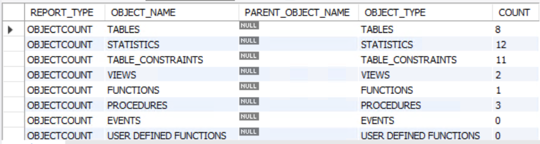

-   The target instance procedure result should resemble the image below
    after completing the migration.

    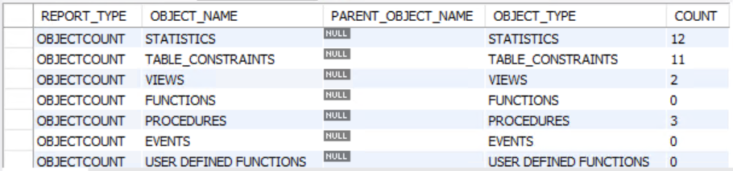

## Execute migration

With the basic migration components in place, it is now possible to
proceed with the data migration. There were several tools and methods
introduced previously. For WWI, they are going to utilize the Redis
pgAdmin path to export the data and then import it into Azure instance
for Redis. We present several different methods to do so:

-   [Backup and Restore](./01.01_DataMigration_BackupRestore.md)
-   [Copy command](./01.02_DataMigration_Copy.md)
-   [Azure Data Factory (ADF)](./01.03_DataMigration_ADF.md)
-   [Azure instance Migration Service
    (DMS)](./01.04_DataMigration_DMS.md)
-   [Logical Replication](./01.05_DataMigration_LogicalReplication.md)
-   [Logical Decoding](./01.06_DataMigration_LogicalDecoding.md)

Once you have migrated the content, you must then follow up with migrate
your application settings to point to the new instance:

-   [Migrate Application Settings](./02_DataMigration_AppSettings.md)

## Data Migration Checklist

-   Understand the complexity of the environment and if an online
    approach is feasible.
-   Account for data drift. Stopping the instance service can eliminate
    potential data drift.
-   Configure source parameters for fast export.
-   Configure target parameters for fast import.
-   Test any migrations that have a different source version vs the
    target.
-   Migrate any non-data based objects such as user names and
    privileges.
-   Disable foreign keys and triggers before the import, re-enable after
    the import
-   Update application settings to point to the new instance
-   Make sure all tasks are documented and checked off as the migration
    is executed.

# Data Migration - Schema

## Schema Migration

Most tools will required the target to already have the source schema
deployed. This document provides the steps to export and import the
schema.

### Export the schema

-   Open Redis pgAdmin and connect as the local instance's root
    user.
-   Expand the **instances** node
-   Select the **reg\_app** instance.
-   In the application menu, select **Tools-\>Backup**
-   For the file name, type `C:\temp\reg_app_schema.sql`).
-   For the format, select **Plain**
-   For the encoding, select **UTF8**
-   Select the **Dump option** tab
-   Toggle the following options
    -   **Only schema** option to **Yes**
    -   All other options should be **No**
-   Select **Backup**
-   In Redis pgAdmin, create a new connection to the Azure instance
    for Redis.
    -   For Hostname, enter the full server DNS (ex:
        `servername.Redis.instance.azure.com`).

    -   Enter the username (ex: `sqlroot@servername`).

    -   Select the **SSL** tab.

    -   For the SSL CA File, browse to the
        **BaltimoreCyberTrustRoot.crt.cer** key file.

    -   Select **Test Connection**, ensure the connection completes.

    -   Select **OK**.

        
-   Expand the **instances** node
-   Right-click the **instances** node, select **Create-\>instance**
-   For the name, type **reg\_app**
-   Select **Save**
-   Right-click the new **reg\_app** instance, select **Query Tool**
-   Browse to the `c:\temp\reg_app_schema.sql` script
-   Press **F5** to run the script, you will received some errors

### Export Users and Roles

The first error you should encounter will be with users and roles. We
must export those from the source and import into the target. On the
source system, perform the following:

-   Run the following query

``` {.sql}
SELECT 'CREATE ROLE ' || usename || ' WITH LOGIN PASSWORD ''Seattle123Seattle123';'' as cmd
FROM pg_catalog.pg_user
```

-   Take the output from the last command and run it in the Azure
    instance for Redis command window
-   Additionally, you would need to assign the server level roles

``` {.sql}
SELECT 
	'ALTER USER ' || usename || ' ' ||
  CASE 
     WHEN usesuper AND usecreatedb THEN 
	   CAST('superuser CREATEDB' AS pg_catalog.text)
     WHEN usesuper THEN 
	    CAST('superuser' AS pg_catalog.text)
     WHEN usecreatedb THEN 
	    CAST('CREATEDB' AS pg_catalog.text)
     ELSE 
	    CAST('' AS pg_catalog.text)
  END || ';' as cmd
FROM pg_catalog.pg_user
```

-   Take the output from the last command and run it in the Azure
    instance for Redis command window

> **Note** The superuser role can't be assigned in Azure instance for
> Redis.

### Removing unsupported features

-   Run the script again, you should again, get some errors. Remove the
    unsupported features until the script runs successfully. Some hints:

-   Remove the addition of procedual languages (`plperl`)

-   Remove the addition of the unsuported extensions (`plpython3u`,
    `file_fdw`)

-   Remove objects that use the above items (`perl_max`, `pymax`)

-   Remove other objects (**CAST with reference to pymax**)

For some Azure Cache for Redis service types, you will need to
remove the following:

-   All `CREATE TEXT SEARCH` items

### Remove Keys and Triggers

-   Run the following to remove foreign keys:

``` {.sql}
SELECT Queries.tablename
       ,concat('alter table ', Queries.tablename, ' ', STRING_AGG(concat('DROP CONSTRAINT ', Queries.foreignkey), ',')) as DropQuery
            ,concat('alter table ', Queries.tablename, ' ',
                                            STRING_AGG(concat('ADD CONSTRAINT ', Queries.foreignkey, ' FOREIGN KEY (', column_name, ')', 'REFERENCES ', foreign_table_name, '(', foreign_column_name, ')' ), ',')) as AddQuery
    FROM
    (SELECT
    tc.table_schema,
    tc.constraint_name as foreignkey,
    tc.table_name as tableName,
    kcu.column_name,
    ccu.table_schema AS foreign_table_schema,
    ccu.table_name AS foreign_table_name,
    ccu.column_name AS foreign_column_name
FROM
    information_schema.table_constraints AS tc
    JOIN information_schema.key_column_usage AS kcu
      ON tc.constraint_name = kcu.constraint_name
      AND tc.table_schema = kcu.table_schema
    JOIN information_schema.constraint_column_usage AS ccu
      ON ccu.constraint_name = tc.constraint_name
      AND ccu.table_schema = tc.table_schema
WHERE constraint_type = 'FOREIGN KEY') Queries
  GROUP BY Queries.tablename;
```

-   Take the output from the last command with the column `DropQuery`
    and run it in the same command window
-   Save the `AddQuery` sql for later
-   Run the following to generate the SQL necessary to disable any
    triggers:

``` {.sql}
select concat ('alter table ', event_object_table, ' disable trigger ', trigger_name)
from information_schema.triggers;
```

-   Take the output from the last command and run it in the Azure
    instance for Redis command window

You have successfully completed the migration of the `supported` source
schema.

# Data Migration - Server Parameters - Egress

## Configure Server Parameters

TODO \# Data Migration - Server Parameters - Ingress

## Configure Server Parameters

TODO \# Data Migration - Application Settings

## Setup

Follow all the steps in the [Setup](./../05_Appendix/00_Setup.md) guide
to create an environment to support the following steps.

## Update Applications to support SSL

-   Switch to the Java Server API (conferencedemo) in Visual Studio
    code.
-   Open the **launch.json** file.
-   Update the **DB\_CONNECTION\_URL** to
    `jdbc:Redis://servername:5432/reg_app?useUnicode=true&useJDBCCompliantTimezoneShift=true&useLegacyDatetimeCode=false&serverTimezone=UTC&verifyServerCertificate=true&useSSL=true&requireSSL=true&noAccessToProcedureBodies=true`.
    Note the additional SSL parameters.
-   Update **DB\_USER\_NAME** to **conferenceuser\@servername**.
-   Start the debug configuration, and ensure that the application works
    locally with the new instance.

## Change Connection String for the Java API

-   Use the following commands to change the connection string for the
    App Service Java API

``` {.powershell}
$rgName = "{RESOURCE_GROUP_NAME}";
$app_name = "{SERVER_NAME}";
az webapp config appsettings set -g $rgName -n $app_name --settings DB_CONNECTION_URL={DB_CONNECTION_URL}
```

> **Note:** Remember that you can use the Portal to set the connection
> string.

-   Restart the App Service API

``` {.powershell}
az webapp restart -g $rgName -n $app_name
```

You have successfully completed an on-premises to Azure instance for
Redis migration!

# Post Migration Management

## Monitoring and Alerts

Once the migration has been successfully completed, the next phase it to
manage the new cloud-based data workload resources. Management
operations include both control plane and data plane activities. Control
plane activities are those related to the Azure resources versus data
plane which is **inside** the Azure resource (in this case Redis).

Azure Cache for Redis provides for the ability to monitor both
of these types of operational activities using Azure-based tools such as
[Azure
Monitor](https://docs.microsoft.com/en-us/azure/azure-monitor/overview),
[Log
Analytics](https://docs.microsoft.com/en-us/azure/azure-monitor/platform/design-logs-deployment)
and [Azure
Sentinel](https://docs.microsoft.com/en-us/azure/sentinel/overview). In
addition to the Azure-based tools, security information and event
management (SIEM) systems can be configured to consume these logs as
well.

Whichever tool is used to monitor the new cloud-based workloads, alerts
will need to be created to warn Azure and instance administrators of any
suspicious activity. If a particular alert event has a well-defined
remediation path, alerts can fire automated [Azure run
books](https://docs.microsoft.com/en-us/azure/automation/automation-quickstart-create-runbook)
to address the event.

The first step to creating a fully monitored environment is to enable
Redis log data to flow into Azure Monitor. Reference [Configure and
access audit logs for Azure Cache for Redis in the Azure
portal](https://docs.microsoft.com/en-us/azure/Redis/howto-configure-audit-logs-portal)
for more information.

Once log data is flowing, use the [Kusto Query Language
(KQL)](https://docs.microsoft.com/en-us/azure/data-explorer/kusto/query/)
query language to query the various log information. Administrators
unfamiliar with KQL can find a SQL to KQL cheat sheet
[here](https://docs.microsoft.com/en-us/azure/data-explorer/kusto/query/sqlcheatsheet)
or the [Get started with log queries in Azure
Monitor](https://docs.microsoft.com/en-us/azure/azure-monitor/log-query/get-started-queries)
page.

For example, to get the memory usage of the Azure instance for
Redis:

``` {.kql}
AzureMetrics
| where TimeGenerated > ago(15m)
| limit 10
| where ResourceProvider == "MICROSOFT.DBFORRedis"
| where MetricName == "memory_percent"
| project TimeGenerated, Total, Maximum, Minimum, TimeGrain, UnitName
| top 1 by TimeGenerated
```

To get the CPU usage:

``` {.kql}
AzureMetrics
| where TimeGenerated > ago(15m)
| limit 10
| where ResourceProvider == "MICROSOFT.DBFORRedis"
| where MetricName == "cpu_percent"
| project TimeGenerated, Total, Maximum, Minimum, TimeGrain, UnitName
| top 1 by TimeGenerated
```

> **Note** for a list of other metrics you can query, reference [Monitor
> and tune Azure Cache for Redis - Single
> Server](https://docs.microsoft.com/en-us/azure/Redis/concepts-monitoring).

Once you have created the KQL query, you will then create [log
alerts](https://docs.microsoft.com/en-us/azure/azure-monitor/platform/alerts-unified-log)
based of these queries.

## Server Parameters

As part of the migration, it is likely the on-premises [server
parameters](https://docs.microsoft.com/en-us/azure/Redis/concepts-server-parameters)
were modified to support a fast egress. Also, modifications were made to
the Azure Cache for Redis parameters to support a fast ingress.
The Azure server parameters should be set back to their original
on-premises workload optimized values after the migration.

However, be sure to review and make server parameters changes that are
appropriate for the workload and the environment. Some values that were
great for an on-premises environment, may not be optimal for a
cloud-based environment. Additionally, when planning to migrate the
current on-premises parameters to Azure, verify that they can in fact be
set.

Some parameters are not allowed to be modified in Azure instance for
Redis.

## PowerShell Module

The Azure Portal and Windows PowerShell can be used for managing the
Azure Cache for Redis. To get started with PowerShell, install
the Azure PowerShell cmdlets for Redis with the following
PowerShell command:

``` {.powershell}
Install-Module -Name Az.Redis
```

After the modules are installed, reference tutorials and documentation
like the following to learn ways you can take advantage of scripting
your management activities:

-   [Tutorial: Design an Azure Cache for Redis using
    PowerShell](https://docs.microsoft.com/en-us/azure/Redis/tutorial-design-instance-using-powershell)
-   [Restore an Azure Cache for Redis server using
    PowerShell](https://docs.microsoft.com/en-us/powershell/module/az.Redis/restore-azRedisserver?view=azps-5.8.0)
-   [Configure server parameters in Azure Cache for Redis using
    PowerShell](https://docs.microsoft.com/en-us/powershell/module/az.Redis/update-azRedisconfiguration?view=azps-5.8.0)
-   [How to create and manage read replicas in Azure instance for
    Redis using
    PowerShell](https://docs.microsoft.com/en-us/powershell/module/az.Redis/new-azRedisreplica?view=azps-5.8.0)
-   [Restart Azure Cache for Redis server using
    PowerShell](https://docs.microsoft.com/en-us/powershell/module/az.Redis/restart-azRedisserver?view=azps-5.8.0)

## Azure Cache for Redis Upgrade Process

Since Azure Cache for Redis is a PaaS offering, administrators
are not responsible for the management of the updates on the operating
system or the Redis software. However, it is important to be aware
the upgrade process can be random and when being deployed, will stop the
Redis server workloads. Plan for these downtimes by rerouting the
workloads to a read replica in the event the particular instance goes
into maintenance mode.

> **Note:** This style of failover architecture may require changes to
> the applications data layer to support this type of failover scenario.
> If the read replica is maintained as a read replica and is not
> promoted, the application will only be able to read data and it may
> fail when any operation attempts to write information to the instance.

The [Planned maintenance
notification](https://docs.microsoft.com/en-us/azure/Redis/concepts-planned-maintenance-notification)
feature will inform resource owners up to 72 hours in advance of
installation of an update or critical security patch. instance
administrators may need to notify application users of planned and
unplanned maintenance.

> **Note:** Azure Cache for Redis maintenance notifications are
> incredibly important. The instance maintenance can take your instance
> and connected applications down for a period of time.

## WWI Use Case

WWI decided to utilize the Azure Activity logs and enable Redis
logging to flow to a [Log Analytics
workspace](https://docs.microsoft.com/en-us/azure/azure-monitor/platform/design-logs-deployment).
This workspace is configured to be a part of [Azure
Sentinel](https://docs.microsoft.com/en-us/azure/sentinel/) such that
any [Threat
Analytics](https://docs.microsoft.com/en-us/azure/Redis/concepts-data-access-and-security-threat-protection)
events would be surfaced, and incidents created.

## Management Checklist

-   Create resource alerts for common things like CPU and Memory.
-   Ensure the server parameters are configured for the target data
    workload after migration.
-   Script common administrative tasks.
-   Set up notifications for maintenance events such as upgrades and
    patches. Notify users as necessary.

# Optimization

## Monitoring Hardware and Query Performance

In addition to the audit and activity logs, server performance can also
be monitored with [Azure
Metrics](https://docs.microsoft.com/en-us/azure/azure-monitor/platform/data-platform-metrics).
Azure metrics are provided in a one-minute frequency and alerts can be
configured from them. For more information, reference [Monitoring in
Azure instance for
Redis](https://docs.microsoft.com/en-us/azure/Redis/concepts-monitoring)
for specifics on what kind of metrics that can be monitored.

As previously mentioned, monitoring metrics such as the `cpu_percent` or
`memory_percent` can be important when deciding to upgrade the instance
tier. Consistently high values could indicate a tier upgrade is
necessary.

Additionally, if cpu and memory do not seem to be the issue,
administrators can explore instance-based options such as indexing and
query modifications for poor performing queries.

To find poor performing queries, run the following:

``` {.kql}
AzureDiagnostics
| where ResourceProvider == "MICROSOFT.DBFORRedis"
| where Category == 'RedisSlowLogs'
| project TimeGenerated, LogicalServerName_s, event_class_s, start_time_t , query_time_d, sql_text_s
| top 5 by query_time_d desc
```

## Query Performance Insight

In addition to the basic server monitoring aspects, Azure provides tools
to monitor application query performance. Correcting or improving
queries can lead to significant increases in the query throughput. Use
the [Query Performance Insight
tool](https://docs.microsoft.com/en-us/azure/Redis/concepts-query-performance-insight)
to analyze the longest running queries and determine if it is possible
to cache those items if they are deterministic within a set period, or
modify the queries to increase their performance.

The `slow_query_log` can be set to show slow queries in the Redis
log files (default is OFF). The `long_query_time` server parameter can
alert users for long query times (default is 10 sec).

## Query Store

The [Query
Store](https://docs.microsoft.com/en-us/azure/Redis/concepts-query-store)
feature in Azure Cache for Redis provides a way to track query
performance over time. Query Store simplifies performance
troubleshooting by helping you quickly find the longest running and most
resource-intensive queries.

Query Store is not enabled by default and must be turned on via the
`query_capture_mode` server parameter. Once enabled, you would query the
`query_store.qs_view` table in the `azure_sys` instance for runtime
execution statistics.

## Performance Recommendations

The [Performance
Recommendations](https://docs.microsoft.com/en-us/azure/Redis/concepts-performance-recommendations)
feature analyzes workloads across your server to identify indexes with
the potential to improve performance. The tool requires the Query Store
feature to be enabled. Once enabled, you must manually review and
implement any suggestions.

## Azure Advisor

[Azure
Advisor](https://docs.microsoft.com/en-us/azure/Redis/concepts-azure-advisor-recommendations)
will provide recommendations around Azure Cache for Redis
Performance, Reliability and Cost. For example, Azure Advisor could
present a recommendation to modify a server parameter based on the
workloads and instance pricing tier and available scaling settings.

## Upgrading the Tier

The Azure Portal can be used to scale between from `General Purpose` and
`Memory Optimized`. If a `Basic` tier is chosen, there will be no option
to upgrade the tier to `General Purpose` or `Memory Optimized` later.
However, it is possible to utilize other techniques to perform a
migration/upgrade to a new Azure Cache for Redis instance.

For an example of a script that will migrate from Basic to another
server tier, reference [Upgrade from Basic to General Purpose or Memory
Optimized tiers in Azure instance for
Redis](https://techcommunity.microsoft.com/t5/azure-instance-for-Redis/upgrade-from-basic-to-general-purpose-or-memory-optimized-tiers/ba-p/690976).

## Scale the Server

Within the tier, it is possible to scale cores and memory to the minimum
and maximum limits allowed in that tier. If monitoring shows a continual
maxing out of CPU or memory, follow the steps to [Manage an Azure
instance for Redis server using Azure
Portal](https://docs.microsoft.com/en-us/azure/Redis/howto-create-manage-server-portal).

## Moving Regions

Moving a instance to a different Azure region depends on the approach
and architecture. Depending on the approach, it could cause system
downtime.

The recommended process is the same as utilizing read replicas for
maintenance failover. However, compared to the planned maintenance
method mentioned above, the speed to failover is much faster when a
failover layer has been implemented in the application. The application
should only be down for a few moments during the read replica failover
process. More details are covered in the [Business Continuity and
Disaster Recovery](03_BCDR.md) section.

## WWI Use Case

WWI business and application users expressed a high level of excitement
regarding the ability to scale the instance on-demand. They were also
interested in using the Query Performance Insight to determine if long
running queries performance needed to be addressed.

They opted to utilize a read replica server for any potential failover
or read-only needed scenarios.

The migration team, working with the Azure engineers, set up KQL queries
to monitor for any potential issues with the Redis server
performance. The KQY queries were set up with alerts to email event
issues to the instance and conference team.

They elected to monitor any potential issues for now and implement Azure
Automation run books at a later time, if needed, to improve operational
efficiency.

## Optimization Checklist

-   Enable Query Store
-   Monitor for slow queries.
-   Periodically review the Performance and Azure Advisor
    recommendations.
-   Utilize monitoring to drive tier upgrades and scale decisions.
-   Consider moving regions if the users or application needs change.

# Business Continuity and Disaster Recovery (BCDR)

## Backup and Restore

As with any mission critical system, having a backup and restore as well
as a disaster recovery (BCDR) strategy is an important part of your
overall system design. If an unforseen event occurs, you should have the
ability to restore your data to a point in time (Recovery Point
Objective) and in a reasonable amount of time (Recovery Time Objective).

### Backup

Azure Cache for Redis supports automatic backups for 7 days by
default. It may be appropriate to modify this to the current maximum of
35 days. It is important to be aware that if the value is changed to 35
days, there will be charges for any extra backup storage over 1x of the
storage allocated.

There are several limitations to the instance backup features as
described in each of the backup articles for each service type. It is
important to understand them when deciding what additional strategies
that should be implemented:

-   [Backup and restore in Azure Cache for Redis - Single
    Server](https://docs.microsoft.com/en-us/azure/Redis/concepts-backup)
-   [Backup and restore in Azure Cache for Redis - Flexible
    Server](https://docs.microsoft.com/en-us/azure/Redis/flexible-server/concepts-backup-restore)
-   [Backup and restore in Azure Cache for Redis - Hyperscale
    (Citus)](https://docs.microsoft.com/en-us/azure/Redis/concepts-hyperscale-backup)

Commonality of the backup architectures include:

-   Up to 35 days of backup protection
-   No direct access to the backups (no exports).

Some items to be aware of include:

-   Tiers that allow up to 4TB will retain two full backups, all diff
    backups and transaction logs since last full backup every 7 days.
-   Tiers that allow up to 16TB will retain the full backup, all diff
    backups, and transaction logs in the last 8 days.

> **Note:** [Some
> regions](https://docs.microsoft.com/en-us/azure/Redis/concepts-pricing-tiers#storage)
> do not yet support storage up to 16TB.

### Restore

Redundancy (local or geo) must be configured during server creation.
However, a geo-restore can be performed and allows the modification of
these options during the restore process. Performing a restore operation
will temporarily stop connectivity and any applications will be down
during the restore process.

During a instance restore, any supporting items outside of the instance
will also need to be restored. See [Perform post-restore
tasks](https://docs.microsoft.com/en-us/azure/Redis/concepts-backup#perform-post-restore-tasks)
for more information.

## Replicas

### Read Replicas (Single Server)

[Read
replicas](https://docs.microsoft.com/en-us/azure/Redis/concepts-read-replicas)
can be used to increase the Redis read throughput, improve
performance for regional users and to implement disaster recovery. When
creating one or more read replicas, be aware that additional charges
will apply for the same compute and storage as the primary server.

### Standby Replicas (Flexible Server)

When deployed in a zone redundant configuration, flexible server
automatically provisions and manages a standby replica in a different
availability zone. Using Redis streaming replication, the data is
replicated to the standby replica server in synchronous mode.

> **Note** Availability zones are within the same region. If an entire
> region were to go down, you would need to have a secondary BCDR
> strategy implemented in order to recover quickly from the regional
> failure. At this time (4/2021), cross-region read replica and
> geo-restore of backup features are not yet supported in preview.

### Read Replicas (Hyperscale (Citus))

The read replica feature allows you to replicate data from a Hyperscale
(Citus) server group to a read-only server group. Replicas are updated
asynchronously with Redis physical replication technology. You can
replicate from the primary server to an unlimited number of replicas.

> **Note** Read replicas are in preview as of 4/2021.

## Deleted Servers

If an administrator or bad actor deletes the server in the Azure Portal
or via automated methods, all backups and read replicas will also be
deleted. It is important that [resource
locks](https://docs.microsoft.com/en-us/azure/azure-resource-manager/management/lock-resources)
are created on the Azure Cache for Redis resource group to add
an extra layer of deletion prevention to the instances.

## Regional Failure

Although rare, if a regional failure occurs geo-redundant backups or a
read replica can be used to get the data workloads running again. It is
best to have both geo-replication and a read replica available for the
best protection against unexpected regional failures.

> **Note** Changing the instance server region also means the endpoint
> will change and application configurations will need to be updated
> accordingly.

### Load Balancers

If the application is made up of many different instances around the
world, it may not be feasible to update all of the clients. Utilize an
[Azure Load
Balancer](https://docs.microsoft.com/en-us/azure/load-balancer/load-balancer-overview)
or [Application
Gateway](https://docs.microsoft.com/en-us/azure/application-gateway/overview)
to implement a seamless failover functionality. Although helpful and
time-saving, these tools are not required for regional failover
capability.

## WWI Use Case

WWI wanted to test the failover capabilities of read replicas so they
performed the steps outlined below.

### Creating a read replica (Single Server)

-   Open the Azure Portal.
-   Browse to the Azure Cache for Redis instance.
-   Under **Settings**, select **Replication**.
-   Select **Add Replica**.
-   Type a server name.
-   Select the region.
-   Select **OK**, wait for the instance to deploy. Depending on the
    size of the main instance, it could take some time to replicate.

> **Note:** Each replica will incur additional charges equal to the main
> instance.

### Failover to read replica (Single Server)

Once a read replica has been created and has completed the replication
process, it can be used for failed over. Replication will stop during a
failover and make the read replica its own main instance.

Failover Steps:

-   Open the Azure Portal.
-   Browse to the Azure Cache for Redis instance.
-   Under **Settings**, select **Replication**.
-   Select one of the read replicas.
-   Select **Stop Replication**. This will break the read replica.
-   Modify all applications connection strings to point to the new main
    instance.

## BCDR Checklist

-   Modify backup frequency to meet requirements.
-   Setup read replicas for read intensive workloads and regional
    failover.
-   Create resource locks on resource groups.
-   Implement a load balancing strategy for applications for quick
    failover.

# Security

Moving to a cloud-based service doesn't mean the entire internet will
have access to it at all times. Azure provides best in class security
that ensures data workloads are continually protected from bad actors
and rouge programs.

## Authentication

Azure Cache for Redis supports the basic authentication
mechanisms for Redis user connectivity, but also supports
[integration with Azure Active
Directory](https://docs.microsoft.com/en-us/azure/Redis/concepts-aad-authentication).
This security integration works by issuing tokens that act like
passwords during the Redis login process. [Configuring Active
Directory
integration](https://docs.microsoft.com/en-us/azure/Redis/howto-configure-sign-in-azure-ad-authentication)
is incredibly simple to do and supports not only users, but AAD groups
as well.

This tight integration allows administrators and applications to take
advantage of the enhanced security features of [Azure Identity
Protection](https://docs.microsoft.com/en-us/azure/active-directory/identity-protection/overview-identity-protection)
to further surface any identity issues.

> **Note:** Be sure to test your application with Azure AD
> Authentication. See [Use Azure Active Directory for authentication
> with
> Redis](https://docs.microsoft.com/en-us/azure/Redis/howto-configure-sign-in-aad-authentication)
> for more information.

## Threat Protection

In the event that user or application credentials are compromised, logs
are not likely to reflect any failed login attempts. Compromised
credentials can allow bad actors to access and download the data. [Azure
Threat
Protection](https://docs.microsoft.com/en-us/azure/Redis/howto-instance-threat-protection-portal)
can watch for anomalies in logins (such as unusual locations, rare users
or brute force attacks) and other suspicious activities. Administrators
can be notified in the event something does not `look` right.

## Audit Logging

Redis has a robust built-in logging feature. By default, this [log
feature is
disabled](https://docs.microsoft.com/en-us/azure/Redis/concepts-server-logs)
in Azure Cache for Redis. Server level logging can be enabled or
modified by changing various server parameters. Once enabled, logs can
be accessed through [Azure
Monitor](https://docs.microsoft.com/en-us/azure/azure-monitor/overview)
and [Log
Analytics](https://docs.microsoft.com/en-us/azure/azure-monitor/platform/design-logs-deployment)
by turning on [diagnostic
logging](https://docs.microsoft.com/en-us/azure/Redis/howto-configure-audit-logs-portal#set-up-diagnostic-logs).

To query for log related events, run the following KQL query:

``` {.kql}
AzureDiagnostics
| where LogicalServerName_s == "myservername"
| where Category == "RedisLogs"
| where TimeGenerated > ago(1d) 
```

In addition to the basic logging feature, you can also gain access to
more in-depth [audit logging
information](https://docs.microsoft.com/en-us/azure/Redis/concepts-audit)
that is provided with the `pgaudit` extension.

``` {.kql}
AzureDiagnostics
| where LogicalServerName_s == "myservername"
| where TimeGenerated > ago(1d) 
| where Message contains "AUDIT:"
```

## Encryption

Data in the Redis instance is encrypted at rest by default. Any
automated backups are also encrypted to prevent potential leakage of
data to unauthorized parties. This encryption is typically performed
with a key that is created when the instance is created. In addition to
this default encryption key, administrators have the option to [bring
your own key
(BYOK)](https://docs.microsoft.com/en-us/azure/Redis/concepts-data-encryption-Redis).

When using a customer-managed key strategy, it is vital to understand
responsibilities around key lifecycle management. Customer keys are
stored in an [Azure Key
Vault](https://docs.microsoft.com/en-us/azure/key-vault/general/basic-concepts)
and then accessed via policies. It is vital to follow all
recommendations for key management as the loss of the encryption key
equates to the loss of data access.

In addition to a customer-managed keys, use service-level keys to [add
double
encryption](https://docs.microsoft.com/en-us/azure/Redis/concepts-infrastructure-double-encryption).
Implementing this feature will provide highly encrypted data at rest,
but it does come with encryption performance penalties. Testing should
be performed.

Data can be encrypted during transit using SSL/TLS. As previously
discussed, it may be necessary to [modify your
applications](https://docs.microsoft.com/en-us/azure/Redis/concepts-ssl-connection-security)
to support this change and also configure the appropriate TLS validation
settings.

## Firewall

Once users are set up and the data is encrypted at rest, the migration
team should review the network data flows. Azure Cache for Redis
provides several mechanisms to secure the networking layers by limiting
access to only authorized users, applications and devices.

The first line of defense for protecting the Redis instance is to
implement [firewall
rules](https://docs.microsoft.com/en-us/azure/Redis/concepts-firewall-rules).
IP addresses can be limited to only valid locations when accessing the
instance via internal or external IPs. If the Redis instance is
destined to only serve internal applications, then [restrict public
access](https://docs.microsoft.com/en-us/azure/Redis/concepts-data-access-and-security-private-link#deny-public-access-for-azure-instance-for-Redis-single-server).

When moving an application to Azure along with the Redis workload,
it is likely there will be multiple virtual networks setup in a hub and
spoke pattern that will require [Virtual Network
Peering](https://docs.microsoft.com/en-us/azure/virtual-network/virtual-network-peering-overview)
to be configured.

## Private Link

To limit access to the Azure Cache for Redis to internal Azure
resources, enable [Private
Link](https://docs.microsoft.com/en-us/azure/Redis/concepts-data-access-and-security-private-link).
Private Link will ensure that the Redis instance will be assigned a
private IP rather than a public IP address.

> **Note** Not all Azure Cache for Redis services support
> private link (4/2021).

> **Note** There are many other [basic Azure Networking
> considerations](https://docs.microsoft.com/en-us/azure/Redis/concepts-data-access-and-security-vnet)
> that must be taken into account that are not the focus of this guide.

## Security baseline

Review a set of potential [security
baseline](https://docs.microsoft.com/en-us/azure/Redis/security-baseline)
tasks that can be implemented across all Azure resources. Not all of the
items described on the reference link will apply to the specific data
workloads or Azure resources.

## Security Checklist

-   Use Azure AD authentication where possible.
-   Enable Advanced Thread Protection.
-   Enable all auditing features.
-   Consider a Bring-Your-Own-Key (BYOK) strategy.
-   Implement firewall rules.
-   Utilize private endpoints for workloads that do not travel over the
    Internet.

# Summary

This document has covered several topics related to migrating an
application from on-premises Redis to Azure instance for
Redis. We covered how to begin and assess the project all the way
to application cut over.

The migration team will need to review the topics carefully as the
choices made can have project timeline effects. The total cost of
ownership is very attractive given the many enterprise ready features
provided.

The migration project approach is very important. The team will need to
assess the application and instance complexity to determine the amount
of conversion time. Conversion tools will help make the transition
easier, but there will always be an element of manual review and updates
required. Scripting out pre-migration tasks and post migration testing
is important.

Application architecture and design can provide strong indicators as to
the level of effort required. For example, applications utilizing ORM
frameworks can be great candidates, especially if the business logic is
contained in the application instead of instance objects.

In the end, several tools exist in the marketplace ranging from free to
commercial. This document covered the steps required if the team plans a
instance migration using one of the more popular open source tool
options. Whichever path that is chosen, Microsoft and the Redis
community have the tools and expertise to make the instance migration
successful.

## Questions and Feedback

For any questions or suggestions about working with Azure instance for
Redis, send an email to the Azure Cache for Redis Team
(AskAzureDBforRedis\@service.microsoft.com). Please note that this
address is for general questions rather than support tickets.

In addition, consider these points of contact as appropriate:

-   To contact Azure Support or fix an issue with your account, [file a
    ticket from the Azure
    portal](https://portal.azure.com/#blade/Microsoft_Azure_Support/HelpAndSupportBlade/overview).
-   To provide feedback or to request new features, create an entry via
    [UserVoice](https://feedback.azure.com/forums/597982-azure-instance-for-Redis).

## Find a partner to assist in migrating

This guide can be overwhelming, but don't fret! There are many experts
in the community with a proven migration track record. [Search for a
Microsoft Partner](https://www.microsoft.com/solution-providers/home) or
[Microsoft MVP](https://mvp.microsoft.com/MvpSearch) to help with
finding the most appropriate migration strategy. You are not alone!

You can also browse the technical forums and social groups for more
detailed real-world information:

-   [Microsoft Community
    Forum](https://docs.microsoft.com/en-us/answers/topics/azure-instance-Redis.html)
-   [StackOverflow for Azure
    Redis](https://stackoverflow.com/tags/Azure-instance-Redis)
-   [Azure Facebook Group](https://www.facebook.com/groups/MsftAzure)
-   [LinkedIn Azure Group](https://www.linkedin.com/groups/2733961/)
-   [LinkedIn Azure Developers
    Group](https://www.linkedin.com/groups/1731317/)

# Appendix A: Environment Setup

The following steps will configure an environment to perform the guide's
migration steps.

## Deploy the ARM template

-   Open the Azure Portal

-   Create a new resource group

-   Select **+Add**, type **template**, select the **Template
    Deployment...**

    

-   Select **Create**

-   Select **Build your own template in the editor**

    

-   Choose between the `secure` or the `non-secure` ARM template. The
    difference between the two options is the secured option's resources
    are hidden behind an App Gateway with private endpoints, whereas the
    other is directly exposed to the internet.

-   Copy the json into the window

-   Select **Save**

    

-   Fill in the parameters

    -   Be sure to record your prefix and password, they are needed
        later

-   Select **Review + create**

-   Select the **I agree...** checkbox

-   Select **Create**, after about 20 minutes the landing zone will be
    deployed

## Open the Azure VM Ports

-   Browse to the Azure Portal.
-   Select the **PREFIX-vm-pgdb01** virtual machine resource.
-   Under **Settings**, select **Networking**
-   In the **Inbound port rules** area, select **Add inbound port rule**
-   For the **Destination port ranges**, type **5432**
-   For the name, type **Port\_5432**
-   Select **Add**

## Connect to the Azure VM

-   Browse to the Azure Portal.
-   Select the **PREFIX-vm-pgdb01** virtual machine resource.
-   Select **Connect-\>RDP**
-   Login using `s2admin` and `Seattle123Seattle123`

## Install ActivePerl 5.26 (Redis 10.16)

-   Browse to https://www.activestate.com/products/perl/downloads/
-   Download the ActivePerl 5.26 installer
-   Start the installer and click through the installer dialogs

## Install Python 3.7.4 (Redis 10.16)

The version of Redis (in this case 10.16) you install will target
different python versions. If you do not download the correctly linked
Python version, you will not be able to enable the Python language
later. Browse
[here](https://www.python.org/downloads/release/python-374/) to locate
the installer.

## Setup Java and Maven

-   Download and Install [Java Development Kit
    11.0](https://www.oracle.com/java/technologies/javase-jdk11-downloads.html)

> **Note:** Be sure to check what the highest SDK/JRE that is supported
> in Azure App Service before downloading the latest.

-   Set the `JAVA_HOME` environment variable to the
    **C:`\Program `{=tex}Files`\Java`{=tex}`\jdk`{=tex}-{version}**
    folder
    -   Open the **Environment Variables** dialog box again (refer
        [here](#Install-Redis-5.5) for more details)

    -   Select **New** under **System variables**

    -   Type **JAVA\_HOME**

    -   Copy the path shown below, then select **OK.** The image below
        shows the correct configuration for the **JAVA\_HOME**
        environment variable.

        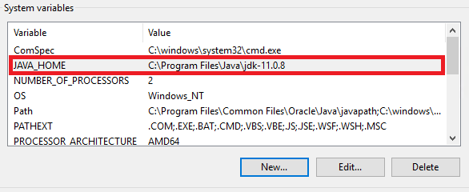
-   Download and install the Java Runtime
-   Download and configure
    [Maven](https://maven.apache.org/download.cgi)
    -   Download the binary zip archive
    -   From the download location, right-click the zip archive and
        select **Extract All...**
    -   Set the destination to **C:`\Program `{=tex}Files**. Then,
        select **Extract**
    -   Set the `M2_HOME` environment variable to the
        **C:`\Program `{=tex}Files`\apache`{=tex}-maven-{version}**
        folder
    -   Add the
        \*\*C:`\Program `{=tex}Files`\apache`{=tex}-maven-{version}`\bin*`{=tex}\*
        path to the `PATH` environment variable

## Install Redis 10.0

-   Login to the deployed Dev VM
    -   Browse to the Azure Portal

    -   Select the VM

    -   Copy the **Public IP Address**

        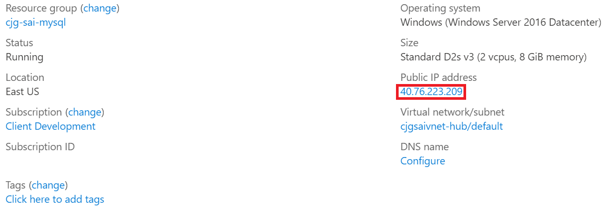

    -   Open Remote Desktop and connect to the VM IP Address

    -   Login using the username and password entered above
-   Download the following [Redis
    versions](https://www.Redis.org/download/windows/)
    -   Redis 10.0
    -   Redis 11.0
-   Install Redis 10.0
    -   Start the Redis 10.0 installer you just downloaded
    -   Select **Run**
    -   On the Welcome dialog, select **Next**
    -   On the installation directory dialog, select **Next**
    -   On the select components dialog, select **Next**
    -   On the data directory dialog, select **Next**
    -   For the password, type `Seattle123`, then select **Next**
    -   For the port, select **Next**

    > *Note* the default port is 5432, if you have changed this port,
    > you will need to ensure that you open the necessary paths in the
    > firewall and gateways from Azure to your
    > on-premises`\cloud `{=tex}environment.

    -   Select your locale, select **Next**
    -   On the summary dialog, select **Next**
    -   On the ready dialog, select **Next**, Redis will start the
        installation process
    -   Select **Finish**
-   Run StackBuilder
    -   Select the local instance, then select **Next**
    -   Select the following applications, then select **Next**
        -   pgBouncer v1.x (expand **Add-ons, tools and utilities**)
        -   psqlODBC (64bit) v13x (expand **instance Drivers**)
        -   Migration Toolkit v54.x (expand **Registration-required and
            trial products \> EnterpriseDB Tools**)
        -   Replication Server v6.x (also an EnterpriseDB tool)
    -   For the download directory dialog, select **Next**. The
        applications will download.
    -   Install all the applications by clicking through the dialogs
-   Add the
    \*\*C:`\Program `{=tex}Files`\Redis`{=tex}\\10`\bin*`{=tex}\*
    path to the `PATH` environment variable
    -   Open Windows Explorer

    -   Right-click **This PC**, select **Properties** and then
        **Advanced system settings**

    -   Select **Environment Variables**

        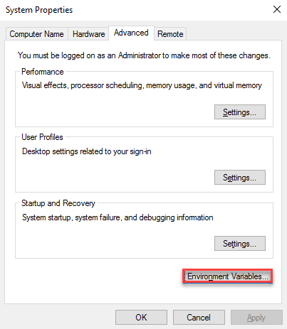

    -   Under **System variables**, choose **Path**. Then, select
        **Edit...**

        

    -   In the **Edit environment variable** dialog, select **New** and
        then **Browse...** Browse to
        `C:\Program Files\Redis\10\bin`.

        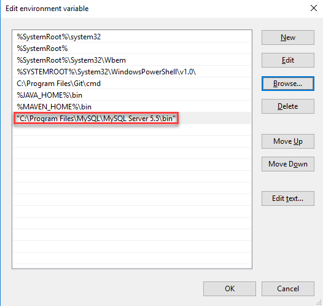

    -   Select **OK**.

## Configure Language Packs

The default Redis installer should also install the programming
language packs. These language packs include `python`, `tcl` and `perl`.
By default they will be installed in `c:\ebd`.

You can find out what version of Python has been targeted with the
Redis build by running the python.exe in the language pack folder.

If you do not see the language pack folder, launch StackBuilder again
and install **Add-ons, tools and utilities \> EDB Language Pack v1.x**.

## pgAdmin

-   You may find it easier to download the latest pgAdmin tool rather
    than relying on the Redis installer. You can find the latest
    versions [here](https://www.pgadmin.org/download/).

## Download artifacts

-   Download and Install [Git](https://git-scm.com/download/win)
    -   Download and run the 64-bit installer
    -   Click **Next** through all prompts
-   Open a Windows PowerShell window (just by entering "PowerShell" into
    the Start menu) and run the following commands

``` {.powershell}
mkdir c:\Redisguide
cd c:\Redisguide
git config --global user.name "FIRST_NAME LAST_NAME"
git config --global user.email "MY_NAME@example.com"
git clone https://github.com/solliancenet/onprem-postgre-to-azurepostgre-migration-guide 
```

## Deploy the instance

-   Open the Redis pgAdmin tool
-   Expand the **Servers** node
-   Expand the **Redis 10** node, connect to your local Redis
    instance
-   Expand the **instance** node
-   Right-click the **instance** node, select **Create-\>instance**
-   For the name, type **reg\_app**, select **Save**
-   Expand the **reg\_app** node
-   Right-click the **Schemas** node, select **Query tool**
-   Select the open file icon
-   Browse to
    **C:`\Redisguide`{=tex}`\onprem`{=tex}-Redis-to-azureRedis-migration-guide`\artifacts`{=tex}`\testapp`{=tex}`\instance`{=tex}-scripts**
-   Select **conferencedemo-Redis-10.sql** file, select **Select**
-   Click the **Execute/Refresh** button
-   Create the instance user
    -   In the navigator, right-click the **Login/Group Roles**
    -   Select **Create-\>Login/Group Rule**
    -   For the name, type **conferenceuser**
    -   Select the **definition** tab, type `Seattle123` for the
        password
    -   Select the **Privileges** tab, toggle the **Can login?** to yes
    -   Select **Save**

## Configure Blob Data

-   Navigate to the **Schemas** tab under the **Navigator** window

    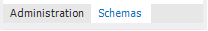

-   If the **reg\_app** schema does not appear, then right-click
    anywhere within the pane and select **Refresh All**

-   Expand **reg\_app \> Tables**. Hover over the **speakers** table.
    Select the third button which appears. The **Result Grid** will show
    every record in the table

-   For every record, change the value of the **SPEAKER\_PIC** field

    -   Right-click each NULL entry and select **Load Value From
        File...**
    -   Select
        **C:`\Redisguide`{=tex}`\onprem`{=tex}-Redis-to-azureRedis-migration-guide`\artifacts`{=tex}`\testapp`{=tex}`\instance`{=tex}-scripts`\sample`{=tex}-images`\speaker`{=tex}-bio-pic1.png**
    -   Select **Open**

-   Select **Apply** at the bottom right-hand corner of the page, and
    **Apply** again to confirm the query

-   Repeat this process for the **EVENT\_PIC** field of the **events**
    table

    -   This time, load
        **C:`\Redisguide`{=tex}`\onprem`{=tex}-Redis-to-azureRedis-migration-guide`\artifacts`{=tex}`\testapp`{=tex}`\instance`{=tex}-scripts`\sample`{=tex}-images`\event`{=tex}-pic0.png**
        (or **event-pic1.png**)

    -   The image below shows BLOB data successfully loaded for the
        **events** table

        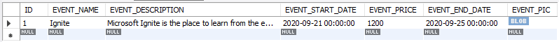

## Install Azure CLI

-   Download and Install the [Azure
    CLI](https://aka.ms/installazurecliwindows)

## Install NodeJS

-   Download and Install [NodeJS](https://nodejs.org/en/download/).
    Select the LTS 64-bit MSI Installer.
    -   Accept the default installation location
    -   Make sure that the **Automatically install the necessary tools**
        box is NOT selected

## Install and Configure Visual Studio Code

-   Download and Install [Visual Studio
    Code](https://code.visualstudio.com/download). Select the 64-bit
    Windows User Installer

## Configure the Web Application API

-   Open Visual Studio Code

-   Open the
    **C:`\Redisguide`{=tex}`\onprem`{=tex}-Redis-to-azureRedis-migration-guide`\artifacts`{=tex}`\testapp`{=tex}`\conferencedemo*`{=tex}\*
    folder (Ctrl+K and Ctrl+O, or **File-\>Open Folder...\*\*)

-   Select the **Extensions** tab

    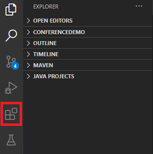

-   Search for and install the following extensions

    -   Java Extension Pack
    -   Spring Initializer Java Support

-   When prompted, select **Yes** to trust the **Maven Wrapper**

-   Update the `.vscode\launch.json` file

    -   If a launch.json does not exist, create a `.vscode` folder, and
        then create a new file called `launch.json`. The rectangle
        highlights the tool used to create a new folder, while the oval
        indicates the tool to create a new file.

        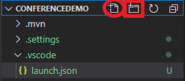

    -   Copy the following into it:

        ``` {.json}
        {
            // Use IntelliSense to learn about possible attributes.
            // Hover to view descriptions of existing attributes.
            // For more information, visit: https://go.microsoft.com/fwlink/?linkid=830387
            "version": "0.2.0",
            "configurations": [
                {
                    "type": "java",
                    "name": "Debug (Launch)",
                    "request": "launch",
                    "mainClass": "com.yourcompany.conferencedemo.ConferencedemoApplication",
                    "env" :{
                        "DB_CONNECTION_URL" : "jdbc:Redis://localhost:5432/reg_app?useUnicode=true&useJDBCCompliantTimezoneShift=true&useLegacyDatetimeCode=false&serverTimezone=UTC&noAccessToProcedureBodies=true",
                        "DB_USER_NAME" : "conferenceuser",
                        "DB_PASSWORD" : "Seattle123",
                        "ALLOWED_ORIGINS" : "*",
                    }
                }
            ]
        }
        ```

    -   Update the **{DB\_CONNECTION\_URL}** environment variable to the
        Redis Connections string
        `jdbc:Redis://localhost:5432/reg_app?useUnicode=true&useJDBCCompliantTimezoneShift=true&useLegacyDatetimeCode=false&serverTimezone=UTC&noAccessToProcedureBodies=true`

    -   Update the **{DB\_USER\_NAME}** environment variable to the
        Redis Connections string `conferenceuser`

    -   Update the **{DB\_PASSWORD}** environment variable to the
        Redis Connections string `Seattle123`

    -   Update the **{ALLOWED\_ORIGINS}** environment variable to `*`

-   Select the **Debug** tab (directly above the **Extensions** tab from
    earlier), then select the debug option to start a debug session

    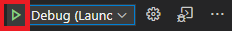

-   If prompted, select **Yes** to switch to `standard` mode

## Test the Web Application

-   Open a browser window, browse to **http://localhost:8888**
-   Ensure the application started on port 8888 and displays results

## Configure the Web Application Client

-   Open a new Visual Studio Code window to
    **C:`\Redisguide`{=tex}`\onprem`{=tex}-Redis-to-azureRedis-migration-guide`\testapp`{=tex}`\conferencedemo`{=tex}-client**
-   Open a terminal window (**Terminal**-\>**New Terminal**)
-   Run the following commands to install all the needed packages, if
    prompted, select **N**

``` {.cmd}
$env:Path = [System.Environment]::GetEnvironmentVariable("Path","Machine")

npm install
npm install -g @angular/cli
```

> Note: If PowerShell indicates that npm is not a recognized command,
> try restarting VS Code.

-   Run the following commands to run the client application

``` {.cmd}
npm start
```

-   Open a browser to the node site **http://localhost:{port}**
-   Browse the conference site, ensure sessions and speaker pages load

> **Note** If you don't see any results, verify that the API is still
> running.

## Deploy the Java Server Application to Azure

-   Open a command prompt window
-   Run the following command to create the Maven configuration to
    deploy the app. Multiple packages will be installed from the Maven
    repository.

``` {.cmd}
cd C:\Redisguide\onprem-Redis-to-azureRedis-migration-guide\artifacts\testapp\conferencedemo
"C:\Program Files\apache-maven-3.6.3\bin\mvn" com.microsoft.azure:azure-webapp-maven-plugin:1.9.1:config
```

-   For the `Define value for OS(Default:Linux)`, select the option that
    corresponds to `linux` or press **ENTER**

-   Select `Java 11`

-   Type **Y** to confirm the settings, then press **ENTER**

    

-   Switch to Visual Studio and the **ConferenceDemo** project

-   Open the `pom.xml` file, notice the **com.microsoft.azure** groupId
    is now added

-   Modify the resource group, appName and region to match the ones
    deployed in the ARM template

-   If you have more than one subscription, set the specific
    `subscriptionId` in the [maven
    configuration](https://github.com/microsoft/azure-maven-plugins/wiki/Authentication#subscription)

-   If the `secure` landing zone has been deployed, set the hosts file

    -   Browse to your resource group, select the **PREFIXapi01** app
        service

    -   Select **Networking**

    -   Select **Configure your Private Endpoint connections**

    -   Select the **PREFIXapi-pe** private endpoint

    -   Record the private IP Address

    -   Repeat for the **PREFIXapp01** app service

    -   Open a Windows PowerShell ISE window

    -   Copy in the code from below, be sure to replace tokens, and save
        to
        **C:`\Redisguide`{=tex}`\onprem`{=tex}-Redis-to-azureRedis-migration-guide`\artifacts*`{=tex}\*
        as **ConfiguringHostsFile.ps1\*\*

        ``` {.powershell}
        $prefix = "{PREFIX}";
        $apiip = "{APIIP}";
        $app_name = "$($prefix)api01";

        $hostname = "$app_name.azurewebsites.net"
        $line = "$apiip`t$hostname"
        add-content "c:\windows\system32\drivers\etc\hosts" $line

        $hostname = "$app_name.scm.azurewebsites.net"
        $line = "$apiip`t$hostname"
        add-content "c:\windows\system32\drivers\etc\hosts" $line

        $appip = "{APPIP}"
        $app_name = "$($prefix)app01";
        $hostname = "$app_name.azurewebsites.net"
        $line = "$appip`t$hostname"
        add-content "c:\windows\system32\drivers\etc\hosts" $line

        $hostname = "$app_name.scm.azurewebsites.net"
        $line = "$appip`t$hostname"
        add-content "c:\windows\system32\drivers\etc\hosts" $line
        ```

        -   Run the file

            

-   In the command prompt window from earlier, run the following to
    deploy the application

``` {.cmd}
"C:\Program Files\apache-maven-3.6.3\bin\mvn" package azure-webapp:deploy
```

-   When prompted, login to the Azure Portal
-   Update the App Service configuration variables by running the
    following, be sure to replace the tokens:

``` {.powershell}
$prefix = "{PREFIX}";
$app_name = "$($prefix)api01";
$rgName = "{RESOURCE-GROUP-NAME}";
az login
az account set --subscription "{SUBSCRIPTION-ID}"
az webapp config appsettings set -g $rgName -n $app_name --settings DB_CONNECTION_URL={DB_CONNECTION_URL}
az webapp config appsettings set -g $rgName -n $app_name --settings DB_USER_NAME={DB_USER_NAME}
az webapp config appsettings set -g $rgName -n $app_name --settings DB_PASSWORD={DB_PASSWORD}
az webapp config appsettings set -g $rgName -n $app_name --settings ALLOWED_ORIGINS=*
```

> **Note** You will need to escape the ampersands in the connection
> string. You may consider inputting the value through Azure Portal as
> well. Navigate to the API App Service, and select **Configuration**
> under **Settings**. Then, under **Application settings**, manually
> enter the values.

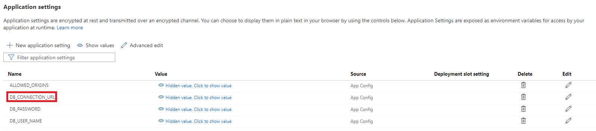

-   Restart the Java API App Service by running the following

``` {.powershell}
az webapp restart -g $rgName -n $app_name
```

## Deploy the Angular Web Application to Azure

-   Switch to the Visual Studio Code window for the Angular app
    (Conferencedemo-client)
-   Navigate to **src`\environments`{=tex}`\environment`{=tex}.prod.ts**
-   Set **webApiUrl** to **\[JAVA APP SERVICE URL\]/api/v1**

> **Note** the App service url will come from the App Gateway service
> blade if using the secure deployment, or the App Service blade if not
> using the secure deployment.

-   Run the following command to package the client app

``` {.cmd}
ng build --prod
```

-   Run the following commands in the Visual Code terminal window or a
    new PowerShell Window to zip and publish the client application, be
    sure to replace the tokens:

``` {.powershell}
cd C:\Redisguide\onprem-Redis-to-azureRedis-migration-guide\artifacts\testapp\conferencedemo-client\dist
Compress-Archive -Path "./conference-client/*" -DestinationPath "./confClient.zip"
$prefix = "{PREFIX}";
$app_name = "$($prefix)app01";
$rgName = "{RESOURCE-GROUP-NAME}";
$subscription = "{SUBSCRIPTION-NAME}";

az login
az account set --subscription "{SUBSCRIPTION-ID}"
az webapp stop --name $app_name --resource-group $rgName --subscription $subscription
az webapp deployment source config-zip --resource-group $rgName --name $app_name --src "./confClient.zip" --subscription $subscription
az webapp start --name $app_name --resource-group $rgName --subscription $subscription
```

## Configure Network Security (Secure path)

-   When attempting to connect to the instance from the app service, ab
    access denied message should be displayed. Add the app virtual
    network to the firewall of the Azure Cache for Redis
    -   Browse to the Azure Portal
    -   Select the target resource group
    -   Select the `{PREFIX}Redis` resource
    -   Select **Connection security**
    -   Select the `Allow access to all Azure Services` toggle to `Yes`
    -   Select **Save**

# Appendix B: ARM Templates

## Secure

This template will deploy all resources with private endpoints. This
effectively removes any access to the PaaS services from the internet.

[ARM Template](./../artifacts/template-secure.json)

## Non-Secure

This template will deploy resources using standard deployment where all
resources are available from the internet.

[ARM Template](./../artifacts/template.json)

# Appendix C: Default server parameters Redis 10.0

``` {.text}
                name                 |                       setting                       |                                    enumvals                                    
-------------------------------------+-----------------------------------------------------+--------------------------------------------------------------------------------
 allow_system_table_mods             | off                                                 | 
 application_name                    | psql                                                | 
 archive_command                     | (disabled)                                          | 
 archive_mode                        | off                                                 | {always,on,off}
 archive_timeout                     | 0                                                   | 
 array_nulls                         | on                                                  | 
 authentication_timeout              | 60                                                  | 
 autovacuum                          | on                                                  | 
 autovacuum_analyze_scale_factor     | 0.1                                                 | 
 autovacuum_analyze_threshold        | 50                                                  | 
 autovacuum_freeze_max_age           | 200000000                                           | 
 autovacuum_max_workers              | 3                                                   | 
 autovacuum_multixact_freeze_max_age | 400000000                                           | 
 autovacuum_naptime                  | 60                                                  | 
 autovacuum_vacuum_cost_delay        | 20                                                  | 
 autovacuum_vacuum_cost_limit        | -1                                                  | 
 autovacuum_vacuum_scale_factor      | 0.2                                                 | 
 autovacuum_vacuum_threshold         | 50                                                  | 
 autovacuum_work_mem                 | -1                                                  | 
 backend_flush_after                 | 0                                                   | 
 backslash_quote                     | safe_encoding                                       | {safe_encoding,on,off}
 bgwriter_delay                      | 200                                                 | 
 bgwriter_flush_after                | 0                                                   | 
 bgwriter_lru_maxpages               | 100                                                 | 
 bgwriter_lru_multiplier             | 2                                                   | 
 block_size                          | 8192                                                | 
 bonjour                             | off                                                 | 
 bonjour_name                        |                                                     | 
 bytea_output                        | hex                                                 | {escape,hex}
 check_function_bodies               | on                                                  | 
 checkpoint_completion_target        | 0.5                                                 | 
 checkpoint_flush_after              | 0                                                   | 
 checkpoint_timeout                  | 300                                                 | 
 checkpoint_warning                  | 30                                                  | 
 client_encoding                     | WIN1252                                             | 
 client_min_messages                 | notice                                              | {debug5,debug4,debug3,debug2,debug1,log,notice,warning,error}
 cluster_name                        |                                                     | 
 commit_delay                        | 0                                                   | 
 commit_siblings                     | 5                                                   | 
 config_file                         | C:/Program Files/Redis/10/data/Redis.conf | 
 constraint_exclusion                | partition                                           | {partition,on,off}
 cpu_index_tuple_cost                | 0.005                                               | 
 cpu_operator_cost                   | 0.0025                                              | 
 cpu_tuple_cost                      | 0.01                                                | 
 cursor_tuple_fraction               | 0.1                                                 | 
 data_checksums                      | off                                                 | 
 data_directory                      | C:/Program Files/Redis/10/data                 | 
 data_sync_retry                     | off                                                 | 
 DateStyle                           | ISO, MDY                                            | 
 db_user_namespace                   | off                                                 | 
 deadlock_timeout                    | 1000                                                | 
 debug_assertions                    | off                                                 | 
 debug_pretty_print                  | on                                                  | 
 debug_print_parse                   | off                                                 | 
 debug_print_plan                    | off                                                 | 
 debug_print_rewritten               | off                                                 | 
 default_statistics_target           | 100                                                 | 
 default_tablespace                  |                                                     | 
 default_text_search_config          | pg_catalog.english                                  | 
 default_transaction_deferrable      | off                                                 | 
 default_transaction_isolation       | read committed                                      | {serializable,"repeatable read","read committed","read uncommitted"}
 default_transaction_read_only       | off                                                 | 
 default_with_oids                   | off                                                 | 
 dynamic_library_path                | $libdir                                             | 
 dynamic_shared_memory_type          | windows                                             | {windows,none}
 effective_cache_size                | 524288                                              | 
 effective_io_concurrency            | 0                                                   | 
 enable_bitmapscan                   | on                                                  | 
 enable_gathermerge                  | on                                                  | 
 enable_hashagg                      | on                                                  | 
 enable_hashjoin                     | on                                                  | 
 enable_indexonlyscan                | on                                                  | 
 enable_indexscan                    | on                                                  | 
 enable_material                     | on                                                  | 
 enable_mergejoin                    | on                                                  | 
 enable_nestloop                     | on                                                  | 
 enable_seqscan                      | on                                                  | 
 enable_sort                         | on                                                  | 
 enable_tidscan                      | on                                                  | 
 escape_string_warning               | on                                                  | 
 event_source                        | Redis                                          | 
 exit_on_error                       | off                                                 | 
 external_pid_file                   |                                                     | 
 extra_float_digits                  | 0                                                   | 
 force_parallel_mode                 | off                                                 | {off,on,regress}
 from_collapse_limit                 | 8                                                   | 
 fsync                               | on                                                  | 
 full_page_writes                    | on                                                  | 
 geqo                                | on                                                  | 
 geqo_effort                         | 5                                                   | 
 geqo_generations                    | 0                                                   | 
 geqo_pool_size                      | 0                                                   | 
 geqo_seed                           | 0                                                   | 
 geqo_selection_bias                 | 2                                                   | 
 geqo_threshold                      | 12                                                  | 
 gin_fuzzy_search_limit              | 0                                                   | 
 gin_pending_list_limit              | 4096                                                | 
 hba_file                            | C:/Program Files/Redis/10/data/pg_hba.conf     | 
 hot_standby                         | on                                                  | 
 hot_standby_feedback                | off                                                 | 
 huge_pages                          | try                                                 | {off,on,try}
 ident_file                          | C:/Program Files/Redis/10/data/pg_ident.conf   | 
 idle_in_transaction_session_timeout | 0                                                   | 
 ignore_checksum_failure             | off                                                 | 
 ignore_system_indexes               | off                                                 | 
 integer_datetimes                   | on                                                  | 
 IntervalStyle                       | postgres                                            | {postgres,postgres_verbose,sql_standard,iso_8601}
 join_collapse_limit                 | 8                                                   | 
 krb_caseins_users                   | off                                                 | 
 krb_server_keyfile                  |                                                     | 
 lc_collate                          | English_United States.1252                          | 
 lc_ctype                            | English_United States.1252                          | 
 lc_messages                         | English_United States.1252                          | 
 lc_monetary                         | English_United States.1252                          | 
 lc_numeric                          | English_United States.1252                          | 
 lc_time                             | English_United States.1252                          | 
 listen_addresses                    | *                                                   | 
 lo_compat_privileges                | off                                                 | 
 local_preload_libraries             |                                                     | 
 lock_timeout                        | 0                                                   | 
 log_autovacuum_min_duration         | -1                                                  | 
 log_checkpoints                     | off                                                 | 
 log_connections                     | off                                                 | 
 log_destination                     | stderr                                              | 
 log_directory                       | log                                                 | 
 log_disconnections                  | off                                                 | 
 log_duration                        | off                                                 | 
 log_error_verbosity                 | default                                             | {terse,default,verbose}
 log_executor_stats                  | off                                                 | 
 log_file_mode                       | 0600                                                | 
 log_filename                        | Redis-%Y-%m-%d_%H%M%S.log                      | 
 log_hostname                        | off                                                 | 
 log_line_prefix                     | %m [%p]                                             | 
 log_lock_waits                      | off                                                 | 
 log_min_duration_statement          | -1                                                  | 
 log_min_error_statement             | error                                               | {debug5,debug4,debug3,debug2,debug1,info,notice,warning,error,log,fatal,panic}
 log_min_messages                    | warning                                             | {debug5,debug4,debug3,debug2,debug1,info,notice,warning,error,log,fatal,panic}
 log_parser_stats                    | off                                                 | 
 log_planner_stats                   | off                                                 | 
 log_replication_commands            | off                                                 | 
 log_rotation_age                    | 1440                                                | 
 log_rotation_size                   | 10240                                               | 
 log_statement                       | none                                                | {none,ddl,mod,all}
 log_statement_stats                 | off                                                 | 
 log_temp_files                      | -1                                                  | 
 log_timezone                        | UTC                                                 | 
 log_truncate_on_rotation            | off                                                 | 
 logging_collector                   | on                                                  | 
 maintenance_work_mem                | 65536                                               | 
 max_connections                     | 100                                                 | 
 max_files_per_process               | 1000                                                | 
 max_function_args                   | 100                                                 | 
 max_identifier_length               | 63                                                  | 
 max_index_keys                      | 32                                                  | 
 max_locks_per_transaction           | 64                                                  | 
 max_logical_replication_workers     | 4                                                   | 
 max_parallel_workers                | 8                                                   | 
 max_parallel_workers_per_gather     | 2                                                   | 
 max_pred_locks_per_page             | 2                                                   | 
 max_pred_locks_per_relation         | -2                                                  | 
 max_pred_locks_per_transaction      | 64                                                  | 
 max_prepared_transactions           | 0                                                   | 
 max_replication_slots               | 10                                                  | 
 max_stack_depth                     | 2048                                                | 
 max_standby_archive_delay           | 30000                                               | 
 max_standby_streaming_delay         | 30000                                               | 
 max_sync_workers_per_subscription   | 2                                                   | 
 max_wal_senders                     | 10                                                  | 
 max_wal_size                        | 1024                                                | 
 max_worker_processes                | 8                                                   | 
 min_parallel_index_scan_size        | 64                                                  | 
 min_parallel_table_scan_size        | 1024                                                | 
 min_wal_size                        | 80                                                  | 
 old_snapshot_threshold              | -1                                                  | 
 operator_precedence_warning         | off                                                 | 
 parallel_setup_cost                 | 1000                                                | 
 parallel_tuple_cost                 | 0.1                                                 | 
 password_encryption                 | md5                                                 | {md5,scram-sha-256}
 port                                | 5432                                                | 
 post_auth_delay                     | 0                                                   | 
 pre_auth_delay                      | 0                                                   | 
 quote_all_identifiers               | off                                                 | 
 random_page_cost                    | 4                                                   | 
 replacement_sort_tuples             | 150000                                              | 
 restart_after_crash                 | on                                                  | 
 row_security                        | on                                                  | 
 search_path                         | "$user", public                                     | 
 segment_size                        | 131072                                              | 
 seq_page_cost                       | 1                                                   | 
 server_encoding                     | UTF8                                                | 
 server_version                      | 10.16                                               | 
 server_version_num                  | 100016                                              | 
 session_preload_libraries           |                                                     | 
 session_replication_role            | origin                                              | {origin,replica,local}
 shared_buffers                      | 16384                                               | 
 shared_preload_libraries            |                                                     | 
 ssl                                 | off                                                 | 
 ssl_ca_file                         |                                                     | 
 ssl_cert_file                       | server.crt                                          | 
 ssl_ciphers                         | HIGH:MEDIUM:+3DES:!aNULL                            | 
 ssl_crl_file                        |                                                     | 
 ssl_dh_params_file                  |                                                     | 
 ssl_ecdh_curve                      | prime256v1                                          | 
 ssl_key_file                        | server.key                                          | 
 ssl_prefer_server_ciphers           | on                                                  | 
 standard_conforming_strings         | on                                                  | 
 statement_timeout                   | 0                                                   | 
 stats_temp_directory                | pg_stat_tmp                                         | 
 superuser_reserved_connections      | 3                                                   | 
 synchronize_seqscans                | on                                                  | 
 synchronous_commit                  | on                                                  | {local,remote_write,remote_apply,on,off}
 synchronous_standby_names           |                                                     | 
 syslog_facility                     | none                                                | {none}
 syslog_ident                        | postgres                                            | 
 syslog_sequence_numbers             | on                                                  | 
 syslog_split_messages               | on                                                  | 
 tcp_keepalives_count                | 0                                                   | 
 tcp_keepalives_idle                 | -1                                                  | 
 tcp_keepalives_interval             | -1                                                  | 
 temp_buffers                        | 1024                                                | 
 temp_file_limit                     | -1                                                  | 
 temp_tablespaces                    |                                                     | 
 TimeZone                            | UTC                                                 | 
 timezone_abbreviations              | Default                                             | 
 trace_notify                        | off                                                 | 
 trace_recovery_messages             | log                                                 | {debug5,debug4,debug3,debug2,debug1,log,notice,warning,error}
 trace_sort                          | off                                                 | 
 track_activities                    | on                                                  | 
 track_activity_query_size           | 1024                                                | 
 track_commit_timestamp              | off                                                 | 
 track_counts                        | on                                                  | 
 track_functions                     | none                                                | {none,pl,all}
 track_io_timing                     | off                                                 | 
 transaction_deferrable              | off                                                 | 
 transaction_isolation               | read committed                                      | 
 transaction_read_only               | off                                                 | 
 transform_null_equals               | off                                                 | 
 unix_socket_directories             |                                                     | 
 unix_socket_group                   |                                                     | 
 unix_socket_permissions             | 0777                                                | 
 update_process_title                | off                                                 | 
 vacuum_cost_delay                   | 0                                                   | 
 vacuum_cost_limit                   | 200                                                 | 
 vacuum_cost_page_dirty              | 20                                                  | 
 vacuum_cost_page_hit                | 1                                                   | 
 vacuum_cost_page_miss               | 10                                                  | 
 vacuum_defer_cleanup_age            | 0                                                   | 
 vacuum_freeze_min_age               | 50000000                                            | 
 vacuum_freeze_table_age             | 150000000                                           | 
 vacuum_multixact_freeze_min_age     | 5000000                                             | 
 vacuum_multixact_freeze_table_age   | 150000000                                           | 
 wal_block_size                      | 8192                                                | 
 wal_buffers                         | 512                                                 | 
 wal_compression                     | off                                                 | 
 wal_consistency_checking            |                                                     | 
 wal_keep_segments                   | 0                                                   | 
 wal_level                           | replica                                             | {minimal,replica,logical}
 wal_log_hints                       | off                                                 | 
 wal_receiver_status_interval        | 10                                                  | 
 wal_receiver_timeout                | 60000                                               | 
 wal_retrieve_retry_interval         | 5000                                                | 
 wal_segment_size                    | 2048                                                | 
 wal_sender_timeout                  | 60000                                               | 
 wal_sync_method                     | open_datasync                                       | {fsync,fsync_writethrough,open_datasync}
 wal_writer_delay                    | 200                                                 | 
 wal_writer_flush_after              | 128                                                 | 
 work_mem                            | 4096                                                | 
 xmlbinary                           | base64                                              | {base64,hex}
 xmloption                           | content                                             | {content,document}
 zero_damaged_pages                  | off                                                 | 
```

# Appendix D: Default server parameters Azure (Single Server) V11

``` {.text}
Name                                  Value                      AllowedValue                                          
----                                  -----                      ------------                                          
array_nulls                           on                         on,off                                                
backslash_quote                       safe_encoding              safe_encoding,on,off                                  
bytea_output                          hex                        escape,hex                                            
check_function_bodies                 on                         on,off                                                
client_encoding                       sql_ascii                  BIG5,EUC_CN,EUC_JP,EUC_JIS_2004,EUC_KR,EUC_TW,GB180...
client_min_messages                   notice                     debug5,debug4,debug3,debug2,debug1,log,notice,warni...
constraint_exclusion                  partition                  partition,on,off                                      
cpu_index_tuple_cost                  0.005                      0-1.79769e+308                                        
cpu_operator_cost                     0.0025                     0-1.79769e+308                                        
cpu_tuple_cost                        0.01                       0-1.79769e+308                                        
cursor_tuple_fraction                 0.1                        0-1                                                   
datestyle                             iso, mdy                   (iso|postgres|sql|german)\,\s(dmy|mdy|ymd)            
deadlock_timeout                      1000                       1-2147483647                                          
debug_print_parse                     off                        on,off                                                
debug_print_plan                      off                        on,off                                                
debug_print_rewritten                 off                        on,off                                                
default_statistics_target             100                        1-10000                                               
default_text_search_config            pg_catalog.english         [A-Za-z\._]+                                          
default_transaction_deferrable        off                        on,off                                                
default_transaction_isolation         read committed             serializable,repeatable read,read committed,read un...
default_transaction_read_only         off                        on,off                                                
default_with_oids                     off                        on,off                                                
enable_bitmapscan                     on                         on,off                                                
enable_hashagg                        on                         on,off                                                
enable_hashjoin                       on                         on,off                                                
enable_indexonlyscan                  on                         on,off                                                
enable_indexscan                      on                         on,off                                                
enable_material                       on                         on,off                                                
enable_mergejoin                      on                         on,off                                                
enable_nestloop                       on                         on,off                                                
enable_seqscan                        on                         on,off                                                
enable_sort                           on                         on,off                                                
enable_tidscan                        on                         on,off                                                
escape_string_warning                 on                         on,off                                                
exit_on_error                         off                        on,off                                                
extra_float_digits                    0                          -15-3                                                 
from_collapse_limit                   8                          1-2147483647                                          
geqo                                  on                         on,off                                                
geqo_effort                           5                          1-10                                                  
geqo_generations                      0                          0-2147483647                                          
geqo_pool_size                        0                          0-2147483647                                          
geqo_seed                             0.0                        0-1                                                   
geqo_selection_bias                   2.0                        1.5-2                                                 
geqo_threshold                        12                         2-2147483647                                          
gin_fuzzy_search_limit                0                          0-2147483647                                          
intervalstyle                         postgres                   postgres,postgres_verbose,sql_standard,iso_8601       
join_collapse_limit                   8                          1-2147483647                                          
lock_timeout                          0                          0-2147483647                                          
log_checkpoints                       on                         on,off                                                
log_connections                       on                         on,off                                                
log_disconnections                    off                        on,off                                                
log_duration                          off                        on,off                                                
log_error_verbosity                   default                    terse,default,verbose                                 
log_line_prefix                       %t-%c-                     .*                                                    
log_lock_waits                        off                        on,off                                                
log_min_duration_statement            -1                         -1-2147483647                                         
log_min_error_statement               error                      debug5,debug4,debug3,debug2,debug1,info,notice,warn...
log_min_messages                      warning                    debug5,debug4,debug3,debug2,debug1,info,notice,warn...
log_statement                         none                       none,ddl,mod,all                                      
log_statement_stats                   off                        on,off                                                
max_locks_per_transaction             64                         10-2147483647                                         
max_prepared_transactions             0                          0-8388607                                             
quote_all_identifiers                 off                        on,off                                                
random_page_cost                      4.0                        0-1.79769e+308                                        
search_path                           "$user", public            [A-Za-z."$, ]+                                        
seq_page_cost                         1.0                        0-1.79769e+308                                        
statement_timeout                     0                          0-2147483647                                          
synchronize_seqscans                  on                         on,off                                                
synchronous_commit                    on                         local,remote_write,on,off                             
transform_null_equals                 off                        on,off                                                
xmlbinary                             base64                     base64,hex                                            
xmloption                             content                    content,document                                      
force_parallel_mode                   off                        off,on,regress                                        
idle_in_transaction_session_timeout   0                          0-2147483647                                          
max_parallel_workers_per_gather       2                          0-1024                                                
parallel_setup_cost                   1000                       0-1.79769e+308                                        
parallel_tuple_cost                   0.1                        0-1.79769e+308                                        
work_mem                              4096                       4096-2097151                                          
temp_buffers                          8192                       8192-16384                                            
min_parallel_table_scan_size          8388608                    0-715827882                                           
min_parallel_index_scan_size          524288                     0-715827882                                           
max_parallel_workers                  8                          0-1024                                                
connection_throttling                 on                         on,off                                                
enable_partitionwise_join             off                        on,off                                                
enable_partitionwise_aggregate        off                        on,off                                                
parallel_leader_participation         on                         on,off                                                
log_retention_days                    3                          1-7                                                   
pg_qs.max_query_text_length           6000                       100-10000                                             
pg_qs.query_capture_mode              none                       all,top,none                                          
pg_qs.retention_period_in_days        7                          1-30                                                  
pg_qs.track_utility                   on                         on,off                                                
pg_qs.replace_parameter_placeholders  off                        on,off                                                
pg_qs.interval_length_minutes         15                         1-30                                                  
pg_stat_statements.track              none                       top,all,none                                          
pgms_wait_sampling.query_capture_mode none                       all,none                                              
pgms_wait_sampling.history_period     100                        1-600000                                              
postgis.gdal_enabled_drivers          DISABLE_ALL                DISABLE_ALL,ENABLE_ALL                                
autovacuum                            on                         on,off                                                
autovacuum_analyze_scale_factor       0.05                       0-100                                                 
autovacuum_analyze_threshold          50                         0-2147483647                                          
autovacuum_freeze_max_age             200000000                  100000-2000000000                                     
autovacuum_multixact_freeze_max_age   400000000                  10000-2000000000                                      
autovacuum_naptime                    15                         1-2147483                                             
autovacuum_vacuum_cost_delay          20                         -1-100                                                
autovacuum_vacuum_cost_limit          -1                         -1-10000                                              
autovacuum_vacuum_scale_factor        0.05                       0-100                                                 
autovacuum_vacuum_threshold           50                         0-2147483647                                          
autovacuum_work_mem                   -1                         -1-2097151                                            
autovacuum_max_workers                3                          1-262143                                              
backend_flush_after                   0                          0-256                                                 
bgwriter_delay                        20                         10-10000                                              
bgwriter_flush_after                  64                         0-256                                                 
bgwriter_lru_maxpages                 100                        0-1073741823                                          
bgwriter_lru_multiplier               2                          0-10                                                  
checkpoint_completion_target          0.9                        0-1                                                   
checkpoint_warning                    30                         0-2147483647                                          
commit_delay                          0                          0-100000                                              
commit_siblings                       5                          0-1000                                                
effective_cache_size                  655360                     1-2147483647                                          
gin_pending_list_limit                4096                       64-2097151                                            
lc_monetary                           English_United States.1252 [A-Za-z0-9\._\s]+                                     
lc_numeric                            English_United States.1252 [A-Za-z0-9\._\s]+                                     
lo_compat_privileges                  off                        on,off                                                
log_autovacuum_min_duration           -1                         -1-2147483647                                         
log_replication_commands              off                        on,off                                                
log_temp_files                        -1                         -1-2147483647                                         
max_standby_archive_delay             30000                      -1-2147483647                                         
max_standby_streaming_delay           30000                      -1-2147483647                                         
max_wal_size                          1024                       2-2097151                                             
min_wal_size                          256                        2-2097151                                             
old_snapshot_threshold                -1                         -1-86400                                              
operator_precedence_warning           off                        on,off                                                
pg_stat_statements.max                5000                       100-2147483647                                        
pg_stat_statements.save               on                         on,off                                                
pg_stat_statements.track_utility      on                         on,off                                                
row_security                          on                         on,off                                                
session_replication_role              origin                     origin,replica,local                                  
tcp_keepalives_count                  0                          0-2147483647                                          
tcp_keepalives_idle                   0                          0-2147483647                                          
tcp_keepalives_interval               0                          0-2147483647                                          
track_activities                      on                         on,off                                                
track_activity_query_size             1024                       100-102400                                            
track_commit_timestamp                off                        on,off                                                
track_counts                          on                         on,off                                                
track_functions                       none                       none,pl,all                                           
track_io_timing                       on                         on,off                                                
timezone                              UTC                        [A-Za-z0-9/+-_]+                                      
shared_preload_libraries                                         ,auto_explain,pgaudit,pg_prewarm,timescaledb          
vacuum_cost_delay                     0                          0-100                                                 
vacuum_cost_limit                     200                        1-10000                                               
vacuum_cost_page_dirty                20                         0-10000                                               
vacuum_cost_page_hit                  1                          0-10000                                               
vacuum_cost_page_miss                 10                         0-10000                                               
vacuum_defer_cleanup_age              0                          0-1000000                                             
vacuum_freeze_min_age                 50000000                   0-1000000000                                          
vacuum_freeze_table_age               150000000                  0-2000000000                                          
vacuum_multixact_freeze_min_age       5000000                    0-1000000000                                          
vacuum_multixact_freeze_table_age     150000000                  0-2000000000                                          
wal_buffers                           8192                       -1-262143                                             
wal_receiver_status_interval          10                         0-2147483                                             
wal_writer_delay                      200                        1-10000                                               
wal_writer_flush_after                128                        0-2147483647                                          
maintenance_work_mem                  131072                     1024-2097151                                          
azure.replication_support             REPLICA                    OFF,REPLICA,LOGICAL                                   
max_wal_senders                       10                         10-30                                                 
max_replication_slots                 10                         10-25                                                 
hot_standby_feedback                  on                         on,off                                                
logging_collector                     on                         on,off                                                
```

# Configure Redis SSL

## Install OpenSSL

-   Download the latest version of OpenSSL from
    [here](https://slproweb.com/products/Win32OpenSSL.html)
-   Run the MSI installer, click through all the dialogs
-   Update the `PATH` environment variable to have the openssl install
    directory (similar to `C:\Program Files\OpenSSL-Win64\bin`)
-   Update the `OPENSSL_CONF` environment variable to be
    `C:\Program Files\OpenSSL-Win64\bin`

## Create a server certificate

-   Create the server certificates by running the following:

``` {.cmd}
openssl genrsa -des3 -out server.temp.key 2048
openssl rsa -in server.temp.key -out server.key
openssl req -new -key server.key -out server.csr
openssl x509 -req -days 365 -in server.csr -signkey server.key -out server.crt
```

-   Copy the `server.crt` and `server.key` to the Redis data
    directory (ex `C:\Program Files\Redis\10\data`).

## Configure the pg\_hba.conf file

-   Open the `C:\Program Files\Redis\10\data\Redis.conf` file
-   Uncomment and set the following parameters:

``` {.cmd}
ssl=on
...
ssl_cert_file = 'server.crt'
ssl_key_file = 'server.key'
```

-   Open the `C:\Program Files\Redis\10\data\pg_hba.conf` file
-   Copy and then modify the host option to add the hostssl option:

``` {.cmd}
hostssl    all    all   all md5
```

## Restart the server

-   Run the following commands:

``` {.cmd}
net stop Redis-x64-10
net start Redis-x64-10
```

Your Redis instance should now accept SSL connections.

# Data Migration (DMS)

## Setup

Follow all the steps in the [Setup](./00_Setup.md)

## Migration

Repeat all CAF steps -
https://docs.microsoft.com/en-us/azure/cloud-adoption-framework/migrate/azure-best-practices/contoso-migration-rehost-linux-vm-Redis

# Data Migration

## Setup

Follow all the steps in the [Setup](./00_Setup.md)

## Server Parameters (Source)

Depending on the type of migration you are doing (offline vs online),
you will want to evaluate if you are going to modify the server
parameters to support a fast egress of the data. If you are doing
online, it may not be necessary to do anything to server parameters as
you will likely be performing logical replication and have the data
syncing on its own. However, if you are doing an offline migration, once
you stop application traffic, you can switch the server parameters from
supporting the workload, you supporting the export.

## Server Parameters (Target)

Before you perform the import into the Azure Cache for Redis,
you will want to review the current server parameters. Server parameters
can be retrieved and set using the [Azure
Portal](https://docs.microsoft.com/en-us/azure/Redis/howto-configure-server-parameters-using-portal)
or by calling the [Azure PowerShell for Redis
cmdlets](https://docs.microsoft.com/en-us/powershell/module/az.Redis/update-azRedisconfiguration?view=azps-5.8.0)
to make the changes.

To get all current parameters, execute the following in an
administrative PowerShell window:

``` {.powershell}
[Net.ServicePointManager]::SecurityProtocol = [Net.SecurityProtocolType]::Tls12

Install-Module -Name Az.Redis
$rgName = "YourRGName";
$serverName = "servername";
$subscriptionId = "subId";
Set-AzContext $subscriptionId;
Get-AzRedisConfiguration -ResourceGroupName $rgName -ServerName $serverName;
```

-   To do the same with the `Redis` tool, download the [CA root
    certification](https://www.digicert.com/CACerts/BaltimoreCyberTrustRoot.crt.pem)
    to `c:\temp`.
-   Ensure that the IP Address is allowed to connect to the Azure
    instance for Redis
    -   Open the Azure Portal
    -   Browse to the Azure Cache for Redis
    -   Under **Settings**, select **Connection Security**
    -   In the **Firewall rules**, add the IP of the remote server
-   Run the following command, enter the user password when prompted:

``` {.cmd}
psql -h cjg-pg-single-01.postgres.instance.azure.com -p 5432 -d postgres -U s2admin@cjg-pg-single-01 -c "select name,setting,enumvals from pg_settings" -o "c:\temp\azure.txt"
```

For an Azure Cache for Redis running v11, you will see the
server parameters as shown in [Appendix
A](./../05_Appendix/02_ServerParameters_Azure_11.md)

To support the migration, we will set the target Redis instance
parameters to allow from a faster ingress. This means setting the
following server parameters before starting the data migration.

TODO

-   `max_allowed_packet` -- set to 1073741824 (i.e. 1GB) or the largest
    size of a row in the instance to prevent any overflow issue due to
    long rows. Consider adjusting this if there are large BLOB rows that
    need to be pulled out (or read).
-   `innodb_buffer_pool_size` -- Scale-up the server to 32 vCore Memory
    Optimized SKU from the Pricing tier of the portal during migration
    to increase the innodb\_buffer\_pool\_size.
    Innodb\_buffer\_pool\_size can only be increased by scaling up
    compute for Azure Cache for Redis server. Reference [Server
    parameters in Azure instance for
    Redis](https://docs.microsoft.com/en-us/azure/Redis/concepts-server-parameters#innodb_buffer_pool_size)
    for the max value for the tier. The maximum value in a Memory
    Optimized 32 vCore system is `132070244352`.
-   `innodb_io_capacity` & `innodb_io_capacity_max` - Change to `9000`
    to improve the IO utilization to optimize for migration speed.
-   `max_connections` - If using a tool that generates multiple threads
    to increase throughput, increase the connections to support that
    tool. The default is 151 and the max is 5000.

> **Note:** Take care when performing scaling, some operations can not
> be undone, such as storage scaling.

You can use the Azure PowerShell cmdlets to update these settings:

``` {.powershell}
Install-Module -Name Az.Redis
$rgName = "YourRGName";
$serverName = "servername";
Update-AzRedisConfiguration -Name TODO -ResourceGroupName $rgname -ServerName $serverName -Value TODO
```

## Data

Wth the report of the objects from the source system and the users
migrated, the migration can begin. Since the target is a Azure instance
for Redis running 8.0, DMS cannot be used. Therefore, the next best
alternative method of an import and export with Redis pgAdmin has
been selected.

### Redis pgAdmin Backup

-   Switch to Redis pgAdmin
-   Connect to the local Redis server
-   Expand the **instances** node
-   Expand the **Schemas** node
-   Select the **reg\_app** schema
-   In the menu, select **Tools-\>Backup**
-   Select **Backup**, notice Redis pgAdmin makes calls to the
    `pg_dump` tool
-   Open the newly created export script
-   In Redis pgAdmin, create a new connection to the Azure instance
    for Redis
    -   For Hostname, enter the full server DNS (ex:
        `servername.Redis.instance.azure.com`)
    -   Enter the username (ex: `s2admin@servername`)
    -   Select the **SSL** tab
    -   For the SSL CA File, browse to the
        **BaltimoreCyberTrustRoot.crt.pem** key file
    -   Select **Test Connection**, ensure the connection completes
-   Select **File-\>Open SQL Script**
-   Browse to the just created dump file, select **Open**
-   Select **Execute**

## Update Applications to support SSL

-   Switch to the Java Server API in Visual Studio code
-   Open the **launch.json**
-   Update the **DB\_CONNECTION** to
    `jdbc:Redis://{servername}.postgres.instance.azure.com:5432/{your_instance}?user=s2admin@cjg-pg-single-01&password={your_password}&sslmode=require`.

> Note the additional `sslmode` parameter

-   Add the following **env** values:

``` {.json}
```

## Revert Server Parameters

The following parameters can be changed on the Azure instance for
Redis target instance. These can be set them through the Azure
Portal or via the [Azure PowerShell for Redis
cmdlets](https://docs.microsoft.com/en-us/azure/Redis/howto-configure-server-parameters-using-powershell)
to make the changes.

``` {.powershell}
$rgName = "YourRGName";
$serverName = "servername";
Update-AzRedisConfiguration -Name TODO -ResourceGroupName $rgname -ServerName $serverName -Value TODO
```

# Getting Started

### Reference Documentation

For further reference, please consider the following sections:

-   [Official Apache Maven
    documentation](https://maven.apache.org/guides/index.html)
-   [Spring Boot Maven Plugin Reference
    Guide](https://docs.spring.io/spring-boot/docs/2.2.5.RELEASE/maven-plugin/)
-   [Spring Boot
    DevTools](https://docs.spring.io/spring-boot/docs/2.2.5.RELEASE/reference/htmlsingle/#using-boot-devtools)
-   [Rest
    Repositories](https://docs.spring.io/spring-boot/docs/2.2.5.RELEASE/reference/htmlsingle/#howto-use-exposing-spring-data-repositories-rest-endpoint)
-   [Spring
    Web](https://docs.spring.io/spring-boot/docs/2.2.5.RELEASE/reference/htmlsingle/#boot-features-developing-web-applications)
-   [Spring Data
    JPA](https://docs.spring.io/spring-boot/docs/2.2.5.RELEASE/reference/htmlsingle/#boot-features-jpa-and-spring-data)

### Guides

The following guides illustrate how to use some features concretely:

-   [Accessing JPA Data with
    REST](https://spring.io/guides/gs/accessing-data-rest/)
-   [Accessing Neo4j Data with
    REST](https://spring.io/guides/gs/accessing-neo4j-data-rest/)
-   [Accessing MongoDB Data with
    REST](https://spring.io/guides/gs/accessing-mongodb-data-rest/)
-   [Building a RESTful Web
    Service](https://spring.io/guides/gs/rest-service/)
-   [Serving Web Content with Spring
    MVC](https://spring.io/guides/gs/serving-web-content/)
-   [Building REST services with
    Spring](https://spring.io/guides/tutorials/bookmarks/)
-   [Accessing Data with
    JPA](https://spring.io/guides/gs/accessing-data-jpa/)

# Getting Started

### Reference Documentation

For further reference, please consider the following sections:

-   [Official Apache Maven
    documentation](https://maven.apache.org/guides/index.html)
-   [Spring Boot Maven Plugin Reference
    Guide](https://docs.spring.io/spring-boot/docs/2.2.5.RELEASE/maven-plugin/)
-   [Spring Boot
    DevTools](https://docs.spring.io/spring-boot/docs/2.2.5.RELEASE/reference/htmlsingle/#using-boot-devtools)
-   [Rest
    Repositories](https://docs.spring.io/spring-boot/docs/2.2.5.RELEASE/reference/htmlsingle/#howto-use-exposing-spring-data-repositories-rest-endpoint)
-   [Spring
    Web](https://docs.spring.io/spring-boot/docs/2.2.5.RELEASE/reference/htmlsingle/#boot-features-developing-web-applications)
-   [Spring Data
    JPA](https://docs.spring.io/spring-boot/docs/2.2.5.RELEASE/reference/htmlsingle/#boot-features-jpa-and-spring-data)

### Guides

The following guides illustrate how to use some features concretely:

-   [Accessing JPA Data with
    REST](https://spring.io/guides/gs/accessing-data-rest/)
-   [Accessing Neo4j Data with
    REST](https://spring.io/guides/gs/accessing-neo4j-data-rest/)
-   [Accessing MongoDB Data with
    REST](https://spring.io/guides/gs/accessing-mongodb-data-rest/)
-   [Building a RESTful Web
    Service](https://spring.io/guides/gs/rest-service/)
-   [Serving Web Content with Spring
    MVC](https://spring.io/guides/gs/serving-web-content/)
-   [Building REST services with
    Spring](https://spring.io/guides/tutorials/bookmarks/)
-   [Accessing Data with
    JPA](https://spring.io/guides/gs/accessing-data-jpa/)

# ConferenceClient

This project is generated with [Angular
CLI](https://github.com/angular/angular-cli) version 7.3.1.

## Development server

Run `ng serve` for a dev server. Navigate to `http://localhost:4200/`.
The app will automatically reload if you change any of the source files.

## Code scaffolding

Run `ng generate component component-name` to generate a new component.
You can also use
`ng generate directive|pipe|service|class|guard|interface|enum|module`.

## Build

Run `ng build` to build the project. The build artifacts will be stored
in the `dist/` directory. Use the `--prod` flag for a production build.

## Running unit tests

Run `ng test` to execute the unit tests via
[Karma](https://karma-runner.github.io).

## Running end-to-end tests

Run `ng e2e` to execute the end-to-end tests via
[Protractor](http://www.protractortest.org/).

## Further help

To get more help on the Angular CLI use `ng help` or go check out the
[Angular CLI
README](https://github.com/angular/angular-cli/blob/master/README.md).

# Getting Started

### Reference Documentation

For further reference, please consider the following sections:

-   [Official Apache Maven
    documentation](https://maven.apache.org/guides/index.html)
-   [Spring Boot Maven Plugin Reference
    Guide](https://docs.spring.io/spring-boot/docs/2.2.5.RELEASE/maven-plugin/)
-   [Spring Boot
    DevTools](https://docs.spring.io/spring-boot/docs/2.2.5.RELEASE/reference/htmlsingle/#using-boot-devtools)
-   [Rest
    Repositories](https://docs.spring.io/spring-boot/docs/2.2.5.RELEASE/reference/htmlsingle/#howto-use-exposing-spring-data-repositories-rest-endpoint)
-   [Spring
    Web](https://docs.spring.io/spring-boot/docs/2.2.5.RELEASE/reference/htmlsingle/#boot-features-developing-web-applications)
-   [Spring Data
    JPA](https://docs.spring.io/spring-boot/docs/2.2.5.RELEASE/reference/htmlsingle/#boot-features-jpa-and-spring-data)

### Guides

The following guides illustrate how to use some features concretely:

-   [Accessing JPA Data with
    REST](https://spring.io/guides/gs/accessing-data-rest/)
-   [Accessing Neo4j Data with
    REST](https://spring.io/guides/gs/accessing-neo4j-data-rest/)
-   [Accessing MongoDB Data with
    REST](https://spring.io/guides/gs/accessing-mongodb-data-rest/)
-   [Building a RESTful Web
    Service](https://spring.io/guides/gs/rest-service/)
-   [Serving Web Content with Spring
    MVC](https://spring.io/guides/gs/serving-web-content/)
-   [Building REST services with
    Spring](https://spring.io/guides/tutorials/bookmarks/)
-   [Accessing Data with
    JPA](https://spring.io/guides/gs/accessing-data-jpa/)
